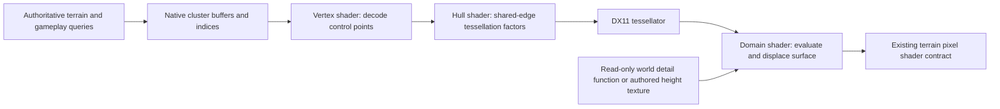

# Visual-only terrain tessellation

Research date: 2026-10-03. Status: feasible from static evidence; no tessellated
gameplay frame, performance measurement, or implementation exists in this workstream.

## Recommendation

Prototype **DX11 triangle tessellation on the native terrain entities that Redux
already submits**, using OGRE material/program APIs. Start with zero displacement
to prove submission and shader compatibility, then add shallow world-space
displacement and adaptive subdivision. Keep the authoritative terrain height
field, terrain-cell words, collision, pathfinding, placement, and networking
unchanged.

A replacement OGRE build does not appear necessary. The installed GOG renderer
contains the relevant shader-binding and patch-topology paths. This is stronger
than an upstream-version assumption, but still needs a runtime proof.

Do not make the first experiment depend on the existing separate terrain proxy:
the latest account in [terrain-render-path.md](terrain-render-path.md#blocker-the-proxy-entity-renders-no-pixels)
reports that a displaced proxy produced no pixels. Earlier proxy parity claims
were explicitly retracted. Its capture, semantic reconstruction, invalidation,
and lifetime work remain useful references; its submission is not a proven base.

## What tessellation would improve

There are two distinct visual goals:

- **Small surface relief:** rocks, soil, snow, lava crust, or other authored
  ground detail can affect silhouettes and parallax near the camera. This is
  the smallest useful initial effect.
- **Rounder large terrain shapes:** a reconstructed curved surface can reduce
  faceting on slopes and hill silhouettes. This requires an explicit smoothing
  policy and creates a larger mismatch with the gameplay surface. Defer it until
  the shallow-detail path is proven.

Subdivision alone preserves the original planar triangles and has no geometric
visual benefit. A normal map affects lighting; a displacement function changes
the visible surface. Stock detail-map luminance is an albedo multiplier, not
authored elevation, and existing RGB normal maps are not height maps. Neither
should silently become displacement data.

Visual-only displacement still has a visible cost: units can seem to float,
projectiles can strike apparently empty space, and building foundations can
intersect the ground. A small, bounded offset reduces this discrepancy but does
not eliminate it. Substantial new hills or craters cannot look physically correct
while preserving the original collision surface.

## Repository and released-build evidence

### Existing terrain geometry

[terrain-render-path.md](terrain-render-path.md#cluster-structure),
`include/terrain_semantic.h`, `src/patches/terrain_semantic.cpp`, and
`src/patches/terrain_proxy.cpp` establish the current contract:

| Property | Current representation |
|---|---|
| Logical terrain cell | 20 world units |
| Render sample interval | 5 world units |
| Cluster | 16 by 16 cells; 320 by 320 world units |
| Vertex count | 9,409 |
| Index count | 38,400, using 16-bit indices |
| Input topology | Triangle list; 12,800 triangles per cluster |
| Slot 0, stride 16 | Local X/Z, stored Y=0, packed COLOR0 |
| Slot 1, stride 4 | Packed atlas UV and normal X/Z |
| Slot 2, stride 4 | Float render height |
| Geometry lifetime | Native cluster mesh/entity/node, with dirty updates |

Do not reinterpret this as one welded 97-by-97 spatial grid. Vertices are
emitted in per-tile blocks with clipped outer ranges. Six samples at 5-unit
intervals span 25 units although neighboring cell origins are 20 units apart:
the render patches overlap. UVs and seam alpha can differ at coincident
positions. The released position generator was checked to corroborate the
5-unit interval; dividing cluster width by the aggregate quad count would give
the wrong interval. Preserve the actual index buffer, duplicates, and COLOR0.

The canonical shader is now
`resources/renderer/enhanced/openshim_enhanced_terrain-sm4.hlsl`, with its program
definitions alongside it. `terrain_vertex` reads height from TEXCOORD1, decodes
the packed normal, computes `(packedUV + 0.5) / 160`, swizzles COLOR0, and emits
view position/normal, depth, and optional PSSM receiver coordinates.
Stock material programs may use `packedUV / 160`; preserve the active program's
convention rather than imposing the Enhanced convention on every material.

### Installed GOG binaries, inspected read-only

Files under the normal GOG installation were hashed on the research date:

| File | SHA-256 |
|---|---|
| `battlezone98redux.exe` | `8d71f56c1314e69a8ad38f4eeaf20a8ff825965a84cf196e5f77ea4cc3377413` |
| `OgreMain.dll` | `e5e693960b95ad0d60733a3b688464a6c6cba234e86950698f9c2bea4acfeb45` |
| `RenderSystem_Direct3D11.dll` | `78a1d8e13c8bd71983b09a39a3dcf7783e6c34dde577de3b9202460db500aae0` |

`bzr-rz-bin.cmd -E <module>` confirms exports for:

- `Ogre::Pass::setTessellationHullProgram` and its parameter setter;
- `Ogre::Pass::setTessellationDomainProgram` and its parameter setter;
- the pass queries for the presence of both programs;
- `D3D11RenderSystem::_getBoundTessellationHullProgram` and the domain equivalent;
- `D3D11RenderSystem::_render` and GPU program binding.

A bounded PE/Capstone inspection followed the exported `_render` jump thunk in
the installed renderer. It found calls through the D3D11 context vtable slots
for `HSSetShader`, `DSSetShader`, `DSSetShaderResources`, and `DSSetSamplers`.
It also found the paired-program branch that selects the three-control-point
patch topology for triangle operations, computes indexed patch count as
indexCount / 3, and passes the topology to `IASetPrimitiveTopology`.

This supports reusing stock triangle indices as triangular patches. It does not
prove that a new material selects the right technique or binds the right data
in a running mission. No game was launched, no PID/live bytes were captured,
and no binary or decompiler output is included in this document.

Static reproduction details: `bzr-rz-bin.cmd -E` was run against both installed
DLL paths; `Get-FileHash -Algorithm SHA256` produced the identities above. Python
`pefile` read the renderer's memory-mapped PE image and `capstone` decoded x86
instructions after following the exported jump thunk. In that file's preferred
image mapping, the inspected `_render` body starts at `0x100558D0`; shader-binding
checks included `0x100568CA` (DS samplers), `0x10056965` (DS resources),
`0x10056D30` (HS), and `0x10056DCD` (DS). The topology branch was inspected over
`0x10056FE0..0x1005722A`, including the triangle-list selection at `0x10057022`
and the topology call at `0x10057227`. These are static evidence coordinates,
not validated runtime pointers or proposed hook sites. No private PDB was used
for the renderer export/disassembly checks.

The installed `Ogre.cfg` requests a maximum feature level of 11.0 and a minimum
of 9.1. That configuration does **not** establish the negotiated device level.
Use `ID3D11Device::GetFeatureLevel()` at runtime and require at least 11_0.
DX11 devices created at 10_x feature levels cannot tessellate. See Microsoft's
[feature-level table](https://learn.microsoft.com/en-us/windows/win32/direct3d11/overviews-direct3d-11-devices-downlevel-intro).

### Upstream reference, independently corroborated

The local `ogre-1.10.0` tree is a reference directory without a Git checkout, so
its origin/branch cannot be verified. The version-tagged public
[OGRE 1.10 renderer source](https://github.com/OGRECave/ogre/blob/v1.10.0/RenderSystems/Direct3D11/src/OgreD3D11RenderSystem.cpp)
provides the architectural reference. The relevant shipped paths above were
checked separately rather than assuming the game DLL equals this source tree.

The official
[OGRE tessellation material sample](https://github.com/OGRECave/ogre/blob/v1.10.0/Samples/Media/materials/scripts/AdaptivePNTrianglesTessellation.material)
shows hull/domain program declarations and pass references. The
[script translator](https://github.com/OGRECave/ogre/blob/v1.10.0/OgreMain/src/OgreScriptTranslator.cpp)
accepts `binding_type tessellation_domain` for texture units.

Native tessellation uses hull/domain shader targets `hs_5_0` and `ds_5_0`, plus
patch input topology. Microsoft's
[tessellation overview](https://learn.microsoft.com/en-us/windows/win32/direct3d11/direct3d-11-advanced-stages-tessellation)
describes the pipeline and requirements. Gate the complete technique rather
than adding hull/domain references to an unconditional SM4/DX9 fallback pass.

## Candidate approaches

| Approach | Assessment |
|---|---|
| Add an opt-in tessellated technique to native terrain materials | Preferred: preserves stock submission, index buffers, deformation updates, and scene ownership |
| Replace native cluster render geometry with a denser CPU mesh | Possible DX9-compatible alternative, but more topology, buffer, invalidation, and LOD work; larger CPU/memory cost |
| Repair and extend the separate terrain proxy | Useful for future HD semantic materials, but blocked on visible submission; replacement would also need stock-draw suppression |
| Intercept arbitrary `DrawIndexed` calls and inject tessellation state | Diagnostic/fallback only: fragile identity, shader-interface, state-restoration, and OGRE-cache boundaries |
| Replace the renderer/OGRE distribution | Not justified by current evidence; substantial ABI and platform qualification cost |
| Parallax/normal mapping | Cheaper relief illusion, but no true tessellated silhouette or geometric smoothing |

## Proposed shader and material path

1. Keep `OT_TRIANGLE_LIST` and the stock index/vertex counts. On the inspected
   renderer, binding both tessellation programs selects three-control-point
   patches. There is no need to infer quads or change to four-point patches.
   Explicit `OT_PATCH_*` enum values in reference headers are not evidence that
   this particular renderer's draw switch supports them.
2. For the zero-displacement proof, a hull/domain pair can interpolate the
   existing vertex program outputs, including clip position and all varyings.
   Start at factor 1 with integer partitioning; prove factors 2 and 4 with
   wireframe or pipeline statistics. Matching the baseline raster at factor 1
   is necessary but cannot by itself prove tessellation happened.
3. For real displacement, use a dedicated control-point vertex program that
   decodes the stock streams and preserves object/world position, UV, normals,
   and COLOR0. The domain shader evaluates position and recomputes clip/view
   position, depth, receiver coordinates, and the lighting normal after the
   offset. Reusing interpolated pre-displacement clip coordinates would leave
   lighting, shadows, and fog referring to the old surface.
4. Keep the existing pixel shader and its texture slots initially. Select one
   known Enhanced per-pixel/no-shadow terrain permutation first, then qualify
   the PSSM, additional-light, glow, and other effective terrain techniques.
   Unique program names must include source/define identity to avoid stale
   OGRE microcode reuse, following the existing semantic shader precedent.
5. Install/select the variant on the **source terrain material/entity**, not a
   new unattested proxy node. Prefer an OGRE technique/material extension and
   existing renderer capability/profile plumbing. Use native hooks only where
   runtime evidence identifies a missing operation.
6. Keep unknown third-party materials on their existing technique unless their
   vertex/pixel interface and permutation are recognized. Failed support,
   compilation, loading, or binding must retain ordinary terrain rendering.

### First displacement function

Use a deterministic, low-frequency world-X/Z procedural function for the first
nonzero proof. It exercises geometry without depending on domain-stage texture
routing. Apply a bounded **vertical** offset and fade it smoothly to zero with
camera distance. Proposed experimental amplitudes of 0.05-0.25 world units are
starting values only, not visually validated defaults.

For production art, introduce an explicit linear height/displacement texture
and a documented neutral value/scale, preferably a single-channel format with
appropriate precision. Sample an explicit mip level in the domain shader;
choose detail frequency and mip to match generated vertex spacing so fine
height detail does not alias. Do not decode height as sRGB.

Domain resource routing needs its own proof. The reference renderer gates
domain texture/sampler binding on its current binding type while maintaining a
shared texture-state array. Merely declaring a texture unit is insufficient
evidence that a mixed PS/DS material uses the expected slots. Trace the actual
domain SRVs/samplers and verify a conspicuous test texture before shipping
texture-driven displacement. If a narrow binding hook is needed, integrate it
with OGRE state ownership and restore all touched state after the terrain draw.

### Cracks, overlaps, and atlas boundaries

- Compute each edge factor from the same two **world-space endpoints**, camera,
  and quality parameters. Make it independent of endpoint order, triangle
  center, cluster ordinal, atlas UV, and material identity. Duplicated geometric
  edges must obtain equal factors and the same partitioning mode.
- Evaluate displacement from a continuous world-space function across tile,
  overlapping-patch, and cluster boundaries. Adjacent atlas tiles need not have
  matching height values. World-space detail is the simplest first solution;
  later tile-specific displacement needs continuous blending or a common edge
  policy across the entire overlap strip, not just its outer edge.
- Preserve stock seam alpha and per-map `TerrainTileBlend`. Verify both blended
  and fully opaque seam modes. Do not weld vertices across material/UV seams.
- Establish geometric adjacency from the real indices and transforms. If a
  future coarser patch mesh introduces different edge segmentation, shared
  endpoint factors alone cannot fix its T-junctions; it needs stitching rules.
- For adaptive LOD, begin with uniform integer factors, then evaluate
  `fractional_odd` for continuous transitions down to factor 1. `fractional_even`
  has a minimum factor of 2 and is not a free distant-terrain baseline.
- Clamp near-plane/projected-edge calculations, avoid independent patch culling
  that discards crossing geometry, and test rapid motion for edge cracks and
  subdivision popping.

### Bounds, contacts, and other render passes

Material-only nonzero displacement can move vertices outside the native mesh
bounds. Expand render bounds by the maximum displacement, through an owned,
validated mesh/bounds operation, before enabling it. This changes render
metadata, not the collision height field. Zero-displacement qualification can
run before this bounds work.

Recompute normals consistently with displacement; do not apply the same relief
again through an unrelated normal map without an intentional art policy. Keep
PSSM receiver positions, any terrain depth pass, glow geometry, and depth-based
effects consistent with the visible surface. Stock terrain construction reports
shadow casting disabled; do not enable terrain casting incidentally.

Building/bridge/pond contacts need explicit visual checks. A later contact mask
could suppress detail near foundations, but discovering/tracking those contacts
adds scope. The first version should rely on a small bounded amplitude and
retain a zero-displacement fallback. Water should retain its own renderer.

### Smoothing hills is a separate follow-up

PN-triangle/Phong-style interpolation is possible, but the stock normals are
quantized, and independent curved patches can disagree across overlaps or
overshoot sharp authored terrain. Do not treat a generic smooth-mesh sample as
a terrain-ready solution.

A later smoother surface should evaluate a single continuous world-space
reconstruction of the current height field, with preserved authored creases,
map-edge handling, bounded departure from the gameplay surface, and complete
deformation invalidation. Read-only samples can feed a render texture/cache;
never write the reconstructed surface into physics or the HG2 data. No terrain
file format change is needed for the proposed first prototype.

## Cost and dynamic terrain

The stock renderer already submits 12,800 triangles per cluster, including its
overlapping patches. Uniform subdivision scales approximately with factor
squared; these are per-cluster estimates, not measured whole-frame costs:

| Uniform factor | Approximate triangles |
|---:|---:|
| 1 | 12,800 |
| 2 | 51,200 |
| 4 | 204,800 |
| 8 | 819,200 |

Adaptive fractional factors and differing edge/interior levels change the exact
counts. A cap near 2-4 and a small near-camera region are sensible initial
experiments. A larger cap is not a recommendation. Measure GPU time, frame-time
tails, tessellated primitive count, visible clusters, and deformation cost.
Tessellation reduces neither the existing draw count nor CPU terrain traversal.

Using native streams means stock height uploads automatically feed the new
shaders. The recorded renderer separates height-dirty changes from full-dirty
rebuilds: gameplay craters, Thumper effects, and building leveling use height
updates, while editor changes/device loss can trigger full rebuilds. A new
normal/height/contact cache must refresh for every relevant change; refreshing
only at map load or only after full rebuild is incorrect. The existing proxy
notes are useful invalidation evidence, not runtime qualification for this feature.

## Work ownership and validation gates

OpenShim owns capability checks, generic shader implementation, recognized
material variants, bounds integration, diagnostics, fallback, and native hook
validation. CR owns authored displacement art and mission/material calibration.
EXU is only needed if a reusable mission-scoped control API is later requested.
No sibling repository was edited during this research. The inspected CR and EXU
checkouts had their origins/branches verified and contain unrelated local work.

Implement in these bounded milestones:

1. **Submission proof:** actual device feature level, native source entity,
   recognized material/technique, factor-1 baseline, factor-2 wireframe or
   pipeline-statistics increase, actual bound HS/DS and patch topology. No
   displacement, no extra terrain entity, and no gameplay mutation.
2. **Geometry proof:** shallow procedural displacement, updated render bounds,
   displaced positions/normals/depth, tile-overlap and cluster-edge sweeps, plus
   building, water, slope, and foundation comparisons.
3. **Asset and LOD proof:** explicit domain-stage height texture, actual bindings,
   shared-edge factors, mip policy, distance fade, and bounded GPU cost.
4. **Integration proof:** height-only deformation, editor full rebuild, mission
   A -> B -> A, profile/quality changes, auxiliary passes, device recreation,
   and clean shutdown. Test unsupported devices and missing/custom materials.

Every future native site/resolve belongs in `scripts/patches.json`, with build
identity and expected-byte gates; do not turn research addresses or private-PDB
hints into feature-local constants. Coordinate with the existing D3D11 observers
instead of installing competing COM-vtable hooks.

Release qualification must cover Windows/GOG, settled Windows/Steam,
Steam/Proton, and GOG/Wine or Proton as required by
[the platform policy](BZR_PLATFORM_COMPATIBILITY.md). DX9 retains ordinary
terrain. Under compatibility layers, qualify the actual DX11 feature level and
effect; Windows/GOG evidence does not prove the translated path. Missing art or
capabilities must leave ordinary terrain active, without a store-specific layout.

For any future game launch, dot-source `reverse_engineering/BZRHarness.ps1`, use
`BZR_FORCE_WINDOWED=1` except for timing comparisons, and stop with `Stop-BZRGame`
(prefer `-Id`). Deploy the full test load chain with `scripts/Deploy-OpenShim.ps1`.

## Current decision

Proceed with a one-material, zero-displacement native-terrain tessellation proof
before expanding the old proxy or redesigning the height field. Static released
renderer evidence supports that experiment. Actual material selection, shader
interface linking, adaptive edge continuity, mixed PS/DS resource binding,
visual contact quality, performance, and all runtime platform lanes remain
unverified.
