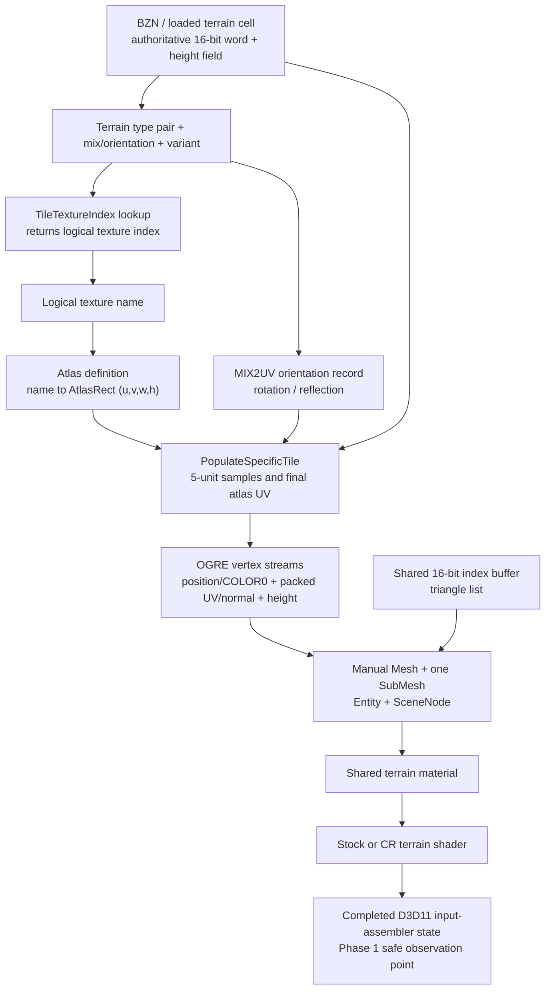

# Battlezone 98 Redux terrain render path

## Phase 1 result

The released Redux renderer can reproduce one stock terrain cluster without
changing gameplay terrain. Its render data is generated from the authoritative
16-bit terrain cell word, packed into three small OGRE vertex streams, and
submitted as one manual mesh/submesh/entity per 320-by-320-world-unit cluster.
The logical tile identity and orientation still exist at CPU construction time,
but only quantized final-atlas UV bytes survive into the D3D11 draw.

Phase 1 adds a disabled-by-default D3D11 observer. It recognizes the completed
terrain input-assembler state, copies one or a few completed buffers through
read-only staging resources, logs a bounded summary, and can write
`terrain_probe.json`. It does not install an executable-address hook, alter
render state, or touch DX9.

The reverse-engineered function names below are semantic labels. Current-build
addresses are included only to make the evidence reproducible; they are not
approved hook addresses.

## End-to-end pipeline



Still unknown: the human-authored meaning/name of every transition lookup entry,
and a stable public OGRE callback that exposes the native zone/cluster coordinate,
material name, and pre-atlas cell word together. Those values are not guessed by
the D3D11 probe.

## Evidence and confidence

The primary static baseline was the released GOG executable with SHA-256
`8d71...7413` (the repository's exact pinned analysis baseline). Repository
notes say settled Steam bytes have matched this executable in the builds checked
so far. Steam still requires post-launch byte validation before any future native
hook is enabled.

The main released-build evidence is in
`reverse_engineering/repo_corpora/bzr_gog_best_effort/ghidrecomp/results/bins/`
`battlezone98redux.exe-6777ca/decomps/`:

- `FUN_007778b0`: zone object construction and the 16 OGRE meshes/entities.
- `FUN_007789a0`: initial mesh population and vertex declaration.
- `FUN_007794f0`: repopulation of dynamic vertex streams and bounds.
- `FUN_00779c20`: terrain-cell lookup, AtlasRect transform, UV/normal/height pack.
- `FUN_0077a650`: manager construction and shared CPU buffer capacities.
- `FUN_0077b000`: zone allocation and 1,280-unit placement.
- `FUN_0077aa50`: atlas-definition parsing and logical-index-to-rect table.
- `FUN_0077c030` / `FUN_0077c130`: shared GPU index/vertex buffer upload.
- `FUN_0077c230` / `FUN_0077c3c0`: shared position and COLOR0 generation.
- `FUN_00780dc0` / `FUN_00780e40`: logical tile and mix lookup from a terrain word.

Private-PDB semantic ranking was refreshed and validated before use. Names such
as `cRenderableZoneCluster::PopulateSpecificTile`,
`cRenderableTileClusterManager::ProcessZones`, `SetClusterNeedsRebuild`, and
`UpdateTerrainHeightMap` are used only as semantic hints corroborated by the
released code's behavior and strings. No leaked-PDB RVA or local-variable storage
location is transferred to the released executable.

The 1.5 executable/PDB decompilation under
`reverse_engineering/decompilation_from_1.5_exe-pdb` was also checked as a
semantic reference. Its named `GetTileTextureIndex` and `GetTileTextureUV`
functions, `mix2UV` table, `AddTerrainPoly`/`AddTerrainSlab` functions, and
terrain-height queries corroborate the legacy logical tile/orientation/UV chain.
Its rendering backend is different, so released Redux code and the live DX11
capture remain authoritative; no 1.5 RVA, layout, or local-variable location is
used by the probe.

## Cluster structure

| Property | Finding |
|---|---|
| Terrain cell size | 20 world units |
| Subdivision | Each normal cell is sampled on a 5-unit grid (5 by 5 subquads) |
| Render cluster | 16 by 16 cells, 320 by 320 world units |
| Zone | 4 by 4 render clusters, 1,280 by 1,280 world units |
| Actual vertex count | 9,409 (97 squared) |
| Actual index count | 38,400 16-bit indices |
| Topology | Triangle list; 6,400 quads / 12,800 triangles |
| CPU/GPU allocations | Exactly 9,409 vertices and 38,400 indices |
| OGRE representation | One manual `Ogre::Mesh`, one `SubMesh`, one `Entity`, and one `SceneNode` per render cluster |
| Entity settings | Shared terrain material, render queue group `0x28`, shadows disabled |
| LOD | No separate terrain LOD representation was found in this construction path |

The generator visits a 17-by-17 set of tile samples. Interior samples contribute
6-by-6 vertices. The outside samples use clipped 3-wide ranges. Tile boundaries
remain duplicated in the vertex sequence, which is important for faithfully
duplicating the index buffer rather than assuming a single welded grid.

Zones are allocated by the manager after map dimensions and origin are known.
Their mesh resources live with the zone object. A renderer-device loss marks the
shared buffers invalid and recreates/repopulates them after restoration.

### Dynamic updates and deformation

Clusters have per-cluster rebuild/update flags. The processing path checks all
16 child clusters in a zone. A full rebuild locks stream 1 and stream 2, reruns
the same `PopulateSpecificTile` sequence, updates the mesh bounds, and clears the
rebuild flag. A second update path refreshes the height stream for height-map
changes. The shared position/COLOR0 stream and shared topology do not need to be
regenerated for ordinary deformation.

Therefore a parallel visual must subscribe to terrain invalidation and refresh
at least height and normals. It must also refresh packed UVs when a terrain tile
or transition changes. Copying a cluster only once at map load would become
visually stale.

## Terrain vertex layout

The OGRE declaration and the D3D11 mapping agree on this three-stream layout:

| Slot / stride | OGRE semantic and type | Bytes | Meaning at construction | Shader interpretation |
|---|---|---:|---|---|
| 0 / 16 | `POSITION`, `VET_FLOAT3` | 0..11 | Local X/Z position; stored Y is 0 | Vertex shader replaces Y with stream-2 height |
| 0 / 16 | `DIFFUSE` (`COLOR0`), `VET_COLOUR` | 12..15 | Static packed RGBA | DX11 uses `R8G8B8A8_UNORM`; CR assigns `vColor = iColor.bgra` |
| 1 / 4 | `BLEND_INDICES`, `VET_UBYTE4` | 0..3 | Quantized atlas U, atlas V, encoded normal X, encoded render-normal Z | `R8G8B8A8_UINT`; UV and normal are reconstructed in the vertex shader |
| 2 / 4 | `TEXCOORD`, index 1, `VET_FLOAT1` | 0..3 | Terrain height multiplied by 0.1 | Becomes final position Y |

For packed bytes `(pu, pv, nx, nz)`, the normal reconstruction is stable but
the final UV center convention belongs to the active vertex program:

```text
stock terrain program: finalAtlasUV = float2(pu, pv) / 160
CR SM4 program:        finalAtlasUV = (float2(pu, pv) + 0.5) / 160
normalXZ     = (float2(nx, nz) - 127) / 127
normalY      = sqrt(saturate(1 - dot(normalXZ, normalXZ)))
renderNormal = float3(normalXZ.x, normalY, normalXZ.y)
```

The CPU stores the source terrain normal's X in byte 2 and its negated Z in
byte 3, matching the render coordinate convention.

### COLOR0 origin

`COLOR0` is produced once in the shared position stream, not read from the BZN
terrain types and not calculated from atlas selection. RGB is always 255. Alpha
is 0 when either local vertex loop coordinate is zero and 255 otherwise. Thus
the two representative byte values are:

```text
[255, 255, 255,   0]  first row or first column of a generated tile patch
[255, 255, 255, 255]  other vertices
```

That condition is proven; its intended artistic semantic is not. It resembles a
seam/overlap mask, but Phase 1 does **not** classify it as terrain material blend
weights. The probe records the real bytes and reports the observed alpha range.

## Logical tile to atlas mapping

Let `w` be the authoritative 16-bit terrain word for a cell. The released code
derives:

```text
typeA       = (w >> 12) & 0xF
typeB       = (w >>  8) & 0xF
mix         = (w >>  4) & 0xF
variant     =  w        & 0x3
lookupIndex = typeA * 64 + typeB * 8 + variant * 2 + ((mix >> 3) & 1)
tileIndex   = TileTextureIndex[lookupIndex]        // uint8 logical index
rect        = AtlasRects[tileIndex]                // float u, v, width, height
orientation = MIX2UV[mix]                          // full 0..15 index
```

The released code indexes all 16 `MIX2UV` records with the complete mix nibble.
Records 0..11 repeat transforms 0..3 in three groups. Records 12..15 use
transforms 5, 6, 7, and 4 in that order. Consequently `mix & 7` is not a valid
general orientation decoder even though it agrees with many cells. The high mix
bit also participates in `lookupIndex` above.

The first eight records, shown as the four normalized rectangle corners
`(bottomLeft, topLeft, topRight, bottomRight)`, are:

| transform | corners |
|---:|---|
| 0 | `(0,1) (0,0) (1,0) (1,1)` |
| 1 | `(0,0) (1,0) (1,1) (0,1)` |
| 2 | `(1,0) (1,1) (0,1) (0,0)` |
| 3 | `(1,1) (0,1) (0,0) (1,0)` |
| 4 | `(1,1) (1,0) (0,0) (0,1)` |
| 5 | `(1,0) (0,0) (0,1) (1,1)` |
| 6 | `(0,0) (0,1) (1,1) (1,0)` |
| 7 | `(0,1) (1,1) (1,0) (0,0)` |

`PopulateSpecificTile` transforms three corners into the AtlasRect, constructs
two affine increments, and evaluates each 5-unit sample. In simplified form:

```text
P00 = rect.xy + orientation.bottomLeft  * rect.wh
P01 = rect.xy + orientation.topLeft     * rect.wh
P10 = rect.xy + orientation.bottomRight * rect.wh

atlasUV(qx, qz) = P00
                  + (qz / 5) * (P01 - P00)
                  + (qx / 5) * (P10 - P00)

packedUV = uint8(atlasUV * 160)          // truncation
shaderUV = active-program convention (packedUV / 160, optionally +0.5 first)
```

There is no separate per-vertex tile index in the finished mesh. UVs are
generated directly in final atlas space. No additional CPU-side padding offset
was found: named atlas definitions control each rect, while the fallback is an
8-by-8 grid of 0.125 rects. Byte quantization is always present in the released
mesh. The optional shader half-step is material-program policy, not part of the
CPU packing contract.

Atlas setup parses named records containing `u,v,w,h`, maps each terrain texture
name to a rect, and fills a 256-entry logical-index vector from the global
16-byte texture-name records. Missing names are logged. If no atlas definition
is available, it constructs the 8-by-8 fallback.

### Recovering `tileIndex + localUV`

Before packing, the exact future representation is already available:

```text
tileIndex   = TileTextureIndex[lookupIndex]
localUV     = float2(qx, qz) / 5
orientation = mix                         // full 0..15 MIX2UV index
atlasRect   = AtlasRects[tileIndex]
```

This is the recommended Phase 2 capture point. Given `atlasRect` and
`orientation`, the affine transform is invertible and local UV can also be
recovered from final UV, subject to the existing 1/160 quantization. Given only
a D3D11 buffer, exact logical identity is ambiguous when rects overlap or are
unknown; the probe therefore emits final UV and raw packed bytes but leaves
`logicalTileIds` null.

## Transition, edge, corner, cap, and diagonal representation

The cell word preserves more information than the final vertex buffer:

- two four-bit terrain codes (`typeA` and `typeB`);
- a four-bit mix value that selects one of 16 `MIX2UV` records;
- a two-bit variant;
- the high mix bit as an additional `TileTextureIndex` lookup selector.

The lookup table combines these fields into one logical texture index. The
current renderer then selects one AtlasRect and samples one already-composited
atlas region. It does not generate special transition geometry and the terrain
pixel shader does not blend two base materials for this legacy path.

The terrain editing code builds a four-neighbor difference mask, rejects
unsupported multi-type combinations, consults two 16-entry mapping tables, and
chooses a rotation/variant. This is strong evidence that diagonal, edge,
corner/cap, rotation, mirror, and randomized variants are encoded by the terrain
word plus lookup table and resolve to precomposited texture entries.

What remains unknown is the authoritative human-readable label for each lookup
entry (for example, exactly which table value means a particular cap shape).
Phase 2 does not need those names to duplicate pixels: it can preserve
`typeA/typeB/mix/variant/tileIndex`. A later array-material translator should
extract and catalogue the runtime `TileTextureIndex` table and terrain texture
name table rather than infer pattern names from atlas pixels.

## OGRE submission and candidate interception points

The construction path is:

```text
terrain word + height/normal queries
  -> cRenderableZoneCluster::PopulateSpecificTile (semantic name)
  -> shared slot-0 VB + per-cluster slot-1/slot-2 VBs + shared 16-bit IB
  -> manual Ogre::Mesh / one SubMesh
  -> Ogre::Entity attached to a child SceneNode
  -> shared terrain material
  -> stock terrain shader or CR_terrain-sm4
  -> completed D3D11 input-assembler state
  -> terrain draw submission
```

Campaign Reimagined preserves this contract. For example,
`Materials/ac_detail_atlas.material` derives `AC_DETAIL_ATLAS` from
`CR_BZTerrainBase` and assigns `achilles_atlas_d.dds` through the `DiffuseMap`
alias. `Shaders/CR_terrain-sm4.hlsl` consumes the exact `POSITION`,
`BLENDINDICES`, `COLOR0`, and `TEXCOORD1` fields described above. It reconstructs
height, normal, and `(packedUV+0.5)/160` before sampling the atlas. The stock
terrain program uses `packedUV/160`; the active program is authoritative. This is a
material/shader extension over the same stock mesh, not a separate CR geometry
path.

No existing OpenShim terrain-construction hook, animated-terrain experiment, or
water-specific terrain proxy was found. The useful reusable infrastructure was
the DX11 diagnostic bootstrap, Ogre material/resource access, and the chunk
visual-proxy SceneManager/Entity/SceneNode path.

| Rank | Candidate | Reliability / state available | Difficulty and compatibility |
|---:|---|---|---|
| 1 | Observe completed cluster buffers at the OGRE mesh/manual-resource boundary, then build a parallel visual | Best balance: exact geometry, native zone/cluster identity, SceneNode transform, material, and rebuild timing should coexist here | Requires a version-validated callback or exported OGRE interface; safest Phase 2 target once one stable seam is proven |
| 2 | Observe the CPU `PopulateSpecificTile` inputs | Only point with exact cell word, logical tile, AtlasRect, mix/orientation, and unquantized local UV | Most useful data but a private native method; requires exact fingerprint, prologue/semantic validation, and a very small guarded hook |
| 3 | Mirror completed hardware-buffer updates | Exact rendered bytes and deformation refreshes; independent of higher-level guesses | Loses logical tile/material identity unless correlated with cluster construction; global OGRE buffer hooks need careful filtering |
| 4 | Observe finished OGRE Entity/Mesh and duplicate it | Stable object/material/transform view and natural stock-visual coexistence | Pre-atlas metadata is already gone; needs buffer readback or a correlation channel |
| 5 | Completed D3D11 input-assembler observation (implemented Phase 1 probe) | Public ABI, no executable address, exact final bytes, easy fail-soft DX11-only behavior | Material/SceneNode/native cluster coordinate and pre-atlas identity are gone; staging readback stalls, so diagnostic only |
| 6 | Replace only the stock material/renderable | Simple eventual visual switch | Too late to recover tile semantics and prematurely suppresses known-good rendering; not appropriate for reconnaissance |

The existing OpenShim chunk visual-proxy work demonstrates that resolving the
OGRE SceneManager, creating a parallel Entity/SceneNode, assigning a material,
and keeping simulation authoritative is viable. Terrain should follow the same
ownership model, but not reuse chunk-specific state or assume an executable
address without validation.

## Implemented terrain probe

The probe extends the existing DX11 diagnostic bootstrap in
`src/patches/dx11_colorspace_diagnostic.cpp`. It reuses renderer-module discovery,
D3D11 device creation observation, COM-vtable patch validation, bounded logging,
and process-lifetime hook ownership.

OGRE binds the vertex and index buffers before setting the primitive topology.
The live Redux DX11 renderer did not expose the terrain submission through the
ordinary context `DrawIndexed` vtable entry, so the primary observation point is
the subsequent public `IASetPrimitiveTopology` call. A direct `DrawIndexed`
observer remains as a fallback. Recognition requires all of the following:

- triangle-list topology;
- vertex slots 0/1/2 with strides 16/4/4 and zero offsets;
- buffers large enough for 9,409 vertices;
- a 16- or 32-bit index buffer large enough for 38,400 indices;
- for the fallback draw observation, `DrawIndexed(38400, 0, 0)`.

This complete signature is intentionally more conservative than matching a
single stride or index count. A distinct slot-1 COM identity is used as the
diagnostic cluster identity. The ordinal is simply first-observed order and is
not a game zone coordinate.

For a matched state, the observer creates staging buffers capped at 4 MiB each,
copies the three vertex streams and index buffer, maps them read-only, samples
summary ranges, and releases every temporary COM object. Rendering continues
unchanged. The observer caps captures at 16 (bounded headroom for stock draws
observed before a Phase 2 overlay is constructed) and distinct identities at
4,096.
Defaults are one JSON capture and no logging at all unless explicitly enabled.

### Configuration

```ini
[Diagnostics]
TerrainRenderProbe = 1
TerrainRenderProbeMaxClusters = 1
TerrainRenderProbeCluster = -1
TerrainRenderProbeDumpJson = 1
```

`OPENSHIM_TERRAIN_RENDER_PROBE=1` is an enable override. A nonnegative
`TerrainRenderProbeCluster` captures only that zero-based observed ordinal and
reduces the capture limit to one.

The output file is beside the game executable:

- one capture or a selected capture: `terrain_probe.json`;
- multiple captures: `terrain_probe_000.json`, `terrain_probe_001.json`, etc.

The JSON schema is `bzr-openshim-terrain-probe-v1`. It contains decoded local
positions, reconstructed shader normals, final atlas UVs, COLOR0 bytes, raw
packed terrain bytes, all submitted indices, expected-submission metadata, and the first eight
bound pixel-shader resources with debug names/descriptors. It explicitly uses
`null` for material name, world position, logical tile IDs, and orientation flags
because those cannot be safely recovered at this boundary.

Representative output from the live `misn04.bzn` DX11 test:

```text
[TERRAIN-PROBE] clusterOrdinal=0 vertexCount=9409 indexCount=38400 topology=triangle-list strides=16/4/4 worldPosition=<unavailable-at-D3D-boundary> material=<unavailable-at-D3D-boundary>
[TERRAIN-PROBE] clusterOrdinal=0 height=[0.000,0.000] finalAtlasUV=[0.128125,0.003125]-[0.503125,0.128125] COLOR0.rgb=static-white COLOR0.alpha=[0,255]
[TERRAIN-PROBE] clusterOrdinal=0 psResourceSlot=0 format=DXGI_FORMAT_BC1_UNORM size=2048x2048
[TERRAIN-PROBE] clusterOrdinal=0 json=written path="...\\terrain_probe.json"
```

The probe was built as x86 Release and launched directly with
`battlezone98redux misn04.bzn -renderer:dx11`. It captured after approximately
eight seconds. The JSON contained 9,409 vertex records and 38,400 indices; the
index range was exactly 0..9,408, all indices were in bounds, the stream strides
were 16/4/4, and five bound pixel-shader resources were described. The captured
file SHA-256 was
`7A376D5555DF0B7B8EED4FF964D332D5D9CFBC5FFC9110E6B45B1ADFDE99F94B`.

## Runtime testing

1. Build x86 Release:

   ```powershell
   & 'C:\Program Files\Microsoft Visual Studio\2022\Community\MSBuild\Current\Bin\MSBuild.exe' BZROpenShim.sln /m /p:Configuration=Release /p:Platform=Win32
   ```

2. Copy the new `bin\Release\winmm.dll` into the Campaign Reimagined canonical
   source `Bin` and deploy through its supported workflow, or run the canonical
   script's `-deploy` action, which refreshes the bundled shim from this repo and
   deploys to the GOG runtime. Do not deploy into Steam's Workshop cache.

3. Put the `[Diagnostics]` block above in `openshim.ini` beside the deployed
   `winmm.dll`. Start BZR with the Direct3D11 renderer and load a terrain map, or
   launch a mission directly:

   ```powershell
   .\battlezone98redux.exe misn04.bzn -renderer:dx11
   ```

4. Confirm `logs\openshim.log` reports the DX11 observer, a matched terrain cluster,
   and `json=written`. Validate the JSON with:

   ```powershell
   Get-Content -Raw 'C:\Program Files (x86)\GOG Galaxy\Games\Battlezone 98 Redux\terrain_probe.json' |
       ConvertFrom-Json | Select-Object schema, clusterOrdinal, vertexCount, indexCount
   ```

5. Spot-check that `vertexCount=9409`, `indexCount=38400`, indices stay below
   9409, packed UV bytes decode using the active shader's `/160` convention, and COLOR0 contains the
   expected white RGB with observed alpha values. Deform terrain and select a
   later cluster ordinal in a second run to confirm the refreshed height/normal
   stream appears.

6. Disable `TerrainRenderProbe` after capture. Staging readback intentionally
   stalls the render thread and is not a shipping telemetry path.

For final Steam verification, upload the validated mod to Workshop, allow Steam
to download item `3686673790`, wait for SteamStub/runtime bytes to settle, and
test the subscribed payload. Never copy development files directly into the
Steam Workshop download cache.

## Phase 2 result

Phase 2 is implemented in `src/patches/terrain_proxy.cpp` and remains strictly
opt-in. It duplicates one completed stock cluster into an OpenShim-named OGRE
mesh/entity/node, leaves the source entity untouched, reuses the source
material, and captures one cluster's pre-atlas CPU semantics. It does not alter
gameplay terrain, physics, collision, the terrain shader, or the atlas.

### Interception seam and safety gates

Two released-build seams are used:

- `FUN_007778b0` at preferred VA `0x007778B0`, after the original zone
  constructor has created and populated all 16 mesh/entity/node triples. This
  is where exact geometry, native identity, material, and transform coexist.
  Its placement-new caller consumes the native constructor's machine-level
  `this` result in EAX, so the detour preserves and returns that value after
  observation.
- `FUN_00778450` at preferred VA `0x00778450`, the zone rebuild dispatcher. The
  hook snapshots the selected cluster's full/height dirty bytes, calls the
  original dispatcher, and only then mirrors the completed dynamic buffers.

The hooks are installed only after all of these checks pass:

- at least one Phase 2 setting is explicitly enabled;
- the main executable SHA-256 is exactly
  `8D71F56C1314E69A8AD38F4EEAF20A8FF825965A84CF196E5F77EA4CC3377413`;
- `OgreMain.dll` SHA-256 is exactly
  `E5E693960B95AD0D60733A3B688464A6C6CBA234E86950698F9C2BEA4ACFEB45`;
- all required OGRE exports resolve;
- both released function entries still begin `55 8B EC 6A FF`;
- each five-byte inline detour and trampoline installs successfully.

The rebuild detour also rejects a null zone pointer before entering stock code,
whose first access is `zone+0x270`. This is a fail-soft corruption backstop and
is not expected to fire in a healthy run.

Any failure logs once and leaves stock rendering active. Phase 2 is initialized
outside the older `g_CompatibleVersion` flag because that legacy flag is never
promoted by the current patcher; the independent full-file hashes and entry-byte
checks are the stronger and actually reachable gate.

### Identity, duplication, and ownership

The zone hook reads the released zone fields at `+0x240/+0x244`, then indexes the
4-by-4 mesh, entity, and SceneNode arrays. It cross-checks those coordinates
against the stock resource name
`RenderableTileCluster_<zoneX>x<zoneZ>_<clusterX>x<clusterZ>` before accepting a
selection. Selection can use construction ordinals or exact native coordinates.

The source entity must expose exactly one triangle-list SubEntity with 9,409
vertices, 38,400 indices, stream strides 16/4/4, and a 16-bit index buffer.
`Ogre::Mesh::clone` then produces the independently named mesh, preserving the
real stock topology, immutable stream 0, dynamic streams 1/2, shared declaration,
and indices. An Entity is created from that mesh, assigned the source SubEntity's
material, queue group `0x28`, shadows disabled, and the configured visibility.
A sibling SceneNode copies source position, orientation, and scale, with the
configured offset added to position. Names use the collision-safe prefix
`OpenShim/TerrainProxy/{Mesh,Entity,Node}/z.../c.../<serial>`.

The existing SceneManager `clearScene` and `destroyAllMovableObjects` observation
hooks notify Phase 2. The SceneManager owns entity/node teardown; Phase 2 removes
its named Mesh resource and forgets all native pointers before another map can be
selected. The clone-return SharedPtr could not be destructed safely across the
Redux/OpenShim CRT boundary when its observed count was one, so one handoff
reference is conservatively retained. This is a bounded one-cluster leak and is
an unresolved cleanup risk, not a reason to risk deleting a live OGRE resource.

### Rebuild and semantic capture

After a selected dirty cluster has been rebuilt by stock code, Phase 2 copies
the completed slot-1 packed UV/normal buffer and slot-2 height buffer into the
proxy with `HardwareBuffer::copyData`, then mirrors mesh bounds, radius, and any
material-name change. A full dirty event also refreshes semantics. Stream 0 and
the index buffer are immutable for ordinary terrain changes and are retained
from the original clone.

Semantic capture is performed at the completed zone seam, but it calls the
released CPU terrain accessors rather than attempting to reverse final D3D UVs.
For each of the selected cluster's 256 cells it records cell and terrain
coordinates, the authoritative word, `typeA`, `typeB`, `mix`, `orientation`,
`variant`, `lookupIndex`, `tileIndex`, and the active `AtlasRect`. The bounded
JSON also records the generated-sample convention `localU=qx/5` and
`localV=qz/5`, for `qx,qz` in 0..5. Output is
`terrain_semantic.json` beside the executable with schema
`bzr-openshim-terrain-semantic-v1`.

One live decoded example from `misn04.bzn`, native zone `(2,2)`, cluster `(1,0)`:

```json
{
  "cellX": 0,
  "cellZ": 0,
  "terrainX": 448,
  "terrainZ": 20096,
  "terrainWord": 4402,
  "typeA": 1,
  "typeB": 1,
  "mix": 3,
  "orientation": 3,
  "variant": 2,
  "lookupIndex": 76,
  "tileIndex": 11,
  "atlasRect": { "u": 0.375, "v": 0.125, "w": 0.125, "h": 0.125 }
}
```

### Configuration

All defaults are off. The environment variables
`OPENSHIM_TERRAIN_PROXY=1` and `OPENSHIM_TERRAIN_SEMANTIC_CAPTURE=1` are enable
overrides.

```ini
[Terrain]
TerrainProxyEnabled = 0
TerrainProxyZone = -1
TerrainProxyCluster = -1
; Optional exact selectors override ordinal-only selection when present:
; TerrainProxyZoneX = 0
; TerrainProxyZoneZ = 0
; TerrainProxyClusterX = 0
; TerrainProxyClusterZ = 0
TerrainProxyOffsetX = 0.0
TerrainProxyOffsetY = 0.0
TerrainProxyOffsetZ = 0.0
TerrainProxyVisible = 1
TerrainSemanticCapture = 0
TerrainSemanticDumpJson = 1
```

`TerrainProxyZone=-1` and `TerrainProxyCluster=-1` choose the first constructed
zone and first matching cluster. Explicit native selectors are preferred for a
repeatable comparison. The stock Entity is never hidden by this subsystem.

### Validation and status

**Proven:**

- A full Win32 Release rebuild succeeded. The 12 compiler warnings from that
  rebuild are existing warnings in unrelated code; subsequent incremental
  builds completed with zero warnings and errors.
- With all new settings absent/off, `misn04.bzn -renderer:dx11` remained alive
  through the test window and emitted no Phase 2 or terrain-probe log records.
- With Phase 2 enabled, both exact hashes and entry bytes validated, native zone
  `(2,2)` / cluster `(1,0)` was selected, and the proxy was created at the exact
  stock transform using material `MA_DETAIL_ATLAS`.
- The existing independent Phase 1 probe captured valid completed terrain draws
  with 9,409 vertices, 38,400 indices, stream strides 16/4/4, and an index range
  of 0..9,408. Observed D3D ordinals could not be correlated reliably to the
  selected stock/proxy pair, so byte-for-byte stock/proxy equality is not
  claimed.
- The stock entity remains present and visible by construction; Phase 2 never
  calls its visibility or destruction APIs.
- A 400-unit X offset produced a distinct proxy node at the expected translated
  position. After correcting constructor return preservation, the mission ran
  for 54 seconds without a crash or null-dispatch warning, then completed a
  normal window-close teardown. The original node was not modified.
- Semantic capture wrote exactly 256 authoritative cell records and the sample
  convention shown above.
- The supplied PID 30112 dump and the follow-up PID 33028 dump traced to the
  initial constructor hook discarding the native EAX return. Redux stores that
  result directly in its 5-by-4 zone table, producing null entries and later
  AVs at `0x007784C0` and `0x00778421`. Returning the original constructor result
  fixes the table corruption; the post-fix run produced no new unhandled crash.

**Observed but not fully proven:**

- The rebuild dispatcher and dirty-byte layout are corroborated by the released
  decompilation. The post-original copy path is installed and ready, but this
  automated run did not trigger a controlled terrain deformation, so live
  height/normal refresh remains unproven.
- A normal window close exercised the `clearScene` integration and logged
  `scene resources released reason=clearScene`. An in-process mission-to-mission
  reload was not completed and is not claimed as equivalent evidence.

**Inferred:**

- `Ogre::Mesh::clone`, matching geometry-contract validation, the reused stock
  material, and the copied transform should produce raster parity under the same
  render state. This remains an inference until a correlated stock/proxy capture
  or framebuffer diff is obtained.

**Still unknown / remaining risks:**

- Runtime deformation mirroring and in-process map reload need interactive
  verification, including the resulting `rebuild mirrored` log. Normal
  `clearScene` release is proven; reload/reselection is not.
- Device-loss/recreation was not forced. Stock device restoration may replace
  buffer objects outside the ordinary dirty path; this requires a dedicated
  test before Phase 2 can be treated as production infrastructure.
- The bounded retained clone-handoff reference described above remains until a
  safe Ogre-module destruction bridge is identified.
- Transition-shape friendly names remain intentionally unknown; captured numeric
  fields are authoritative.

Texture arrays, new terrain formats/shaders, PBR, stock-terrain suppression,
terrain LOD, and gameplay/physics changes remain outside Phase 2.

## Phase 3A result

Phase 3A adds an opt-in semantic atlas renderer to the existing one-cluster
proxy. It still renders the stock atlas and preserves the stock entity. Its
vertex shader no longer uses stream 1's packed `pu,pv` bytes to address that
atlas. Those bytes remain present only as a CPU-validation oracle and for any
untouched auxiliary material techniques.

### Semantic vertex representation

`src/patches/terrain_semantic.cpp` reproduces the released clipped 17-by-17
tile-generation order, including duplicated tile-edge vertices, to produce the
same 9,409-element ordering as the completed stock cluster. Each generated
vertex carries this 28-byte stream in slot 3:

| Offset | OGRE / HLSL input | Value |
|---:|---|---|
| 0 | `TEXCOORD2`, `float2` | Cell-local `localUV = (qx,qz)/5` |
| 8 | `TEXCOORD3`, `ubyte4` / `uint4` | `tileIndex`, full-nibble orientation, `typeA`, `typeB` |
| 12 | `TEXCOORD4`, `float4` | `AtlasRect = (u,v,w,h)` |

The AtlasRect is deliberately repeated per vertex for this proof. This avoids
introducing a second global table ABI before texture-array design while keeping
`tileIndex` explicit as the future lookup/slice key. `mix` and `variant` remain
in the CPU representation for validation and future translation.

The orientation transform uses the full 0..15 `MIX2UV` index described above.
This differs from the original Phase 1 inference and was required for exact
parity. The shader computes:

```text
orientedUV = OpenShimApplyTerrainOrientation(localUV, orientation)
atlasUV    = AtlasRect.xy + orientedUV * AtlasRect.zw
```

### CPU proof

**Proven:** on the live released GOG DX11 build with `misn04.bzn`, the CPU path
reconstructed packed UV bytes solely from cell word fields, the runtime
`TileTextureIndex` lookup, full-nibble `MIX2UV` orientation, AtlasRect, and local
sample coordinates. Readback of stock stream 1 was used only after reconstruction
for comparison:

```text
[TERRAIN-P3-UV] checked=9409 matched=9409 mismatched=0 maxUvErrorBeforeQuantization=0.006249998
```

The exact result also validates the released vertex emission order and the
single-precision multiply/add/truncate sequence. The reported maximum is the
distance from the unquantized semantic coordinate to the lower quantization
edge represented by the stock byte; it is not a packed-byte mismatch.

### Shader and material architecture

The proxy adds a dynamic DX11 slot-3 buffer and clones the selected stock
material (`MA_DETAIL_ATLAS` in `misn04`, `MN_DETAIL_ATLAS` in `misn01`). For each
active DX11 terrain vertex-program delegate, OpenShim creates a separately named
HLSL program from that delegate's source, adds the semantic inputs and
orientation helper, and replaces only the packed-UV assignment. Pixel programs,
textures, atlas binding, lighting, fog, COLOR0 behavior, techniques, passes,
render queue, and the stock position/normal/height streams remain inherited.
The tested materials required 13 unique semantic vertex programs across 109
passes.

This runtime-source specialization is intentional: it preserves the active
material's shader permutations and its sample-center convention. In legacy
quantization mode the semantic shader evaluates `floor(atlasUV*160)` and then
applies the active program's `/160` rule, including `+0.5` only when that source
used it. In experimental unquantized mode it feeds the semantic `atlasUV`
directly. Neither mode reads stock `pu,pv` for texture addressing.

### Configuration

All Phase 3A settings default off. Existing proxy selectors and offsets choose
the semantic cluster and provide both overlay and side-by-side modes.

```ini
[Terrain]
TerrainProxyEnabled = 1
TerrainSemanticRenderer = 0
TerrainSemanticValidateUV = 0
TerrainSemanticLegacyUVQuantization = 1
TerrainSemanticDumpMismatches = 0
TerrainSemanticLifecycleLog = 0
TerrainSemanticDebug = 0
TerrainSemanticFrameCapture = 0
TerrainSemanticFrameCaptureStride = 300
```

`openshim.ini.example` carries the full per-key documentation. Environment
overrides exist for every run-varying key so an automated series does not have
to depend on profile-API write caching:

| Key | Environment override |
|---|---|
| `TerrainProxyEnabled` | `OPENSHIM_TERRAIN_PROXY` |
| `TerrainSemanticRenderer` | `OPENSHIM_TERRAIN_SEMANTIC_RENDERER` |
| `TerrainSemanticValidateUV` | `OPENSHIM_TERRAIN_SEMANTIC_VALIDATE_UV` |
| `TerrainSemanticLegacyUVQuantization` | `OPENSHIM_TERRAIN_SEMANTIC_LEGACY_UV_QUANTIZATION` |
| `TerrainSemanticLifecycleLog` | `OPENSHIM_TERRAIN_SEMANTIC_LIFECYCLE_LOG` |
| `TerrainSemanticDebug` | `OPENSHIM_TERRAIN_SEMANTIC_DEBUG` |
| `TerrainSemanticFrameCapture` | `OPENSHIM_TERRAIN_SEMANTIC_FRAME_CAPTURE` |
| `TerrainSemanticFrameCaptureStride` | `OPENSHIM_TERRAIN_SEMANTIC_FRAME_CAPTURE_STRIDE` |

### Semantic debug visualization

`TerrainSemanticDebug` replaces the shaded color of the semantic proxy cluster
with a false color derived from the slot-3 stream. It is DX11-only, has no
effect unless `TerrainSemanticRenderer = 1`, never touches DX9 or the stock
entity, and leaves geometry, normals, depth, queue order and draw execution
untouched.

| Mode | Name | Output |
|---:|---|---|
| 0 | off | normal semantic rendering |
| 1 | `tileIndex` | deterministic hashed color per runtime tile id |
| 2 | `orientation` | full 0..15 nibble, 16 separated colors |
| 3 | `typeA` | high type nibble, same palette |
| 4 | `typeB` | low type nibble, same palette |
| 5 | `localUV` | post-orientation local UV as red/green gradients |
| 6 | `atlasRect` | AtlasRect origin in red/green, width in blue |
| 7 | `uvDelta` | `|semanticUV - stockPackedUV|` amplified 640x |

The palette gives values 8..15 their own colors rather than aliasing them onto
0..7, so a regression back to `mix & 7` is visible on screen rather than only in
a log. Mode 7 is the in-frame parity check: in legacy quantization mode the
semantic UV and the stock packed UV are the same value, so a correct cluster
renders black. It needs no correlation between separate runs because both
values are computed in the same vertex invocation.

The false color travels through the stock `COLOR0` interpolator. To stop the
pixel program from modulating it with lighting and the atlas sample, debug modes
additionally specialize each pass's fragment program with a single edit that
replaces `oColor.a = vColor.a;` with `oColor = float4(saturate(vColor.xyz), 1.0);`.
Everything else in the inherited fragment program is preserved. If a program
permutation does not expose the expected assignment the specialization is
skipped with a warning and that pass keeps modulated color; rendering never
fails because of a debug mode.

`OPENSHIM_TERRAIN_SEMANTIC_RENDERER=1` and
`OPENSHIM_TERRAIN_SEMANTIC_VALIDATE_UV=1` are enable overrides. The renderer
requires the proxy. If CPU validation is enabled, a mismatch prevents semantic
material installation and leaves the stock-material proxy in place.

### Validation and lifecycle status

**Proven:** both legacy-quantized and unquantized semantic programs compiled,
installed, and rendered an offset `misn01` proxy without OpenShim shader errors.
The legacy-quantized `misn04` run reached normal mission completion. The stock
terrain remained present and visible by construction.

**Observed:** static captures of the offset quantized and unquantized `misn01`
proxy showed the same tile selection and transition orientation, with no obvious
seams or atlas bleeding. A coarse screenshot comparison contained normal
time-dependent frame differences, so it is not a pixel-equivalence proof. No
visible sharpness difference was established, and texture stability in motion
was not tested.

**Inferred:** the 9,409/9,409 packed-byte proof plus a shader transform using the
same inputs is strong evidence for legacy-quantized raster parity. A correlated
stock/proxy draw or controlled framebuffer diff is still required before calling
visual output byte- or pixel-identical.

**Implemented; runtime proof pending:** a
full dirty event regenerates semantic cells and refreshes slot 3 after the stock
rebuild. A height-only event retains slot 3/material state and mirrors only the
existing height/normal path. Semantic programs and the cloned material are
removed through the Phase 2 `clearScene`/teardown owner before mesh-state reset.

## Phase 3A closeout: lifecycle, ownership and parity tooling

This section supersedes the Phase 3A validation notes above where they conflict.
It records what is instrumented, what was actually reproduced on the live build,
and what is still untested. Nothing here changes the rendering design: the
atlas, pixel programs, lighting, fog, `COLOR0`, geometry, transitions and
orientation mapping are unchanged, and the stable path is untouched when the
semantic renderer is off.

### Semantic resource ownership

| Resource | Created by | Owned/destroyed by | Shim identity |
|---|---|---|---|
| slot-3 vertex buffer | `HardwareBufferManager::createVertexBuffer` | the proxy mesh's `VertexBufferBinding`; released when the cloned mesh dies | `vbGeneration` (process-lifetime serial) |
| slot-3 declaration elements | `VertexDeclaration::addElement` | the cloned mesh's shared declaration | audited via `findElementBySemantic` |
| cloned terrain material | `Material::clone` | shim, by name, at teardown or material change | `materialGeneration` |
| specialized vertex/fragment programs | `HighLevelGpuProgramManager::createProgram` | shim, by name, at teardown or material change | names carry both generations |

Resource names embed `proxyGeneration/materialGeneration`, where
`materialGeneration` is a process-lifetime serial. A recreated cluster therefore
cannot collide with a name the resource manager may still hold, which is the
failure mode that a per-proxy-generation name alone would not prevent when the
stock material changes inside one proxy lifetime.

The shim does not destroy the slot-3 buffer itself. Its handoff `SharedPtr`
reference is conservatively retained when the observed count is one, exactly as
for the Phase 2 mesh clone, because the Redux/OpenShim CRT boundary makes that
destruction unsafe. `ReleaseSemanticStreamOwnership` therefore forgets the
identity and records the release rather than freeing memory; retained handoffs
are counted in `totals={...,handoffRetained:N}`. This remains a bounded,
one-cluster leak.

### Update classification and diagnostics

Three update classes are distinguishable in the log, all state-change or
one-shot gated rather than per frame:

```text
[TERRAIN-PROXY] refresh mirrored ... type=full ...        full geometry rebuild
[TERRAIN-P3] terrain_semantic: semantic_rebuild ...       semantic regeneration
[TERRAIN-P3] terrain_semantic: height_update ... retained=1 rebuilt=0
```

The `height_update` record is produced by re-reading slot 3, the declaration and
the active material back out of OGRE after the stock height path has run, and
comparing the resource pointer with the one recorded at creation. Retention is
therefore asserted from engine state, not inferred from shim bookkeeping.

Semantic regeneration hashes the 28-byte GPU payload. When a full dirty event
produces identical tile semantics the existing GPU copy is kept and the upload
is skipped (`semantic_unchanged`, `retained=1`), so semantic data is not
needlessly regenerated when only geometry changed.

Guarded invariants run on every audited transition and log rather than abort:
slot-3 present, stride exactly 28, vertex count at least 9,409, buffer identity
unchanged, `TEXCOORD2/3/4` still sourced from slot 3, active material still the
semantic clone while it is installed, and CPU vertex count exactly 9,409. Per
vertex, generation additionally rejects orientation above 15, a non-finite or
out-of-range `AtlasRect`, and local UV outside 0..1; a failure skips the upload
and leaves the stock material in place.

Shader specialization is reported in the requested form, including reuse:

```text
[TERRAIN-P3] terrain_semantic_shader: material="MA_DETAIL_ATLAS"
clone="OpenShim/TerrainSemantic/Material/1/1" materialGeneration=1
passes=109 specialized_passes=109 semantic_programs=13 created=13 reused=96
debug=off debug_fragment_programs={created:0,reused:0,api:1}
```

A material that yields no compatible DX11 terrain vertex program is marked
unsupported so later dirty events do not clone a fresh material per rebuild.
That flag is cleared if the stock material name itself changes, which is the one
case where a retry is meaningful.

### Parity capture

Two capture mechanisms exist, and they are not equivalent.

`TerrainSemanticFrameCapture` writes full framebuffers through OGRE's own
`RenderTarget::writeContentsToFile` at fixed *rendered world-frame* indices,
counted from the frame the proxy exists. It is driven from the existing legacy
world render-queue detour, so it costs nothing when the count is zero. Because
two runs of the same mission capture the same frame index, the resulting PNGs
are directly differenceable. This is the mechanism to use.

`scripts/Test-TerrainSemanticParity.ps1` drives a series of runs over the modes
`stock`, `packed` (proxy with the stock packed-UV material -- the legacy parity
reference), `quantized`, `unquantized` and `uvdelta`, collects both the engine
captures and wall-clock desktop screenshots, and hands pairs to
`scripts/Compare-TerrainCaptures.ps1`, which reports `different_pixels`,
`different_fraction`, `max_channel_error`, `mean_absolute_error` and `rmse`, and
optionally writes an amplified difference image. `-Region left,top,w,h`
restricts the metrics to terrain so HUD and sky do not count as mismatches.

Limitations, stated plainly: the desktop screenshot path is only wall-clock
aligned and cannot guarantee the same frame; it also captures the lock screen if
the workstation session is locked. Even the engine captures are the same *frame
index*, not the same simulation state, so animation, particles and unit motion
still differ between runs. `TerrainSemanticDebug = 7` is the only exact,
in-frame, per-pixel parity answer available.

### Motion stability procedure

Not a temporal filter and not an automated pass/fail; this is the repeatable
procedure to run by hand:

1. Enable the proxy with a lateral `TerrainProxyOffset` so the semantic cluster
   is visible next to the stock terrain, and set
   `TerrainSemanticFrameCapture = 12`, `TerrainSemanticFrameCaptureStride = 30`.
2. Run the mission twice with the same starting position and the same camera
   path: once with `TerrainSemanticLegacyUVQuantization = 1`, once with `0`.
   Drive the camera slowly across rotated tiles, a transition boundary, a
   high-frequency texture and distant terrain.
3. Difference the two capture sets by index with `Compare-TerrainCaptures.ps1`.
   Frame-to-frame instability that is present in one mode and absent in the
   other shows up as a large `max_channel_error` in tile interiors rather than
   only along silhouettes.
4. Watch for texture swimming, subpixel UV instability, tile-edge shimmer,
   orientation-dependent jitter, and seams that only appear while moving.

`TerrainSemanticLegacyUVQuantization` is read at startup, so switching modes is
a relaunch, not a live toggle.

### What was reproduced on the live build

Run on the pinned GOG DX11 build with Campaign Reimagined and EXU loaded,
`misn04.bzn -renderer:dx11`, Win32 Release shim, hash-verified at deploy.

**Proven in this closeout:**

- CPU reconstruction is still exact, in every mode exercised:
  `checked=9409 matched=9409 mismatched=0 maxUvErrorBeforeQuantization=0.006249998`.
- Slot-3 declaration audit reports
  `declSlot3={localUV:1,semantic:1,atlasRect:1,audited:1}`, i.e. all three
  semantic elements resolve and are sourced from slot 3.
- Creation/bind lifecycle is recorded with stable identities:
  `terrain_semantic: create generation=1 vertices=9409 stride=28 bytes=263452`
  followed by `bind ... slot3=1 stride=28 vertices=9409` and
  `material-installed ... semanticMaterial=1`.
- Specialization is deterministic on `MA_DETAIL_ATLAS` under Campaign
  Reimagined: `passes=109 specialized_passes=109 semantic_programs=13
  created=13 reused=96` in every run, quantized, unquantized and debug.
- Legacy-quantized, unquantized, `TerrainSemanticDebug=2` and
  `TerrainSemanticDebug=7` all compiled, loaded and installed with zero OpenShim
  shader errors and zero new OGRE errors mentioning an OpenShim resource.
- Debug fragment specialization works on the Campaign Reimagined terrain
  material: `debug_fragment_programs={created:28,reused:81,api:1}`.
- The in-process capture writes real 3840x2160 framebuffers at the requested
  render-frame indices (`frame_capture index=N renderFrame=300/600/900`).

**Instrumented but not reproduced:** height-only deformation, a controlled full
tile/transition rebuild, mission A -> B and A -> B -> A recreation, and the
debug modes' actual on-screen color. All of these require getting past the
mission briefing screen, which needs interactive input. The workstation session
was locked for this pass, so every capture landed on the loading or briefing
screen and no terrain pixels were obtained. The lifecycle code paths for these
cases are implemented and logged, but they were not executed.

**Not tested:** device loss and swap-chain recreation. See below.

### Device loss and resource recreation audit

What was inspected: OpenShim installs no device-reset, swap-chain or
`RenderSystem` recreation hook, and none exists in the Phase 2/3A code. The
semantic path holds exactly four kinds of engine-owned state: the slot-3
`HardwareVertexBuffer` (an OGRE `D3D11HardwareVertexBuffer`, written through the
mapped D3D11 buffer), the shared `VertexDeclaration` elements, the cloned
`Material`, and the named `HighLevelGpuProgram`s. All four are ordinary OGRE
resources; OGRE 1.10's D3D11 render system owns their device-side recreation,
and the shim never caches an `ID3D11Buffer*`, view, or device pointer across
calls -- `ReadD3D11VertexBuffer`/`WriteD3D11VertexBuffer` re-resolve the buffer
and re-acquire the device and context on every use, then release them.

Protections that do exist: the binding audit re-reads slot 3 from OGRE and
detects a buffer whose identity changed under the shim, adopts it under a new
`vbGeneration`, invalidates the cached payload hash so the next semantic build
re-uploads, and logs `slot 3 resource replaced by owner`. A lost declaration
element, a lost slot-3 binding, or a silent revert to the packed-UV material are
each reported as a named invariant violation.

What remains untested: no device-loss event was forced, so it is not known
whether Redux's D3D11 render system recreates buffer contents, whether the
dynamic slot-3 buffer comes back empty, or whether the specialized programs
survive a device reset. The residual risk is that after a real device loss the
slot-3 contents are undefined until the next full dirty event triggers a
re-upload. This is documented as an open risk, not as a validated behavior.

### Known remaining limitations

- One retained `SharedPtr` handoff reference per semantic buffer and per mesh
  clone; bounded, one cluster, unresolved.
- The debug false color is injected after the stock `COLOR0` assignment. One of
  the thirteen Campaign Reimagined terrain vertex programs
  (the glow permutation) does not contain that assignment, so its passes keep
  stock coloring; this is logged by program name and does not affect the other
  twelve.
- Campaign Reimagined queues its own OpenShim replacement on game exit, so a
  deployed `winmm.dll` can be silently replaced between test runs. Always verify
  the deployed hash; `Test-TerrainSemanticParity.ps1 -DeployShim` now fails loudly
  if it does not match.
- Writing `[Terrain]` keys with the Windows profile API proved unreliable across
  back-to-back launches; the harness rewrites the section as text instead.
- Transition-shape friendly names remain unknown; numeric transition selection
  and orientation are preserved and authoritative.

**Conclusion:** the semantic bridge's ownership model, identity scheme,
invariants and diagnostics are now in place and the shader/material
specialization is deterministic across repeated installs within a process. The
lifecycle cases that Phase 3A most needed to prove -- height-only retention,
full rebuild replacement, and same-process mission recreation -- are instrumented
but were not executed in this pass, so they remain unproven. No texture-array,
new terrain-format, PBR, stock terrain suppression, LOD, physics, or gameplay
work was added here.

## Phase 3A interactive validation (supersedes the GPU-side claims above)

An interactive pass on the live GOG DX11 build re-ran the closeout on real
gameplay frames. It invalidated part of the record above and found three
defects. Read this section before trusting any GPU-side statement earlier in
this document.

### Stale microcode invalidates the earlier cross-mode comparisons

`src/patches/ogre_shader_cache.cpp` enables Ogre's microcode cache, which is
keyed by **program name**, and its invalidation fingerprint covers only the
mod's shader *files on disk*. The specialized programs are generated at runtime
and formerly used stable names (`OpenShim/TerrainSemantic/Vertex/<gen>/<n>`),
so after their first compile every later run was handed back that microcode
regardless of the source actually set. `setProgramSource` succeeded, the Pass
reported the program bound, and Ogre logged no error -- the only wrong thing was
which microcode the cache returned.

Consequences for the record above:

- Every debug mode rendered the cluster opaque white, because the vertex
  programs came from a cached non-debug compile while the debug fragment
  programs compiled fresh.
- `quantized` and `unquantized` emit identically named programs from different
  source, so a session that compiled one mode could silently reuse it for the
  other. **Any claim that those two modes were observed to render differently is
  unsupported.** The claim that both compiled and installed still holds.

Fixed by hashing the generated source into the program name
(`SourceHashSuffix`). Verified: with a populated cache present, debug mode 2 now
renders the 16-colour palette and mode 7 renders black.

### Two further defects found

- The debug false colour is skipped for a vertex program that lacks the stock
  `vColor = iColor.bgra;` token (the glow permutation), but the matching
  fragment specialization was still applied to those passes. That rewrite
  replaces the whole `oColor` *after* the fog blend, so such a pass emitted
  stock COLOR0 -- opaque, unfogged white -- over the cluster. The fragment
  specialization is now gated on the vertex program having received the colour,
  and the count is reported as `skipped_no_vertex_color`.
- Program binds were credited from the call succeeding. A bind audit now reads
  the program back off the Pass and reports
  `bind audit: vertex={verified,mismatched} fragment={...}`.

### Verified on real gameplay frames

- CPU reconstruction still exact in every mode:
  `checked=9409 matched=9409 mismatched=0 maxUvErrorBeforeQuantization=0.006249998`.
- `TerrainSemanticDebug=7` renders pure black over the cluster: across five
  3840x2160 captures, 4,348,401 cluster pixels, **zero** with a nonzero delta at
  640x amplification. This is the per-pixel packed-vs-semantic parity proof.
- Full-nibble orientation reaches the GPU. Exact framebuffer classification
  against the palette confirms values 1,2,3,4,5,6,10,11,12,13 -- including 12 and
  13, which occupy one cell each out of 256. Since 2,3,4,5 are observed
  simultaneously, a `mix & 7` collapse is excluded. Value 14 was not observed
  (2 cells, never in frame); 0, 7 and 15 are achromatic and cannot be told apart
  from cockpit/HUD pixels, so they are recorded as inconclusive.
- Height-only deformation retains semantics, asserted from engine state:
  `height_update ... retained=1 rebuilt=0` across 8 events, with slot-3 buffer
  identity, `vbGeneration` and payload hash unchanged while `heightHash` changed.
- Disabled path clean: with no `[Terrain]` section, zero terrain records.
- Zero OpenShim errors, zero Ogre errors naming an OpenShim resource, zero new
  crash dumps across the whole session.

### Blocker: in-process mission transition is not observed

Redux changes mission in-process via `RUN_STARTED -> RUN_WAS_BOOKMARK ->
RUN_STARTED`, which never reaches the `clearScene` /
`destroyAllMovableObjects` seams Phase 2 relies on. Those hooks install and then
never fire. `g_proxy.selected` therefore stays true for the life of the process,
and `ObserveZone` early-returns for every zone of every later mission.

Reproduced twice, in two processes, misn04 -> misn03 (different terrain):

- no `teardown-begin`, no `lifecycle released`, no new `selected`, no new proxy;
- **no semantic rendering at all in any mission after the first in a process**;
- the mission-A proxy keeps pointers to destroyed mesh/entity/node. It is inert
  only because the rebuild dispatcher's zone-pointer comparison does not match a
  reallocated zone. If a new zone were allocated at the old address it would
  match and mirror into freed resources.

This blocks mission A -> B -> A, which is an explicit Phase 3B readiness
requirement. A fix needs a reliable "new map" signal, since zone construction
alone cannot distinguish a new map from the remaining zones of the current one.

### Cross-run framebuffer parity is not achievable by hand

Correlated packed-vs-quantized captures were attempted with a hand-driven
camera. The viewpoint cannot be reproduced closely enough: 97-99% of pixels
differed with max channel error 255 on frames whose terrain is identical. These
metrics measure camera mismatch, not terrain, and are recorded as inconclusive
by construction. `TerrainSemanticDebug=7` remains the only exact answer, and it
is unambiguous.

Also note: `Test-TerrainSemanticParity.ps1` sends SPACE on `Waiting For VO` to
skip the briefing. SPACE is a bound in-game action and ends the mission roughly
190 ms after the first frame, so every automated series it produced measured a
mission that had already terminated. It needs a different skip key before it can
be trusted.
