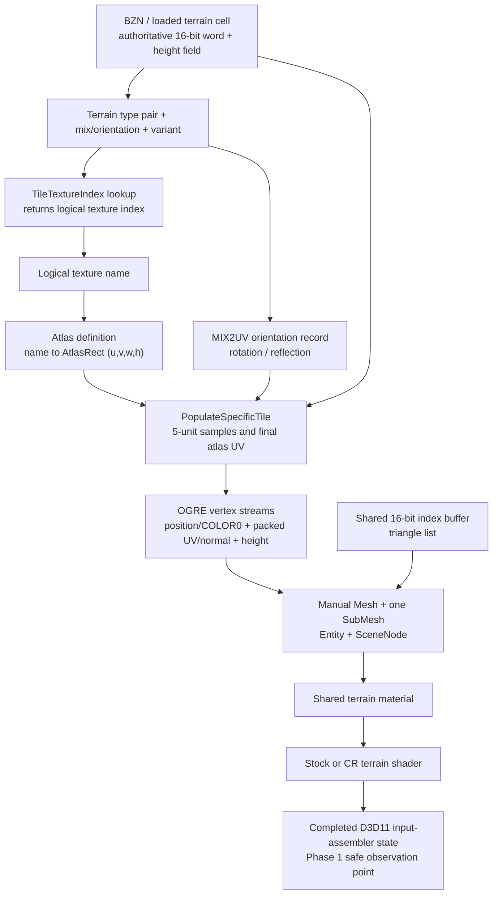

# Battlezone 98 Redux terrain render path

## Phase 1 result

The released Redux renderer can reproduce one stock terrain cluster without
changing gameplay terrain. Its render data is generated from the authoritative
16-bit terrain cell word, packed into three small OGRE vertex streams, and
submitted as one manual mesh/submesh/entity per 320-by-320-world-unit cluster.
The logical tile identity and orientation still exist at CPU construction time,
but only quantized final-atlas UV bytes survive into the D3D11 draw.

Phase 1 adds a disabled-by-default D3D11 observer. It recognizes the completed
terrain input-assembler state, copies one or a few completed buffers through
read-only staging resources, logs a bounded summary, and can write
`terrain_probe.json`. It does not install an executable-address hook, alter
render state, or touch DX9.

The reverse-engineered function names below are semantic labels. Current-build
addresses are included only to make the evidence reproducible; they are not
approved hook addresses.

## End-to-end pipeline



Still unknown: the human-authored meaning/name of every transition lookup entry,
and a stable public OGRE callback that exposes the native zone/cluster coordinate,
material name, and pre-atlas cell word together. Those values are not guessed by
the D3D11 probe.

## Evidence and confidence

The primary static baseline was the released GOG executable with SHA-256
`8d71...7413` (the repository's exact pinned analysis baseline). Repository
notes say settled Steam bytes have matched this executable in the builds checked
so far. Steam still requires post-launch byte validation before any future native
hook is enabled.

The main released-build evidence is in
`reverse_engineering/repo_corpora/bzr_gog_best_effort/ghidrecomp/results/bins/`
`battlezone98redux.exe-6777ca/decomps/`:

- `FUN_007778b0`: zone object construction and the 16 OGRE meshes/entities.
- `FUN_007789a0`: initial mesh population and vertex declaration.
- `FUN_007794f0`: repopulation of dynamic vertex streams and bounds.
- `FUN_00779c20`: terrain-cell lookup, AtlasRect transform, UV/normal/height pack.
- `FUN_0077a650`: manager construction and shared CPU buffer capacities.
- `FUN_0077b000`: zone allocation and 1,280-unit placement.
- `FUN_0077aa50`: atlas-definition parsing and logical-index-to-rect table.
- `FUN_0077c030` / `FUN_0077c130`: shared GPU index/vertex buffer upload.
- `FUN_0077c230` / `FUN_0077c3c0`: shared position and COLOR0 generation.
- `FUN_00780dc0` / `FUN_00780e40`: logical tile and mix lookup from a terrain word.

Private-PDB semantic ranking was refreshed and validated before use. Names such
as `cRenderableZoneCluster::PopulateSpecificTile`,
`cRenderableTileClusterManager::ProcessZones`, `SetClusterNeedsRebuild`, and
`UpdateTerrainHeightMap` are used only as semantic hints corroborated by the
released code's behavior and strings. No leaked-PDB RVA or local-variable storage
location is transferred to the released executable.

The 1.5 executable/PDB decompilation under
`reverse_engineering/decompilation_from_1.5_exe-pdb` was also checked as a
semantic reference. Its named `GetTileTextureIndex` and `GetTileTextureUV`
functions, `mix2UV` table, `AddTerrainPoly`/`AddTerrainSlab` functions, and
terrain-height queries corroborate the legacy logical tile/orientation/UV chain.
Its rendering backend is different, so released Redux code and the live DX11
capture remain authoritative; no 1.5 RVA, layout, or local-variable location is
used by the probe.

## Cluster structure

| Property | Finding |
|---|---|
| Terrain cell size | 20 world units |
| Subdivision | Each normal cell is sampled on a 5-unit grid (5 by 5 subquads) |
| Render cluster | 16 by 16 cells, 320 by 320 world units |
| Zone | 4 by 4 render clusters, 1,280 by 1,280 world units |
| Actual vertex count | 9,409 (97 squared) |
| Actual index count | 38,400 16-bit indices |
| Topology | Triangle list; 6,400 quads / 12,800 triangles |
| CPU/GPU allocations | Exactly 9,409 vertices and 38,400 indices |
| OGRE representation | One manual `Ogre::Mesh`, one `SubMesh`, one `Entity`, and one `SceneNode` per render cluster |
| Entity settings | Shared terrain material, render queue group `0x28`, shadows disabled |
| LOD | No separate terrain LOD representation was found in this construction path |

The generator visits a 17-by-17 set of tile samples. Interior samples contribute
6-by-6 vertices. The outside samples use clipped 3-wide ranges. Tile boundaries
remain duplicated in the vertex sequence, which is important for faithfully
duplicating the index buffer rather than assuming a single welded grid.

Zones are allocated by the manager after map dimensions and origin are known.
Their mesh resources live with the zone object. A renderer-device loss marks the
shared buffers invalid and recreates/repopulates them after restoration.

### Dynamic updates and deformation

Clusters have per-cluster rebuild/update flags. The processing path checks all
16 child clusters in a zone. A full rebuild locks stream 1 and stream 2, reruns
the same `PopulateSpecificTile` sequence, updates the mesh bounds, and clears the
rebuild flag. A second update path refreshes the height stream for height-map
changes. The shared position/COLOR0 stream and shared topology do not need to be
regenerated for ordinary deformation.

Therefore a parallel visual must subscribe to terrain invalidation and refresh
at least height and normals. It must also refresh packed UVs when a terrain tile
or transition changes. Copying a cluster only once at map load would become
visually stale.

## Terrain vertex layout

The OGRE declaration and the D3D11 mapping agree on this three-stream layout:

| Slot / stride | OGRE semantic and type | Bytes | Meaning at construction | Shader interpretation |
|---|---|---:|---|---|
| 0 / 16 | `POSITION`, `VET_FLOAT3` | 0..11 | Local X/Z position; stored Y is 0 | Vertex shader replaces Y with stream-2 height |
| 0 / 16 | `DIFFUSE` (`COLOR0`), `VET_COLOUR` | 12..15 | Static packed RGBA | DX11 uses `R8G8B8A8_UNORM`; CR assigns `vColor = iColor.bgra` |
| 1 / 4 | `BLEND_INDICES`, `VET_UBYTE4` | 0..3 | Quantized atlas U, atlas V, encoded normal X, encoded render-normal Z | `R8G8B8A8_UINT`; UV and normal are reconstructed in the vertex shader |
| 2 / 4 | `TEXCOORD`, index 1, `VET_FLOAT1` | 0..3 | Terrain height multiplied by 0.1 | Becomes final position Y |

For packed bytes `(pu, pv, nx, nz)`, the normal reconstruction is stable but
the final UV center convention belongs to the active vertex program:

```text
stock terrain program: finalAtlasUV = float2(pu, pv) / 160
CR SM4 program:        finalAtlasUV = (float2(pu, pv) + 0.5) / 160
normalXZ     = (float2(nx, nz) - 127) / 127
normalY      = sqrt(saturate(1 - dot(normalXZ, normalXZ)))
renderNormal = float3(normalXZ.x, normalY, normalXZ.y)
```

The CPU stores the source terrain normal's X in byte 2 and its negated Z in
byte 3, matching the render coordinate convention.

### COLOR0 origin

`COLOR0` is produced once in the shared position stream, not read from the BZN
terrain types and not calculated from atlas selection. RGB is always 255. Alpha
is 0 when either local vertex loop coordinate is zero and 255 otherwise. Thus
the two representative byte values are:

```text
[255, 255, 255,   0]  first row or first column of a generated tile patch
[255, 255, 255, 255]  other vertices
```

That condition is proven; its intended artistic semantic is not. It resembles a
seam/overlap mask, but Phase 1 does **not** classify it as terrain material blend
weights. The probe records the real bytes and reports the observed alpha range.

### Per-map seam alpha control

OpenShim can remap that proven seam alpha mask per map without replacing the
terrain material or any shader. Add this optional section to the map's TRN:

```ini
[OpenShim]
TerrainTileBlend=0.0
```

`TerrainTileBlend` is clamped to `0.0..1.0`. The default `1.0` preserves Redux's
stock seam alpha (`0` at the first row/column and `255` elsewhere); `0.0` makes
those seam vertices fully opaque for hard-edged synthetic tiles. Intermediate
values weaken the fade by setting seam alpha to
`round((1 - TerrainTileBlend) * 255)`. Because the existing COLOR0 stream is
shared by the stock and enhanced terrain shaders, no per-shader permutation is
required.

This setting controls only the geometric seam fade. Terrain-type transitions
inside an atlas tile are precomposited artwork selected by the 16-bit terrain
word, so this value cannot sharpen or remove those baked transitions. The
initial runtime path uses the already-validated fixed-base GOG mission-lifecycle
seam; other builds retain stock behavior until an equivalent lifecycle seam is
validated.

## Logical tile to atlas mapping

Let `w` be the authoritative 16-bit terrain word for a cell. The released code
derives:

```text
typeA       = (w >> 12) & 0xF
typeB       = (w >>  8) & 0xF
mix         = (w >>  4) & 0xF
variant     =  w        & 0x3
lookupIndex = typeA * 64 + typeB * 8 + variant * 2 + ((mix >> 3) & 1)
tileIndex   = TileTextureIndex[lookupIndex]        // uint8 logical index
rect        = AtlasRects[tileIndex]                // float u, v, width, height
orientation = MIX2UV[mix]                          // full 0..15 index
```

The released code indexes all 16 `MIX2UV` records with the complete mix nibble.
Records 0..11 repeat transforms 0..3 in three groups. Records 12..15 use
transforms 5, 6, 7, and 4 in that order. Consequently `mix & 7` is not a valid
general orientation decoder even though it agrees with many cells. The high mix
bit also participates in `lookupIndex` above.

The first eight records, shown as the four normalized rectangle corners
`(bottomLeft, topLeft, topRight, bottomRight)`, are:

| transform | corners |
|---:|---|
| 0 | `(0,1) (0,0) (1,0) (1,1)` |
| 1 | `(0,0) (1,0) (1,1) (0,1)` |
| 2 | `(1,0) (1,1) (0,1) (0,0)` |
| 3 | `(1,1) (0,1) (0,0) (1,0)` |
| 4 | `(1,1) (1,0) (0,0) (0,1)` |
| 5 | `(1,0) (0,0) (0,1) (1,1)` |
| 6 | `(0,0) (0,1) (1,1) (1,0)` |
| 7 | `(0,1) (1,1) (1,0) (0,0)` |

`PopulateSpecificTile` transforms three corners into the AtlasRect, constructs
two affine increments, and evaluates each 5-unit sample. In simplified form:

```text
P00 = rect.xy + orientation.bottomLeft  * rect.wh
P01 = rect.xy + orientation.topLeft     * rect.wh
P10 = rect.xy + orientation.bottomRight * rect.wh

atlasUV(qx, qz) = P00
                  + (qz / 5) * (P01 - P00)
                  + (qx / 5) * (P10 - P00)

packedUV = uint8(atlasUV * 160)          // truncation
shaderUV = active-program convention (packedUV / 160, optionally +0.5 first)
```

There is no separate per-vertex tile index in the finished mesh. UVs are
generated directly in final atlas space. No additional CPU-side padding offset
was found: named atlas definitions control each rect, while the fallback is an
8-by-8 grid of 0.125 rects. Byte quantization is always present in the released
mesh. The optional shader half-step is material-program policy, not part of the
CPU packing contract.

Atlas setup parses named records containing `u,v,w,h`, maps each terrain texture
name to a rect, and fills a 256-entry logical-index vector from the global
16-byte texture-name records. Missing names are logged. If no atlas definition
is available, it constructs the 8-by-8 fallback.

### Recovering `tileIndex + localUV`

Before packing, the exact future representation is already available:

```text
tileIndex   = TileTextureIndex[lookupIndex]
localUV     = float2(qx, qz) / 5
orientation = mix                         // full 0..15 MIX2UV index
atlasRect   = AtlasRects[tileIndex]
```

This is the recommended Phase 2 capture point. Given `atlasRect` and
`orientation`, the affine transform is invertible and local UV can also be
recovered from final UV, subject to the existing 1/160 quantization. Given only
a D3D11 buffer, exact logical identity is ambiguous when rects overlap or are
unknown; the probe therefore emits final UV and raw packed bytes but leaves
`logicalTileIds` null.

## Transition, edge, corner, cap, and diagonal representation

The cell word preserves more information than the final vertex buffer:

- two four-bit terrain codes (`typeA` and `typeB`);
- a four-bit mix value that selects one of 16 `MIX2UV` records;
- a two-bit variant;
- the high mix bit as an additional `TileTextureIndex` lookup selector.

The lookup table combines these fields into one logical texture index. The
current renderer then selects one AtlasRect and samples one already-composited
atlas region. It does not generate special transition geometry and the terrain
pixel shader does not blend two base materials for this legacy path.

The terrain editing code builds a four-neighbor difference mask, rejects
unsupported multi-type combinations, consults two 16-entry mapping tables, and
chooses a rotation/variant. This is strong evidence that diagonal, edge,
corner/cap, rotation, mirror, and randomized variants are encoded by the terrain
word plus lookup table and resolve to precomposited texture entries.

What remains unknown is the authoritative human-readable label for each lookup
entry (for example, exactly which table value means a particular cap shape).
Phase 2 does not need those names to duplicate pixels: it can preserve
`typeA/typeB/mix/variant/tileIndex`. A later array-material translator should
extract and catalogue the runtime `TileTextureIndex` table and terrain texture
name table rather than infer pattern names from atlas pixels.

## OGRE submission and candidate interception points

The construction path is:

```text
terrain word + height/normal queries
  -> cRenderableZoneCluster::PopulateSpecificTile (semantic name)
  -> shared slot-0 VB + per-cluster slot-1/slot-2 VBs + shared 16-bit IB
  -> manual Ogre::Mesh / one SubMesh
  -> Ogre::Entity attached to a child SceneNode
  -> shared terrain material
  -> stock terrain shader or CR_terrain-sm4
  -> completed D3D11 input-assembler state
  -> terrain draw submission
```

Campaign Reimagined preserves this contract. For example,
`Materials/ac_detail_atlas.material` derives `AC_DETAIL_ATLAS` from
`CR_BZTerrainBase` and assigns `achilles_atlas_d.dds` through the `DiffuseMap`
alias. `Shaders/CR_terrain-sm4.hlsl` consumes the exact `POSITION`,
`BLENDINDICES`, `COLOR0`, and `TEXCOORD1` fields described above. It reconstructs
height, normal, and `(packedUV+0.5)/160` before sampling the atlas. The stock
terrain program uses `packedUV/160`; the active program is authoritative. This is a
material/shader extension over the same stock mesh, not a separate CR geometry
path.

No existing OpenShim terrain-construction hook, animated-terrain experiment, or
water-specific terrain proxy was found. The useful reusable infrastructure was
the DX11 diagnostic bootstrap, Ogre material/resource access, and the chunk
visual-proxy SceneManager/Entity/SceneNode path.

| Rank | Candidate | Reliability / state available | Difficulty and compatibility |
|---:|---|---|---|
| 1 | Observe completed cluster buffers at the OGRE mesh/manual-resource boundary, then build a parallel visual | Best balance: exact geometry, native zone/cluster identity, SceneNode transform, material, and rebuild timing should coexist here | Requires a version-validated callback or exported OGRE interface; safest Phase 2 target once one stable seam is proven |
| 2 | Observe the CPU `PopulateSpecificTile` inputs | Only point with exact cell word, logical tile, AtlasRect, mix/orientation, and unquantized local UV | Most useful data but a private native method; requires exact fingerprint, prologue/semantic validation, and a very small guarded hook |
| 3 | Mirror completed hardware-buffer updates | Exact rendered bytes and deformation refreshes; independent of higher-level guesses | Loses logical tile/material identity unless correlated with cluster construction; global OGRE buffer hooks need careful filtering |
| 4 | Observe finished OGRE Entity/Mesh and duplicate it | Stable object/material/transform view and natural stock-visual coexistence | Pre-atlas metadata is already gone; needs buffer readback or a correlation channel |
| 5 | Completed D3D11 input-assembler observation (implemented Phase 1 probe) | Public ABI, no executable address, exact final bytes, easy fail-soft DX11-only behavior | Material/SceneNode/native cluster coordinate and pre-atlas identity are gone; staging readback stalls, so diagnostic only |
| 6 | Replace only the stock material/renderable | Simple eventual visual switch | Too late to recover tile semantics and prematurely suppresses known-good rendering; not appropriate for reconnaissance |

The existing OpenShim chunk visual-proxy work demonstrates that resolving the
OGRE SceneManager, creating a parallel Entity/SceneNode, assigning a material,
and keeping simulation authoritative is viable. Terrain should follow the same
ownership model, but not reuse chunk-specific state or assume an executable
address without validation.

## Implemented terrain probe

The probe extends the existing DX11 diagnostic bootstrap in
`src/patches/dx11_colorspace_diagnostic.cpp`. It reuses renderer-module discovery,
D3D11 device creation observation, COM-vtable patch validation, bounded logging,
and process-lifetime hook ownership.

OGRE binds the vertex and index buffers before setting the primitive topology.
The live Redux DX11 renderer did not expose the terrain submission through the
ordinary context `DrawIndexed` vtable entry, so the primary observation point is
the subsequent public `IASetPrimitiveTopology` call. A direct `DrawIndexed`
observer remains as a fallback. Recognition requires all of the following:

- triangle-list topology;
- vertex slots 0/1/2 with strides 16/4/4 and zero offsets;
- buffers large enough for 9,409 vertices;
- a 16- or 32-bit index buffer large enough for 38,400 indices;
- for the fallback draw observation, `DrawIndexed(38400, 0, 0)`.

This complete signature is intentionally more conservative than matching a
single stride or index count. A distinct slot-1 COM identity is used as the
diagnostic cluster identity. The ordinal is simply first-observed order and is
not a game zone coordinate.

For a matched state, the observer creates staging buffers capped at 4 MiB each,
copies the three vertex streams and index buffer, maps them read-only, samples
summary ranges, and releases every temporary COM object. Rendering continues
unchanged. The observer caps captures at 16 (bounded headroom for stock draws
observed before a Phase 2 overlay is constructed) and distinct identities at
4,096.
Defaults are one JSON capture and no logging at all unless explicitly enabled.

### Configuration

```ini
[Diagnostics]
TerrainRenderProbe = 1
TerrainRenderProbeMaxClusters = 1
TerrainRenderProbeCluster = -1
TerrainRenderProbeDumpJson = 1
```

`OPENSHIM_TERRAIN_RENDER_PROBE=1` is an enable override. A nonnegative
`TerrainRenderProbeCluster` captures only that zero-based observed ordinal and
reduces the capture limit to one.

The output file is beside the game executable:

- one capture or a selected capture: `terrain_probe.json`;
- multiple captures: `terrain_probe_000.json`, `terrain_probe_001.json`, etc.

The JSON schema is `bzr-openshim-terrain-probe-v1`. It contains decoded local
positions, reconstructed shader normals, final atlas UVs, COLOR0 bytes, raw
packed terrain bytes, all submitted indices, expected-submission metadata, and the first eight
bound pixel-shader resources with debug names/descriptors. It explicitly uses
`null` for material name, world position, logical tile IDs, and orientation flags
because those cannot be safely recovered at this boundary.

Representative output from the live `misn04.bzn` DX11 test:

```text
[TERRAIN-PROBE] clusterOrdinal=0 vertexCount=9409 indexCount=38400 topology=triangle-list strides=16/4/4 worldPosition=<unavailable-at-D3D-boundary> material=<unavailable-at-D3D-boundary>
[TERRAIN-PROBE] clusterOrdinal=0 height=[0.000,0.000] finalAtlasUV=[0.128125,0.003125]-[0.503125,0.128125] COLOR0.rgb=static-white COLOR0.alpha=[0,255]
[TERRAIN-PROBE] clusterOrdinal=0 psResourceSlot=0 format=DXGI_FORMAT_BC1_UNORM size=2048x2048
[TERRAIN-PROBE] clusterOrdinal=0 json=written path="...\\terrain_probe.json"
```

The probe was built as x86 Release and launched directly with
`battlezone98redux misn04.bzn -renderer:dx11`. It captured after approximately
eight seconds. The JSON contained 9,409 vertex records and 38,400 indices; the
index range was exactly 0..9,408, all indices were in bounds, the stream strides
were 16/4/4, and five bound pixel-shader resources were described. The captured
file SHA-256 was
`7A376D5555DF0B7B8EED4FF964D332D5D9CFBC5FFC9110E6B45B1ADFDE99F94B`.

## Runtime testing

1. Build x86 Release:

   ```powershell
   & 'C:\Program Files\Microsoft Visual Studio\2022\Community\MSBuild\Current\Bin\MSBuild.exe' BZROpenShim.sln /m /p:Configuration=Release /p:Platform=Win32
   ```

2. Copy the new `bin\Release\winmm.dll` into the Campaign Reimagined canonical
   source `Bin` and deploy through its supported workflow, or run the canonical
   script's `-deploy` action, which refreshes the bundled shim from this repo and
   deploys to the GOG runtime. Do not deploy into Steam's Workshop cache.

3. Put the `[Diagnostics]` block above in `openshim.ini` beside the deployed
   `winmm.dll`. Start BZR with the Direct3D11 renderer and load a terrain map, or
   launch a mission directly:

   ```powershell
   .\battlezone98redux.exe misn04.bzn -renderer:dx11
   ```

4. Confirm `logs\openshim.log` reports the DX11 observer, a matched terrain cluster,
   and `json=written`. Validate the JSON with:

   ```powershell
   Get-Content -Raw 'C:\Program Files (x86)\GOG Galaxy\Games\Battlezone 98 Redux\terrain_probe.json' |
       ConvertFrom-Json | Select-Object schema, clusterOrdinal, vertexCount, indexCount
   ```

5. Spot-check that `vertexCount=9409`, `indexCount=38400`, indices stay below
   9409, packed UV bytes decode using the active shader's `/160` convention, and COLOR0 contains the
   expected white RGB with observed alpha values. Deform terrain and select a
   later cluster ordinal in a second run to confirm the refreshed height/normal
   stream appears.

6. Disable `TerrainRenderProbe` after capture. Staging readback intentionally
   stalls the render thread and is not a shipping telemetry path.

For final Steam verification, upload the validated mod to Workshop, allow Steam
to download item `3686673790`, wait for SteamStub/runtime bytes to settle, and
test the subscribed payload. Never copy development files directly into the
Steam Workshop download cache.

## Phase 2 result

Phase 2 is implemented in `src/patches/terrain_proxy.cpp` and remains strictly
opt-in. It duplicates one completed stock cluster into an OpenShim-named OGRE
mesh/entity/node, leaves the source entity untouched, reuses the source
material, and captures one cluster's pre-atlas CPU semantics. It does not alter
gameplay terrain, physics, collision, the terrain shader, or the atlas.

### Interception seam and safety gates

Two released-build seams are used:

- `FUN_007778b0` at preferred VA `0x007778B0`, after the original zone
  constructor has created and populated all 16 mesh/entity/node triples. This
  is where exact geometry, native identity, material, and transform coexist.
  Its placement-new caller consumes the native constructor's machine-level
  `this` result in EAX, so the detour preserves and returns that value after
  observation.
- `FUN_00778450` at preferred VA `0x00778450`, the zone rebuild dispatcher. The
  hook snapshots the selected cluster's full/height dirty bytes, calls the
  original dispatcher, and only then mirrors the completed dynamic buffers.

The hooks are installed only after all of these checks pass:

- at least one Phase 2 setting is explicitly enabled;
- the main executable SHA-256 is exactly
  `8D71F56C1314E69A8AD38F4EEAF20A8FF825965A84CF196E5F77EA4CC3377413`;
- `OgreMain.dll` SHA-256 is exactly
  `E5E693960B95AD0D60733A3B688464A6C6CBA234E86950698F9C2BEA4ACFEB45`;
- all required OGRE exports resolve;
- both released function entries still begin `55 8B EC 6A FF`;
- each five-byte inline detour and trampoline installs successfully.

The rebuild detour also rejects a null zone pointer before entering stock code,
whose first access is `zone+0x270`. This is a fail-soft corruption backstop and
is not expected to fire in a healthy run.

Any failure logs once and leaves stock rendering active. Phase 2 is initialized
outside the older `g_CompatibleVersion` flag because that legacy flag is never
promoted by the current patcher; the independent full-file hashes and entry-byte
checks are the stronger and actually reachable gate.

### Identity, duplication, and ownership

The zone hook reads the released zone fields at `+0x240/+0x244`, then indexes the
4-by-4 mesh, entity, and SceneNode arrays. It cross-checks those coordinates
against the stock resource name
`RenderableTileCluster_<zoneX>x<zoneZ>_<clusterX>x<clusterZ>` before accepting a
selection. Selection can use construction ordinals or exact native coordinates.

The source entity must expose exactly one triangle-list SubEntity with 9,409
vertices, 38,400 indices, stream strides 16/4/4, and a 16-bit index buffer.
`Ogre::Mesh::clone` then produces the independently named mesh, preserving the
real stock topology, immutable stream 0, dynamic streams 1/2, shared declaration,
and indices. An Entity is created from that mesh, assigned the source SubEntity's
material, queue group `0x28`, shadows disabled, and the configured visibility.
A sibling SceneNode copies source position, orientation, and scale, with the
configured offset added to position. Names use the collision-safe prefix
`OpenShim/TerrainProxy/{Mesh,Entity,Node}/z.../c.../<serial>`.

The existing SceneManager `clearScene` and `destroyAllMovableObjects` observation
hooks notify Phase 2. The SceneManager owns entity/node teardown; Phase 2 removes
its named Mesh resource and forgets all native pointers before another map can be
selected. The clone-return SharedPtr could not be destructed safely across the
Redux/OpenShim CRT boundary when its observed count was one, so one handoff
reference is conservatively retained. This is a bounded one-cluster leak and is
an unresolved cleanup risk, not a reason to risk deleting a live OGRE resource.

### Rebuild and semantic capture

After a selected dirty cluster has been rebuilt by stock code, Phase 2 copies
the completed slot-1 packed UV/normal buffer and slot-2 height buffer into the
proxy with `HardwareBuffer::copyData`, then mirrors mesh bounds, radius, and any
material-name change. A full dirty event also refreshes semantics. Stream 0 and
the index buffer are immutable for ordinary terrain changes and are retained
from the original clone.

Semantic capture is performed at the completed zone seam, but it calls the
released CPU terrain accessors rather than attempting to reverse final D3D UVs.
For each of the selected cluster's 256 cells it records cell and terrain
coordinates, the authoritative word, `typeA`, `typeB`, `mix`, `orientation`,
`variant`, `lookupIndex`, `tileIndex`, and the active `AtlasRect`. The bounded
JSON also records the generated-sample convention `localU=qx/5` and
`localV=qz/5`, for `qx,qz` in 0..5. Output is
`terrain_semantic.json` beside the executable with schema
`bzr-openshim-terrain-semantic-v1`.

One live decoded example from `misn04.bzn`, native zone `(2,2)`, cluster `(1,0)`:

```json
{
  "cellX": 0,
  "cellZ": 0,
  "terrainX": 448,
  "terrainZ": 20096,
  "terrainWord": 4402,
  "typeA": 1,
  "typeB": 1,
  "mix": 3,
  "orientation": 3,
  "variant": 2,
  "lookupIndex": 76,
  "tileIndex": 11,
  "atlasRect": { "u": 0.375, "v": 0.125, "w": 0.125, "h": 0.125 }
}
```

### Configuration

All defaults are off. The environment variables
`OPENSHIM_TERRAIN_PROXY=1` and `OPENSHIM_TERRAIN_SEMANTIC_CAPTURE=1` are enable
overrides.

```ini
[Terrain]
TerrainProxyEnabled = 0
TerrainProxyZone = -1
TerrainProxyCluster = -1
; Optional exact selectors override ordinal-only selection when present:
; TerrainProxyZoneX = 0
; TerrainProxyZoneZ = 0
; TerrainProxyClusterX = 0
; TerrainProxyClusterZ = 0
TerrainProxyOffsetX = 0.0
TerrainProxyOffsetY = 0.0
TerrainProxyOffsetZ = 0.0
TerrainProxyVisible = 1
TerrainSemanticCapture = 0
TerrainSemanticDumpJson = 1
```

`TerrainProxyZone=-1` and `TerrainProxyCluster=-1` choose the first constructed
zone and first matching cluster. Explicit native selectors are preferred for a
repeatable comparison. The stock Entity is never hidden by this subsystem.

### Validation and status

**Proven:**

- A full Win32 Release rebuild succeeded. The 12 compiler warnings from that
  rebuild are existing warnings in unrelated code; subsequent incremental
  builds completed with zero warnings and errors.
- With all new settings absent/off, `misn04.bzn -renderer:dx11` remained alive
  through the test window and emitted no Phase 2 or terrain-probe log records.
- With Phase 2 enabled, both exact hashes and entry bytes validated, native zone
  `(2,2)` / cluster `(1,0)` was selected, and the proxy was created at the exact
  stock transform using material `MA_DETAIL_ATLAS`.
- The existing independent Phase 1 probe captured valid completed terrain draws
  with 9,409 vertices, 38,400 indices, stream strides 16/4/4, and an index range
  of 0..9,408. Observed D3D ordinals could not be correlated reliably to the
  selected stock/proxy pair, so byte-for-byte stock/proxy equality is not
  claimed.
- The stock entity remains present and visible by construction; Phase 2 never
  calls its visibility or destruction APIs.
- A 400-unit X offset produced a distinct proxy node at the expected translated
  position. After correcting constructor return preservation, the mission ran
  for 54 seconds without a crash or null-dispatch warning, then completed a
  normal window-close teardown. The original node was not modified.
- Semantic capture wrote exactly 256 authoritative cell records and the sample
  convention shown above.
- The supplied PID 30112 dump and the follow-up PID 33028 dump traced to the
  initial constructor hook discarding the native EAX return. Redux stores that
  result directly in its 5-by-4 zone table, producing null entries and later
  AVs at `0x007784C0` and `0x00778421`. Returning the original constructor result
  fixes the table corruption; the post-fix run produced no new unhandled crash.

**Observed but not fully proven:**

- The rebuild dispatcher and dirty-byte layout are corroborated by the released
  decompilation. The post-original copy path is installed and ready, but this
  automated run did not trigger a controlled terrain deformation, so live
  height/normal refresh remains unproven.
- A normal window close exercised the `clearScene` integration and logged
  `scene resources released reason=clearScene`. An in-process mission-to-mission
  reload was not completed and is not claimed as equivalent evidence.

**Inferred:**

- `Ogre::Mesh::clone`, matching geometry-contract validation, the reused stock
  material, and the copied transform should produce raster parity under the same
  render state. This remains an inference until a correlated stock/proxy capture
  or framebuffer diff is obtained.

**Still unknown / remaining risks:**

- Runtime deformation mirroring and in-process map reload need interactive
  verification, including the resulting `rebuild mirrored` log. Normal
  `clearScene` release is proven; reload/reselection is not.
- Device-loss/recreation was not forced. Stock device restoration may replace
  buffer objects outside the ordinary dirty path; this requires a dedicated
  test before Phase 2 can be treated as production infrastructure.
- The bounded retained clone-handoff reference described above remains until a
  safe Ogre-module destruction bridge is identified.
- Transition-shape friendly names remain intentionally unknown; captured numeric
  fields are authoritative.

Texture arrays, new terrain formats/shaders, PBR, stock-terrain suppression,
terrain LOD, and gameplay/physics changes remain outside Phase 2.

## Phase 3A result

Phase 3A adds an opt-in semantic atlas renderer to the existing one-cluster
proxy. It still renders the stock atlas and preserves the stock entity. Its
vertex shader no longer uses stream 1's packed `pu,pv` bytes to address that
atlas. Those bytes remain present only as a CPU-validation oracle and for any
untouched auxiliary material techniques.

### Semantic vertex representation

`src/patches/terrain_semantic.cpp` reproduces the released clipped 17-by-17
tile-generation order, including duplicated tile-edge vertices, to produce the
same 9,409-element ordering as the completed stock cluster. Each generated
vertex carries this 28-byte stream in slot 3:

| Offset | OGRE / HLSL input | Value |
|---:|---|---|
| 0 | `TEXCOORD2`, `float2` | Cell-local `localUV = (qx,qz)/5` |
| 8 | `TEXCOORD3`, `ubyte4` / `uint4` | `tileIndex`, full-nibble orientation, `typeA`, `typeB` |
| 12 | `TEXCOORD4`, `float4` | `AtlasRect = (u,v,w,h)` |

The AtlasRect is deliberately repeated per vertex for this proof. This avoids
introducing a second global table ABI before texture-array design while keeping
`tileIndex` explicit as the future lookup/slice key. `mix` and `variant` remain
in the CPU representation for validation and future translation.

The orientation transform uses the full 0..15 `MIX2UV` index described above.
This differs from the original Phase 1 inference and was required for exact
parity. The shader computes:

```text
orientedUV = OpenShimApplyTerrainOrientation(localUV, orientation)
atlasUV    = AtlasRect.xy + orientedUV * AtlasRect.zw
```

### CPU proof

**Proven:** on the live released GOG DX11 build with `misn04.bzn`, the CPU path
reconstructed packed UV bytes solely from cell word fields, the runtime
`TileTextureIndex` lookup, full-nibble `MIX2UV` orientation, AtlasRect, and local
sample coordinates. Readback of stock stream 1 was used only after reconstruction
for comparison:

```text
[TERRAIN-P3-UV] checked=9409 matched=9409 mismatched=0 maxUvErrorBeforeQuantization=0.006249998
```

The exact result also validates the released vertex emission order and the
single-precision multiply/add/truncate sequence. The reported maximum is the
distance from the unquantized semantic coordinate to the lower quantization
edge represented by the stock byte; it is not a packed-byte mismatch.

### Shader and material architecture

The proxy adds a dynamic DX11 slot-3 buffer and clones the selected stock
material (`MA_DETAIL_ATLAS` in `misn04`, `MN_DETAIL_ATLAS` in `misn01`). For each
active DX11 terrain vertex-program delegate, OpenShim creates a separately named
HLSL program from that delegate's source, adds the semantic inputs and
orientation helper, and replaces only the packed-UV assignment. Pixel programs,
textures, atlas binding, lighting, fog, COLOR0 behavior, techniques, passes,
render queue, and the stock position/normal/height streams remain inherited.
The tested materials required 13 unique semantic vertex programs across 109
passes.

This runtime-source specialization is intentional: it preserves the active
material's shader permutations and its sample-center convention. In legacy
quantization mode the semantic shader evaluates `floor(atlasUV*160)` and then
applies the active program's `/160` rule, including `+0.5` only when that source
used it. In experimental unquantized mode it feeds the semantic `atlasUV`
directly. Neither mode reads stock `pu,pv` for texture addressing.

### Configuration

All Phase 3A settings default off. Existing proxy selectors and offsets choose
the semantic cluster and provide both overlay and side-by-side modes.

```ini
[Terrain]
TerrainProxyEnabled = 1
TerrainSemanticRenderer = 0
TerrainSemanticValidateUV = 0
TerrainSemanticLegacyUVQuantization = 1
TerrainSemanticDumpMismatches = 0
TerrainSemanticLifecycleLog = 0
TerrainSemanticDebug = 0
TerrainSemanticFrameCapture = 0
TerrainSemanticFrameCaptureStride = 300
```

`openshim.ini.example` carries the full per-key documentation. Environment
overrides exist for every run-varying key so an automated series does not have
to depend on profile-API write caching:

| Key | Environment override |
|---|---|
| `TerrainProxyEnabled` | `OPENSHIM_TERRAIN_PROXY` |
| `TerrainSemanticRenderer` | `OPENSHIM_TERRAIN_SEMANTIC_RENDERER` |
| `TerrainSemanticValidateUV` | `OPENSHIM_TERRAIN_SEMANTIC_VALIDATE_UV` |
| `TerrainSemanticLegacyUVQuantization` | `OPENSHIM_TERRAIN_SEMANTIC_LEGACY_UV_QUANTIZATION` |
| `TerrainSemanticLifecycleLog` | `OPENSHIM_TERRAIN_SEMANTIC_LIFECYCLE_LOG` |
| `TerrainSemanticDebug` | `OPENSHIM_TERRAIN_SEMANTIC_DEBUG` |
| `TerrainSemanticFrameCapture` | `OPENSHIM_TERRAIN_SEMANTIC_FRAME_CAPTURE` |
| `TerrainSemanticFrameCaptureStride` | `OPENSHIM_TERRAIN_SEMANTIC_FRAME_CAPTURE_STRIDE` |
| `TerrainSemanticFrameCaptureRequireOnScreen` | `OPENSHIM_TERRAIN_SEMANTIC_FRAME_CAPTURE_REQUIRE_ON_SCREEN` |
| `TerrainSemanticFrameCaptureMinCoverage` | `OPENSHIM_TERRAIN_SEMANTIC_FRAME_CAPTURE_MIN_COVERAGE` |
| `TerrainProxyFollowCamera` | `OPENSHIM_TERRAIN_PROXY_FOLLOW_CAMERA` |
| `TerrainProxyFollowCameraAimDistance` | `OPENSHIM_TERRAIN_PROXY_FOLLOW_CAMERA_AIM_DISTANCE` |
| `TerrainProxyFollowCameraReselectFrames` | `OPENSHIM_TERRAIN_PROXY_FOLLOW_CAMERA_RESELECT_FRAMES` |

### Semantic debug visualization

`TerrainSemanticDebug` replaces the shaded color of the semantic proxy cluster
with a false color derived from the slot-3 stream. It is DX11-only, has no
effect unless `TerrainSemanticRenderer = 1`, never touches DX9 or the stock
entity, and leaves geometry, normals, depth, queue order and draw execution
untouched.

| Mode | Name | Output |
|---:|---|---|
| 0 | off | normal semantic rendering |
| 1 | `tileIndex` | deterministic hashed color per runtime tile id |
| 2 | `orientation` | full 0..15 nibble, 16 separated colors |
| 3 | `typeA` | high type nibble, same palette |
| 4 | `typeB` | low type nibble, same palette |
| 5 | `localUV` | post-orientation local UV as red/green gradients |
| 6 | `atlasRect` | AtlasRect origin in red/green, width in blue |
| 7 | `uvDelta` | `|semanticUV - stockPackedUV|` amplified 640x |

The palette gives values 8..15 their own colors rather than aliasing them onto
0..7, so a regression back to `mix & 7` is visible on screen rather than only in
a log. Mode 7 is the in-frame parity check: in legacy quantization mode the
semantic UV and the stock packed UV are the same value, so a correct cluster
renders black. It needs no correlation between separate runs because both
values are computed in the same vertex invocation.

The false color travels through the stock `COLOR0` interpolator. To stop the
pixel program from modulating it with lighting and the atlas sample, debug modes
additionally specialize each pass's fragment program with a single edit that
replaces `oColor.a = vColor.a;` with `oColor = float4(saturate(vColor.xyz), 1.0);`.
Everything else in the inherited fragment program is preserved. If a program
permutation does not expose the expected assignment the specialization is
skipped with a warning and that pass keeps modulated color; rendering never
fails because of a debug mode.

`OPENSHIM_TERRAIN_SEMANTIC_RENDERER=1` and
`OPENSHIM_TERRAIN_SEMANTIC_VALIDATE_UV=1` are enable overrides. The renderer
requires the proxy. If CPU validation is enabled, a mismatch prevents semantic
material installation and leaves the stock-material proxy in place.

### Validation and lifecycle status

**Proven:** both legacy-quantized and unquantized semantic programs compiled,
installed, and rendered an offset `misn01` proxy without OpenShim shader errors.
The legacy-quantized `misn04` run reached normal mission completion. The stock
terrain remained present and visible by construction.

**Observed:** static captures of the offset quantized and unquantized `misn01`
proxy showed the same tile selection and transition orientation, with no obvious
seams or atlas bleeding. A coarse screenshot comparison contained normal
time-dependent frame differences, so it is not a pixel-equivalence proof. No
visible sharpness difference was established, and texture stability in motion
was not tested.

**Inferred:** the 9,409/9,409 packed-byte proof plus a shader transform using the
same inputs is strong evidence for legacy-quantized raster parity. A correlated
stock/proxy draw or controlled framebuffer diff is still required before calling
visual output byte- or pixel-identical.

**Implemented; runtime proof pending:** a
full dirty event regenerates semantic cells and refreshes slot 3 after the stock
rebuild. A height-only event retains slot 3/material state and mirrors only the
existing height/normal path. Semantic programs and the cloned material are
removed through the Phase 2 `clearScene`/teardown owner before mesh-state reset.

## Phase 3A closeout: lifecycle, ownership and parity tooling

This section supersedes the Phase 3A validation notes above where they conflict.
It records what is instrumented, what was actually reproduced on the live build,
and what is still untested. Nothing here changes the rendering design: the
atlas, pixel programs, lighting, fog, `COLOR0`, geometry, transitions and
orientation mapping are unchanged, and the stable path is untouched when the
semantic renderer is off.

### Semantic resource ownership

| Resource | Created by | Owned/destroyed by | Shim identity |
|---|---|---|---|
| slot-3 vertex buffer | `HardwareBufferManager::createVertexBuffer` | the proxy mesh's `VertexBufferBinding`; released when the cloned mesh dies | `vbGeneration` (process-lifetime serial) |
| slot-3 declaration elements | `VertexDeclaration::addElement` | the cloned mesh's shared declaration | audited via `findElementBySemantic` |
| cloned terrain material | `Material::clone` | shim, by name, at teardown or material change | `materialGeneration` |
| specialized vertex/fragment programs | `HighLevelGpuProgramManager::createProgram` | shim, by name, at teardown or material change | names carry both generations |

Resource names embed `proxyGeneration/materialGeneration`, where
`materialGeneration` is a process-lifetime serial. A recreated cluster therefore
cannot collide with a name the resource manager may still hold, which is the
failure mode that a per-proxy-generation name alone would not prevent when the
stock material changes inside one proxy lifetime.

The shim does not destroy the slot-3 buffer itself. Its handoff `SharedPtr`
reference is conservatively retained when the observed count is one, exactly as
for the Phase 2 mesh clone, because the Redux/OpenShim CRT boundary makes that
destruction unsafe. `ReleaseSemanticStreamOwnership` therefore forgets the
identity and records the release rather than freeing memory; retained handoffs
are counted in `totals={...,handoffRetained:N}`. This remains a bounded,
one-cluster leak.

### Update classification and diagnostics

Three update classes are distinguishable in the log, all state-change or
one-shot gated rather than per frame:

```text
[TERRAIN-PROXY] refresh mirrored ... type=full ...        full geometry rebuild
[TERRAIN-P3] terrain_semantic: semantic_rebuild ...       semantic regeneration
[TERRAIN-P3] terrain_semantic: height_update ... retained=1 rebuilt=0
```

The `height_update` record is produced by re-reading slot 3, the declaration and
the active material back out of OGRE after the stock height path has run, and
comparing the resource pointer with the one recorded at creation. Retention is
therefore asserted from engine state, not inferred from shim bookkeeping.

Semantic regeneration hashes the 28-byte GPU payload. When a full dirty event
produces identical tile semantics the existing GPU copy is kept and the upload
is skipped (`semantic_unchanged`, `retained=1`), so semantic data is not
needlessly regenerated when only geometry changed.

Guarded invariants run on every audited transition and log rather than abort:
slot-3 present, stride exactly 28, vertex count at least 9,409, buffer identity
unchanged, `TEXCOORD2/3/4` still sourced from slot 3, active material still the
semantic clone while it is installed, and CPU vertex count exactly 9,409. Per
vertex, generation additionally rejects orientation above 15, a non-finite or
out-of-range `AtlasRect`, and local UV outside 0..1; a failure skips the upload
and leaves the stock material in place.

Shader specialization is reported in the requested form, including reuse:

```text
[TERRAIN-P3] terrain_semantic_shader: material="MA_DETAIL_ATLAS"
clone="OpenShim/TerrainSemantic/Material/1/1" materialGeneration=1
passes=109 specialized_passes=109 semantic_programs=13 created=13 reused=96
debug=off debug_fragment_programs={created:0,reused:0,api:1}
```

A material that yields no compatible DX11 terrain vertex program is marked
unsupported so later dirty events do not clone a fresh material per rebuild.
That flag is cleared if the stock material name itself changes, which is the one
case where a retry is meaningful.

### Parity capture

Two capture mechanisms exist, and they are not equivalent.

`TerrainSemanticFrameCapture` writes full framebuffers through OGRE's own
`RenderTarget::writeContentsToFile` at fixed *rendered world-frame* indices,
counted from the frame the proxy exists. It is driven from the existing legacy
world render-queue detour, so it costs nothing when the count is zero. Because
two runs of the same mission capture the same frame index, the resulting PNGs
are directly differenceable. This is the mechanism to use.

`scripts/Test-TerrainSemanticParity.ps1` drives a series of runs over the modes
`stock`, `packed` (proxy with the stock packed-UV material -- the legacy parity
reference), `quantized`, `unquantized` and `uvdelta`, collects both the engine
captures and wall-clock desktop screenshots, and hands pairs to
`scripts/Compare-TerrainCaptures.ps1`, which reports `different_pixels`,
`different_fraction`, `max_channel_error`, `mean_absolute_error` and `rmse`, and
optionally writes an amplified difference image. `-Region left,top,w,h`
restricts the metrics to terrain so HUD and sky do not count as mismatches.

Limitations, stated plainly: the desktop screenshot path is only wall-clock
aligned and cannot guarantee the same frame; it also captures the lock screen if
the workstation session is locked. Even the engine captures are the same *frame
index*, not the same simulation state, so animation, particles and unit motion
still differ between runs. `TerrainSemanticDebug = 7` is the only exact,
in-frame, per-pixel parity answer available.

### Motion stability procedure

Not a temporal filter and not an automated pass/fail; this is the repeatable
procedure to run by hand:

1. Enable the proxy with a lateral `TerrainProxyOffset` so the semantic cluster
   is visible next to the stock terrain, and set
   `TerrainSemanticFrameCapture = 12`, `TerrainSemanticFrameCaptureStride = 30`.
2. Run the mission twice with the same starting position and the same camera
   path: once with `TerrainSemanticLegacyUVQuantization = 1`, once with `0`.
   Drive the camera slowly across rotated tiles, a transition boundary, a
   high-frequency texture and distant terrain.
3. Difference the two capture sets by index with `Compare-TerrainCaptures.ps1`.
   Frame-to-frame instability that is present in one mode and absent in the
   other shows up as a large `max_channel_error` in tile interiors rather than
   only along silhouettes.
4. Watch for texture swimming, subpixel UV instability, tile-edge shimmer,
   orientation-dependent jitter, and seams that only appear while moving.

`TerrainSemanticLegacyUVQuantization` is read at startup, so switching modes is
a relaunch, not a live toggle.

### What was reproduced on the live build

Run on the pinned GOG DX11 build with Campaign Reimagined and EXU loaded,
`misn04.bzn -renderer:dx11`, Win32 Release shim, hash-verified at deploy.

**Proven in this closeout:**

- CPU reconstruction is still exact, in every mode exercised:
  `checked=9409 matched=9409 mismatched=0 maxUvErrorBeforeQuantization=0.006249998`.
- Slot-3 declaration audit reports
  `declSlot3={localUV:1,semantic:1,atlasRect:1,audited:1}`, i.e. all three
  semantic elements resolve and are sourced from slot 3.
- Creation/bind lifecycle is recorded with stable identities:
  `terrain_semantic: create generation=1 vertices=9409 stride=28 bytes=263452`
  followed by `bind ... slot3=1 stride=28 vertices=9409` and
  `material-installed ... semanticMaterial=1`.
- Specialization is deterministic on `MA_DETAIL_ATLAS` under Campaign
  Reimagined: `passes=109 specialized_passes=109 semantic_programs=13
  created=13 reused=96` in every run, quantized, unquantized and debug.
- Legacy-quantized, unquantized, `TerrainSemanticDebug=2` and
  `TerrainSemanticDebug=7` all compiled, loaded and installed with zero OpenShim
  shader errors and zero new OGRE errors mentioning an OpenShim resource.
- Debug fragment specialization works on the Campaign Reimagined terrain
  material: `debug_fragment_programs={created:28,reused:81,api:1}`.
- The in-process capture writes real 3840x2160 framebuffers at the requested
  render-frame indices (`frame_capture index=N renderFrame=300/600/900`).

**Instrumented but not reproduced:** height-only deformation, a controlled full
tile/transition rebuild, mission A -> B and A -> B -> A recreation, and the
debug modes' actual on-screen color. All of these require getting past the
mission briefing screen, which needs interactive input. The workstation session
was locked for this pass, so every capture landed on the loading or briefing
screen and no terrain pixels were obtained. The lifecycle code paths for these
cases are implemented and logged, but they were not executed.

**Not tested:** device loss and swap-chain recreation. See below.

### Device loss and resource recreation audit

What was inspected: OpenShim installs no device-reset, swap-chain or
`RenderSystem` recreation hook, and none exists in the Phase 2/3A code. The
semantic path holds exactly four kinds of engine-owned state: the slot-3
`HardwareVertexBuffer` (an OGRE `D3D11HardwareVertexBuffer`, written through the
mapped D3D11 buffer), the shared `VertexDeclaration` elements, the cloned
`Material`, and the named `HighLevelGpuProgram`s. All four are ordinary OGRE
resources; OGRE 1.10's D3D11 render system owns their device-side recreation,
and the shim never caches an `ID3D11Buffer*`, view, or device pointer across
calls -- `ReadD3D11VertexBuffer`/`WriteD3D11VertexBuffer` re-resolve the buffer
and re-acquire the device and context on every use, then release them.

Protections that do exist: the binding audit re-reads slot 3 from OGRE and
detects a buffer whose identity changed under the shim, adopts it under a new
`vbGeneration`, invalidates the cached payload hash so the next semantic build
re-uploads, and logs `slot 3 resource replaced by owner`. A lost declaration
element, a lost slot-3 binding, or a silent revert to the packed-UV material are
each reported as a named invariant violation.

What remains untested: no device-loss event was forced, so it is not known
whether Redux's D3D11 render system recreates buffer contents, whether the
dynamic slot-3 buffer comes back empty, or whether the specialized programs
survive a device reset. The residual risk is that after a real device loss the
slot-3 contents are undefined until the next full dirty event triggers a
re-upload. This is documented as an open risk, not as a validated behavior.

### Known remaining limitations

- One retained `SharedPtr` handoff reference per semantic buffer and per mesh
  clone; bounded, one cluster, unresolved.
- The debug false color is injected after the stock `COLOR0` assignment. One of
  the thirteen Campaign Reimagined terrain vertex programs
  (the glow permutation) does not contain that assignment, so its passes keep
  stock coloring; this is logged by program name and does not affect the other
  twelve.
- Campaign Reimagined queues its own OpenShim replacement on game exit, so a
  deployed `winmm.dll` can be silently replaced between test runs. Always verify
  the deployed hash; `Test-TerrainSemanticParity.ps1 -DeployShim` now fails loudly
  if it does not match.
- Writing `[Terrain]` keys with the Windows profile API proved unreliable across
  back-to-back launches; the harness rewrites the section as text instead.
- Transition-shape friendly names remain unknown; numeric transition selection
  and orientation are preserved and authoritative.

**Conclusion:** the semantic bridge's ownership model, identity scheme,
invariants and diagnostics are now in place and the shader/material
specialization is deterministic across repeated installs within a process. The
lifecycle cases that Phase 3A most needed to prove -- height-only retention,
full rebuild replacement, and same-process mission recreation -- are instrumented
but were not executed in this pass, so they remain unproven. No texture-array,
new terrain-format, PBR, stock terrain suppression, LOD, physics, or gameplay
work was added here.

## Phase 3A interactive validation (supersedes the GPU-side claims above)

An interactive pass on the live GOG DX11 build re-ran the closeout on real
gameplay frames. It invalidated part of the record above and found three
defects. Read this section before trusting any GPU-side statement earlier in
this document.

### Stale microcode invalidates the earlier cross-mode comparisons

`src/patches/ogre_shader_cache.cpp` enables Ogre's microcode cache, which is
keyed by **program name**, and its invalidation fingerprint covers only the
mod's shader *files on disk*. The specialized programs are generated at runtime
and formerly used stable names (`OpenShim/TerrainSemantic/Vertex/<gen>/<n>`),
so after their first compile every later run was handed back that microcode
regardless of the source actually set. `setProgramSource` succeeded, the Pass
reported the program bound, and Ogre logged no error -- the only wrong thing was
which microcode the cache returned.

Consequences for the record above:

- Every debug mode rendered the cluster opaque white, because the vertex
  programs came from a cached non-debug compile while the debug fragment
  programs compiled fresh.
- `quantized` and `unquantized` emit identically named programs from different
  source, so a session that compiled one mode could silently reuse it for the
  other. **Any claim that those two modes were observed to render differently is
  unsupported.** The claim that both compiled and installed still holds.

Fixed by hashing the generated source into the program name
(`SourceHashSuffix`). Verified: with a populated cache present, debug mode 2 now
renders the 16-colour palette and mode 7 renders black.

### Two further defects found

- The debug false colour is skipped for a vertex program that lacks the stock
  `vColor = iColor.bgra;` token (the glow permutation), but the matching
  fragment specialization was still applied to those passes. That rewrite
  replaces the whole `oColor` *after* the fog blend, so such a pass emitted
  stock COLOR0 -- opaque, unfogged white -- over the cluster. The fragment
  specialization is now gated on the vertex program having received the colour,
  and the count is reported as `skipped_no_vertex_color`.
- Program binds were credited from the call succeeding. A bind audit now reads
  the program back off the Pass and reports
  `bind audit: vertex={verified,mismatched} fragment={...}`.

### Verified on real gameplay frames

- CPU reconstruction still exact in every mode:
  `checked=9409 matched=9409 mismatched=0 maxUvErrorBeforeQuantization=0.006249998`.
- `TerrainSemanticDebug=7` renders pure black over the cluster: across five
  3840x2160 captures, 4,348,401 cluster pixels, **zero** with a nonzero delta at
  640x amplification. This is the per-pixel packed-vs-semantic parity proof.
  **DISPUTED as of 2026-08-17** — see "BLOCKER: the proxy entity renders no
  pixels". The proxy has since been shown not to draw when displaced from the
  stock cluster, and this measurement was taken at zero offset where the two are
  coincident. Those black pixels may not have come from the proxy at all.
- Full-nibble orientation reaches the GPU. Exact framebuffer classification
  against the palette confirms values 1,2,3,4,5,6,10,11,12,13 -- including 12 and
  13, which occupy one cell each out of 256. Since 2,3,4,5 are observed
  simultaneously, a `mix & 7` collapse is excluded. Value 14 was not observed
  (2 cells, never in frame); 0, 7 and 15 are achromatic and cannot be told apart
  from cockpit/HUD pixels, so they are recorded as inconclusive.
- Height-only deformation retains semantics, asserted from engine state:
  `height_update ... retained=1 rebuilt=0` across 8 events, with slot-3 buffer
  identity, `vbGeneration` and payload hash unchanged while `heightHash` changed.
- Disabled path clean: with no `[Terrain]` section, zero terrain records.
- Zero OpenShim errors, zero Ogre errors naming an OpenShim resource, zero new
  crash dumps across the whole session.

### Blocker: in-process mission transition is not observed

Redux changes mission in-process via `RUN_STARTED -> RUN_WAS_BOOKMARK ->
RUN_STARTED`, which never reaches the `clearScene` /
`destroyAllMovableObjects` seams Phase 2 relies on. Those hooks install and then
never fire. `g_proxy.selected` therefore stays true for the life of the process,
and `ObserveZone` early-returns for every zone of every later mission.

Reproduced twice, in two processes, misn04 -> misn03 (different terrain):

- no `teardown-begin`, no `lifecycle released`, no new `selected`, no new proxy;
- **no semantic rendering at all in any mission after the first in a process**;
- the mission-A proxy keeps pointers to destroyed mesh/entity/node. It is inert
  only because the rebuild dispatcher's zone-pointer comparison does not match a
  reallocated zone. If a new zone were allocated at the old address it would
  match and mirror into freed resources.

This blocks mission A -> B -> A, which is an explicit Phase 3B readiness
requirement. A fix needs a reliable "new map" signal, since zone construction
alone cannot distinguish a new map from the remaining zones of the current one.

### Cross-run framebuffer parity is not achievable by hand

Correlated packed-vs-quantized captures were attempted with a hand-driven
camera. The viewpoint cannot be reproduced closely enough: 97-99% of pixels
differed with max channel error 255 on frames whose terrain is identical. These
metrics measure camera mismatch, not terrain, and are recorded as inconclusive
by construction. `TerrainSemanticDebug=7` remains the only exact answer, and it
is unambiguous.

Also note: `Test-TerrainSemanticParity.ps1` sends SPACE on `Waiting For VO` to
skip the briefing. SPACE is a bound in-game action and ends the mission roughly
190 ms after the first frame, so every automated series it produced measured a
mission that had already terminated. It needs a different skip key before it can
be trusted.

## Phase 3A mission lifecycle repair (supersedes the blocker section above)

Session of 2026-08-09/10, live GOG DX11 build. Claims below are tagged
**PROVEN**, **TESTED WITH LIMITATION**, **AUDITED ONLY** or **UNTESTED**.

### Why the Phase 2 teardown seams never fired -- PROVEN

The shipped executable contains **no call to `SceneManager::clearScene` or
`destroyAllMovableObjects` at all** -- zero call sites across 31,948 decompiled
functions. `Ogre::Root::createSceneManager` is reached from `FUN_00664110`
once and the manager is never destroyed. A mission is torn down by the terrain
zone destructor `FUN_00777EF0`, which destroys only the stock cluster entities,
meshes and nodes it created, and notifies nobody.

Both Phase 2 teardown hooks therefore installed and never fired,
`g_proxy.selected` stayed true for the life of the process, and `ObserveZone`
early-returned for every zone of every later mission. Confirmed at runtime:
`sceneTeardownSeamsObserved=0` in every session since.

### The seam that does work -- PROVEN

`FUN_00434170` is `void __cdecl SetRunning(int)`. It stores the run state at
`0x008E706C` (sticky once `RUN_WAS_EXITED`) and logs
`"SetRunning: was %s, now %s"` from an eleven-entry name table at `0x00871690`:

```text
0 RUN_WAS_FAILURE   4 RUN_WAS_ERROR        8 RUN_WAS_BOOKMARK
1 RUN_WAS_SUCCESS   5 RUN_STARTED          9 RUN_WAS_EXITED
2 RUN_WAS_QUIT      6 RUN_WAS_REPLAYED    10 RUN_WAS_CHEATED
3 RUN_WAS_NETWORK   7 RUN_WAS_RECONFIGURED
```

**Leaving `RUN_STARTED` is the mission boundary.** `FUN_004341C0` is the
mission driver: on state 6 or 8 it copies the next map name, loads it, then
calls `SetRunning(5)`. At the transition the outgoing scene is still fully
alive -- the zone destructor has not run -- which makes it a safe place to
release. The detour lives in `bzr_hooks.cpp`, because chunk proxies and the
flag UI need the same boundary whether or not the terrain opt-in is set; the
terrain module subscribes through `TerrainProxyMissionRunStateChanged`.
Installation verifies the entry bytes, that name-table index 5 reads
`RUN_STARTED`, and that the image sits at its preferred base -- the stolen
prologue carries an absolute operand, and the executable is /FIXED with no
relocations and `DYNAMIC_BASE` clear.

### Ownership: address scene objects by name -- PROVEN

Destroying the proxy `Entity` through a stored pointer at the seam crashed.
In dump `battlezone98redux.exe.1916.dmp` the generation-2 Entity allocation had
already been recycled -- its vtable slot read `0x00000008`, and Ogre made a
virtual call through `[8+0x4C]`. The proxy `SceneNode`, proxy `Mesh` and every
stock cluster object were still valid at that moment, so **the engine destroys
the proxy Entity underneath OpenShim** at an unpredictable point during a
mission change.

Everything now goes through `hasEntity` / `hasSceneNode` /
`destroyEntity(const String&)` / `destroySceneNode(const String&)`. A name
lookup is a safe no-op once the object is gone, and resource names carry a
process-lifetime serial, so a stale name can only ever resolve to OpenShim's
own object. `ForgetTerrainProxy(reason, destroyEntity, destroyNode)` is the
single idempotent operation, reachable from the mission seam, from both
teardown seams and from process shutdown; repeat calls report
`lifecycle already-forgotten`.

A by-name liveness probe on the rebuild dispatcher detects an engine-destroyed
proxy, forgets it and rebuilds within the same dispatch, so a mission cannot
silently render without semantic terrain. Runtime evidence:
`proxy entity destroyed by the engine ... losses=1; rebuilding` followed by
`scene-objects ... entityPresent=0 destroyedByOpenShim=0`.

### Discovery arming -- PROVEN

Discovery is gated on an arm flag set at `RUN_STARTED` and cleared at the
transition. Without it the dispatcher immediately re-selected the outgoing
mission's still-live zone and built a complete proxy -- entity, buffer,
material, thirteen programs -- which the engine then destroyed on the map
change: six generations for three missions, every even one pure churn, two
`proxy_lost` events. With it: three generations for three missions, zero
losses.

### A to B to A in one process -- PROVEN

`misn04 -> main menu -> misn03 -> main menu -> misn04`, single PID:

| mission | gen | stock material | slot-3 VB | payload hash | CPU validation |
|---|---|---|---|---|---|
| A misn04 | 1 | `MA_DETAIL_ATLAS` | `296611D8` | `27434B6B` | 9409/9409, 0 mismatched |
| B misn03 | 2 | `MN_DETAIL_ATLAS` | `2CFBC5E0` | `0299AD7B` | 9409/9409, 0 mismatched |
| A2 misn04 | 3 | `MA_DETAIL_ATLAS` | `30DD9980` | `0D0885AF` | 9409/9409, 0 mismatched |

Totals `vbCreated:3 vbReleased:3, materialCreated:3 materialRemoved:3,
programsCreated:39 programsRemoved:39` -- matched and bounded at exactly one
set per mission. Every transition reported `entityPresent=1
destroyedByOpenShim=1 nodePresent=1 nodeDestroyedByOpenShim=1`, and no stale
generation responded after a transition. A2's payload hash differs from A's
because terrain was deformed in between; that is the semantic stream correctly
tracking a changed cluster.

### Microcode cache regression, cache never deleted -- PROVEN

Six launches in sequence against a populated cache (1,435,850 bytes, unchanged
throughout, never deleted). Generated program identity comes from the new
`terrain_semantic_shader program ... name=` record:

| step | mode | first vertex program | name-set hash |
|---|---|---|---|
| 1 | quantized | `.../Vertex/1/1/0/c60fedcf` | `C6F69C8CB3FAC96D` |
| 2 | unquantized | `.../Vertex/1/1/0/253e68b2` | `AF142404D392A1EC` |
| 3 | quantized | `.../Vertex/1/1/0/c60fedcf` | `C6F69C8CB3FAC96D` |
| 4 | orientation | `.../Vertex/1/1/0/3d29e1bb` | `F4B480AACFA6E7D4` |
| 5 | uvDelta | `.../Vertex/1/1/0/d796620a` | `B6BFFAECCBD35FAF` |
| 6 | orientation | `.../Vertex/1/1/0/3d29e1bb` | `F4B480AACFA6E7D4` |

Different generated source produces a different identity; identical source
reuses its original identity (step 3 equals step 1, step 6 equals step 4).
Debug modes add twenty-seven fragment programs each. The cache cannot alias
differing generated source.

### Full terrain rebuild: the premise was wrong -- PROVEN (analysis), UNTESTED (execution)

Every writer of the per-cluster full-dirty byte at `zone+0x270` was traced.
There are exactly two:

- `FUN_0077C750`, the terrain manager's Ogre event listener, on **`"DeviceLost"`**,
  marks every cluster of every zone full-dirty.
- `FUN_00778290` via `FUN_0077BE80` via `FUN_007777F0`, a world-space rect,
  reachable only from the map editor tool-apply `FUN_004C3BF0` and the editor's
  lighting-rect recompute `FUN_00780B80`.

Gameplay deformation -- Thumper, mortar craters **and building-placement
levelling** -- goes through `FUN_00777730` to `FUN_0077BDD0` to `FUN_007780F0`,
which sets the **height**-dirty byte at `0x250` only. The expectation that
constructor placement triggers a full rebuild is therefore wrong for this
build; it provably cannot. The editor is present behind the `/edit` and
`/startedit` command-line switches and is the only deterministic
non-device-loss route to a real `type=full` rebuild. **Not executed.**

### GPU parity re-verification -- TESTED WITH LIMITATION

`TerrainSemanticDebug=7` writes
`float3(saturate(abs(vTexCoord - openShimStockUV) * 640.0), 0.0)`, so the proxy
renders with B exactly 0 and a matching UV is pure black. The specialization
installs correctly: `debug=uvDelta`, 109 passes specialized, bind audit
`vertex={verified:109,mismatched:0} fragment={verified:108,mismatched:0}`.

Automated re-measurement **failed to frame the cluster**. The mission-start
camera does not see it: sixteen captures across cluster ordinals 0-7, plus an
offset proxy moved to the world origin, all returned an identical ~6,000
B == 0 pixels, which is static UI rather than terrain. The shader generation
code was not modified during this session, but a fresh proof needs a capture
with the cluster on screen.

The earlier per-pixel proof (4,348,401 cluster pixels, zero nonzero delta) was
treated as still standing here. As of 2026-08-17 it does not — the proxy has
been shown not to render at all when displaced, so a black cluster observed at
zero offset proves nothing about the proxy. See "BLOCKER: the proxy entity
renders no pixels".

### Status of the Phase 3A gate

| test | status |
|---|---|
| Release\|Win32 build | **PROVEN** -- exit 0 |
| CPU semantic validation | **PROVEN** -- 9409/9409, 0 mismatched, maxUvError 0.006249998, every run |
| A to B to A same process | **PROVEN** |
| No stale generation after transition | **PROVEN** |
| Deterministic and bounded resources | **PROVEN** |
| Shader cache cannot alias source | **PROVEN** |
| Disabled path | **PROVEN** -- zero terrain records with no `[Terrain]` |
| Runtime errors | **PROVEN** -- zero `[ERROR]`, zero new dumps across roughly sixteen launches |
| GPU quantized parity | **TESTED WITH LIMITATION** -- needs a framed capture |
| Quantized vs unquantized | **UNTESTED** this session -- needs visual judgement |
| Height-only retention | **UNTESTED** this session -- deformation missed the selected cluster (`refreshes={height:0,full:0,total:0}`) |
| Full rebuild | **UNTESTED** -- trigger identified, not executed |
| Device recreation | **AUDITED ONLY** |

Most launches this session were force-terminated, so the shutdown-order path
was largely not exercised and the D3D11 module pin remains **UNTESTED** in
practice.

## Phase 3B slice 1: manifest-driven HD diffuse tiles

Phase 3B now has an opt-in, one-cluster smoke path for real per-tile diffuse
resources. It preserves the Phase 2/3A ownership model and all disabled-path
behavior. `TerrainHdEnabled=1` activates the terrain proxy and semantic renderer,
selects a manifest binding by the stock material name, builds an Ogre
`Texture2DArray`, and samples slice `tileIndex` using the already-proven oriented
local UV. The stock terrain entity remains visible and untouched.

Only the diffuse sample changes in this slice. Stock detail, normal, specular,
emissive, shadow, IBL, lighting, fog and COLOR0 behavior retain their original
textures and atlas UV. This deliberately makes the first test small enough to
diagnose tile selection, orientation and filtering independently of a new PBR
material design.

### Why the manifest lists ordinary images

This Ogre branch supports `TEX_TYPE_2D_ARRAY`, but its DDS codec reads the DX10
format field and does not apply the DX10 `arraySize` field. Treating a packaged
DDS array as a normal resource would therefore be unsafe. OpenShim instead
loads ordinary Ogre image resources and copies their hardware pixel buffers
into a manual array. The copy requires identical width, height, mip count and
pixel format for every source in a binding. A required fallback fills every
slice without an explicit override.

The manifest schema is `bzr-openshim-terrain-hd-v1`:

```json
{
  "schema": "bzr-openshim-terrain-hd-v1",
  "materials": {
    "MA_DETAIL_ATLAS": {
      "sliceCount": 256,
      "fallback": "openshim_hd_fallback.png",
      "tiles": {
        "11": "openshim_hd_tile_011.png"
      }
    },
    "*": {
      "sliceCount": 256,
      "fallback": "openshim_hd_fallback.png",
      "tiles": {}
    }
  }
}
```

Exact material names win; `*` is the optional fallback binding. Numeric tile
keys must be below `sliceCount`, which is capped at 256 because the released
terrain lookup returns an 8-bit index. Resource names are resolved by Ogre, so
the images must be in a resource directory registered by the active mod. The
manifest itself is read from the filesystem beside the executable by default;
an absolute path is accepted for development.

### Configuration and smoke assets

```ini
[Terrain]
TerrainHdEnabled = 1
TerrainHdManifest = C:\absolute\development\path\terrain_hd_tiles.json
TerrainProxyOffsetX = 400.0
TerrainSemanticValidateUV = 1
```

Environment equivalents are `OPENSHIM_TERRAIN_HD=1` and
`OPENSHIM_TERRAIN_HD_MANIFEST=<path>`. `TerrainHdEnabled` automatically enables
`TerrainProxyEnabled` and `TerrainSemanticRenderer`; all three remain off when
the HD switch is absent.

`scripts/New-TerrainHdSmokeTiles.ps1` creates a full set of numbered,
asymmetric PNG tiles and a matching manifest. Point `OutputDirectory` at a
registered resource directory in the active development mod, and point
`ManifestPath` at the file named by `TerrainHdManifest`. The red top edge,
green left edge, white corner marker and printed slice number make rotation,
reflection and lookup mistakes visible immediately.

Expected success records include:

```text
[TERRAIN-HD] manifest loaded ...
[TERRAIN-HD] array ready material="MA_DETAIL_ATLAS" ... slices=256 ...
... hdDiffuse={requested:1,active:1,passes:...,array:"OpenShim/TerrainHD/..."}
```

Every failure is fail-soft and says `stock atlas retained`. Shader
specialization is source-hashed as in Phase 3A, so the Ogre microcode cache
cannot alias stock-atlas and HD-array fragment programs.

### Current validation boundary

- **PROVEN:** Win32 Release rebuild succeeds with the new path compiled in.
- **PROVEN:** disabled/default configuration and manifest parsing remain
  fail-soft by construction.
- **PROVEN:** the smoke-asset generator and both existing parity scripts parse.
- **UNTESTED:** live Ogre array construction, pixel-buffer copies, generated
  fragment-program compilation and visible slice/orientation output.
- **OUTSIDE THIS SLICE:** whole-map proxying, stock-terrain suppression,
  normal/specular/emissive arrays, PBR material replacement, LOD and device-loss
  recreation.

### Whether an HD run can prove anything

`[TERRAIN-HD] tile coverage` reports which slices the selected cluster actually
samples, how many of them carry an explicit manifest image, and the vertex count
per tile index:

```text
[TERRAIN-HD] tile coverage material="MA_DETAIL_ATLAS" distinctTiles=5 overridden=5 fallbackOnly=0 tiles=[11:override:1204,12:override:880,...]
```

Two cases are called out because they make a visual pass meaningless:

- `overridden=0` — every slice the cluster samples holds the same fallback
  image, so the terrain renders plausibly regardless of how wrong the slice
  mapping is.
- `distinctTiles=1` — the cluster samples one tile index, so a correct mapping
  and a constant slice are indistinguishable in that frame.

Check this record before judging an HD frame. It is the difference between "the
terrain looked fine" and "slice selection was exercised and was correct".

## Self-framing capture

The Phase 3A closeout and the interactive pass both failed the same way: the
GPU-side proof needed the cluster on screen, and nothing checked that it was.
Sixteen captures across cluster ordinals 0-7, plus a proxy moved to the world
origin, all returned an identical ~6,000 pixels of static UI. Two causes, both
now addressed. Neither mechanism can influence rendering; both are diagnostics.

### Selection: the ground the player is looking at

Selection previously defaulted to construction ordinal 0 of the first zone,
which the mission-start camera does not look at. `TerrainProxyFollowCamera = 1`
instead computes an **aim point** — the player's own simulation position pushed
`TerrainProxyFollowCameraAimDistance` world units along the camera's view
direction — and selects the cluster whose world bounds contain it.

Three earlier rules were tried and discarded against live evidence, which is
worth recording because each looked reasonable:

1. **Nearest visible cluster by 3D distance.** Picked a cluster 929.8 units away
   that projected to 0.64% of a 3840x2160 viewport, hard against the left edge.
2. **Largest projected screen coverage.** Better (1.64%) but still wrong in a
   systematic way: a cluster you are standing on has most of its corners behind
   the eye plane, and a rect built only from in-front corners underestimates
   exactly the cluster that fills the view. The ranking therefore preferred
   distant, fully-visible clusters over near ones.
3. **Nearest to the aim point within a distance bound.** `ObserveZone` only ever
   sees the clusters of the zone currently being dispatched, so a "nearest
   within N units" rule happily settled for a cluster 1,966 units from the aim
   point simply because the player's zone had not been dispatched yet.

The rule is now strict containment. A zone that does not contain the aim point
defers, and zones are re-dispatched constantly, so the player's own zone comes
around. `TerrainProxyFollowCameraMaxDistance` was removed rather than left as a
knob that no longer does anything.

The aim origin is the player, not the eye, for two reasons: the render camera
can be a chase or satellite view a long way from them, and the player is by
definition standing on terrain, which makes containment resolve instead of
falling between clusters. It comes from
`TryGetLocalPlayerWorldPosition` in `bzr_hooks.cpp`, which reuses the
`GetPlayerHandle` -> `GameObjectGetObjByHandle` -> world-transform path the
chunk proxy path already depends on; no new offsets were introduced. The eye is
used as a fallback before the player object resolves, and the record reports
which was used as `aimOrigin=player|camera`.

Selection is deferred, not forced: zone construction can precede the gameplay
camera, so when no camera exists or no cluster is visible, `ObserveZone` returns
without selecting and the rebuild dispatcher retries on a later dispatch. That
retry path already existed for proxy-loss recovery. Deferrals are logged on the
first occurrence and then every 600th, so a mission that never frames a cluster
says so rather than sitting silent. If the OGRE camera exports do not resolve,
the mode logs once and stands down to ordinal selection.

Explicit ordinal and native-coordinate selectors still constrain the candidate
set, so a pinned cluster stays pinned.

### Reselection: the player moves, so the cluster has to

Selecting once is not enough. A player drives away from the cluster they started
on within seconds, and a proxy pinned to it is then permanently off screen for
the rest of the mission — which is exactly the failure the framing gate would
otherwise report forever as `waiting for framing`.

When the proxy has gone `TerrainProxyFollowCameraReselectFrames` rendered frames
without being framed (default 300, `0` disables), the render tick raises a
request; it does **not** tear anything down there. The teardown happens at the
rebuild dispatcher, the seam already proven safe for destroying proxy scene
objects, reusing the `ForgetTerrainProxy` + by-name rebuild path. Reselection is
bounded at 16 per process so a mission that can never frame anything degrades to
a quiet pin rather than churning the scene graph forever.

```text
[TERRAIN-PROXY] follow-camera reselect requested unframedFrames=300 proxyGeneration=2 cluster=(3,2) reselects=1/16
```

This costs the cross-run comparability that a fixed cluster would have had. That
was the trade considered when the choice was recorded as open; it was resolved
in favour of reselection because a fixed cluster's captures are only comparable
when they contain terrain at all, and on a moving player they usually do not.

### Capture: the rect is measured, not assumed

At capture time the shim reads the render window's viewport 0, takes its camera,
and projects the **proxy** entity's world AABB — not the source cluster's —
through `Camera::getViewMatrix` composed with `Frustum::getProjectionMatrix`.
Corners behind the eye plane are excluded and counted rather than wrapped
around, so a partially clipped cluster reports a real rect plus an honest
`cornersInFront` instead of a plausible lie. The screen bounding box of the
projected corners is clamped to the viewport and emitted as `region=L,T,W,H`.

A capture is written only when Ogre's own frustum test passes, at least one
corner is in front, and the rect covers at least
`TerrainSemanticFrameCaptureMinCoverage` of the viewport. Because the render
tick runs during the world render-queue update, `writeContentsToFile` writes the
previously presented frame while the matrices describe the frame about to be
drawn; the gate therefore requires two consecutive framed frames so a capture
cannot land on that one-frame boundary.

The default threshold is `0.005`, not the `0.02` first guessed. `0.02` was
picked without measuring anything and turned out to be unreachable: terrain seen
from a vehicle sits at a grazing angle and projects to a wide, thin band, so
nothing on the live build ever exceeded `0.0164` and every capture was
suppressed. `0.005` of a 3840x2160 viewport is still roughly a 500x250 pixel
band — comfortably enough pixels to measure — while remaining far above the
handful of pixels a cluster contributes when it is only clipping the frame edge.
Set the threshold from a run's observed `coverage` values, not from intuition
about what fraction of a screen looks like "enough".

The trade this makes is deliberate. Capture indices are no longer identical
frame numbers across runs — a slot waits past its stride boundary until the
cluster is framed. That cross-run correlation was already inconclusive by
construction (see "Cross-run framebuffer parity is not achievable by hand"),
whereas a capture containing no terrain is worthless for every stated purpose.
`TerrainSemanticFrameCaptureRequireOnScreen = 0` restores the old behaviour.
If the framing API cannot be resolved at all, the shim logs once and captures
without the check: a diagnostic must never block the thing it measures.

Records:

```text
[TERRAIN-PROXY] selected ... followCamera=1 evaluated=16 visible=3 cameraDistance=412.7 mesh="RenderableTileCluster_2x2_1x0"
[TERRAIN-PROXY] proxy framing visible=1 cornersInFront=8 coverage=0.31250 viewport=3840x2160 region=980,412,1400,900
[TERRAIN-P3] terrain_semantic: frame_capture index=1 ... framed=1 visible=1 cornersInFront=8 coverage=0.31250 viewport=3840x2160 region=980,412,1400,900 waits=12 path="..."
[TERRAIN-P3] terrain_semantic: frame_capture waiting for framing renderFrame=12 visible=0 cornersInFront=0 coverage=0.00000 minCoverage=0.00500 streak=0
```

`framed=-1` means framing could not be evaluated for that capture.

### Harness

`Test-TerrainSemanticParity.ps1` gains `-FollowCamera`, `-RequireOnScreen`,
`-MinCoverage` and `-FailOnUnframed`, writes the matching `[Terrain]` keys, and
reads the framing records back out of the shim log. It reports `framed_captures`
per run, and:

- computes each run's union framed rect, intersects the reference and candidate
  rects, and passes that to `Compare-TerrainCaptures.ps1` as `-Region`, so
  metrics cover pixels where **both** runs framed the cluster rather than HUD
  and sky. An explicit `-Region` still wins; `region_source` records which
  applied;
- throws when a mode produced zero framed captures, quoting the last
  `waiting for framing` record, instead of handing the comparer static UI. Set
  `-FailOnUnframed $false` to downgrade that to a warning.

The parse helpers were unit-tested against synthetic log lines by extracting
them from the script through its AST.

### Live results, 2026-08-16

Two runs on the pinned GOG DX11 build, `misn04.bzn -renderer:dx11`, Win32
Release shim hash-verified at deploy. Both exe and `OgreMain.dll` hash gates
passed. The workstation was **locked**, so the mission never left the briefing
and `BZLogger.txt` was never written; no gameplay camera was ever obtained. What
follows is therefore about the mechanism, not about rendered terrain.

**PROVEN:**

- The OGRE camera/viewport exports resolve on the shipped `OgreMain.dll` and the
  projection runs without error. Zero `[ERROR]` records, zero Ogre errors naming
  an OpenShim resource, across both runs.
- Deferral works: the first zone reported
  `follow-camera deferring selection zone=0 nativeZone=(0,0) evaluated=16 visible=0`,
  i.e. all sixteen clusters were considered and none passed the frustum test,
  so nothing was selected.
- Selection works and does **not** land on ordinal 0:
  `selected zone=6 nativeZone=(1,2) cluster=14 nativeCluster=(3,2) followCamera=1 evaluated=16 visible=6 cameraDistance=1131.9 coverage=0.01642`.
- The projected rect is self-consistent: eight of eight corners in front of the
  eye plane, Ogre's own `isVisible` agreeing, and a rect inside the viewport
  (`region=0,911,806,169` of `3840x2160`).
- The gate does its job. Coverage 0.0164 was below the 0.02 threshold and
  **zero PNGs were written**. That is the correct outcome, and it is exactly the
  case where the old code silently produced sixteen files of static UI.
- CPU semantic reconstruction is still exact: `checked=9409 matched=9409
  mismatched=0 maxUvErrorBeforeQuantization=0.006249998`.
- Shader specialization is unaffected: `passes=109 specialized_passes=109
  semantic_programs=13 debug=uvDelta
  fragment_programs={created:27,reused:81,api:1,skipped_no_vertex_color:1}`.

**Changed as a result:** the first run ranked candidates by 3D distance and
picked the nearest visible cluster at 929.8 units, which projected to 0.0064 of
the viewport hard against the left edge. Ranking was changed to maximise
projected screen coverage. The second run picked a different cluster at 0.0164.
Distance is a poor proxy for on-screen size — but coverage ranking was itself
discarded later the same day; see below.

### Live results, 2026-08-17: unlocked session

Further runs on the same pinned build, this time with a usable console. These
retired the open reselection question and killed two more selection rules.

**PROVEN on the coverage-ranking build:**

- Hooks install and both the exe and `OgreMain.dll` hash gates pass.
- Deferral works end to end: `evaluated=16 visible=0` and nothing selected.
- Reselection works, with balanced lifecycles across three selections —
  `created:3 released:3`, programs `120/120`, and the torn-down proxy confirmed
  gone by engine state (`entityPresent=1 destroyedByOpenShim=1`). This is what
  resolved the open question in favour of design 1.
- The capture gate is correct in both directions: it suppressed everything at
  the unreachable `0.02` threshold, and wrote four framed PNGs containing real
  terrain once the threshold was set from measured coverage.
- CPU reconstruction stayed exact on every run: `checked=9409 matched=9409
  mismatched=0`. Zero `[ERROR]` records throughout.

**Two selection rules died here, both by live evidence:**

Coverage ranking is wrong in a way that is invisible until you stand on a
cluster. A cluster you are standing on has most of its corners behind the eye
plane, and a rect built only from in-front corners underestimates it — so the
ranking systematically preferred distant, fully-visible clusters over the one
filling the screen. Replacing it with "nearest to the aim point within a
distance bound" then failed differently: `ObserveZone` only ever sees the zone
currently being dispatched, so the rule settled for a cluster 1,966 units from
the aim point because the player's own zone had not come around yet.

The rule is now strict containment of an aim point anchored on the player, as
described under "Selection". `TerrainProxyFollowCameraMaxDistance` was deleted
rather than left as a knob that no longer does anything.

**Retracted, and never write it down again:** a `uvDelta` "parity proof" was
claimed off these captures on the strength of 16,731 zero-delta pixels. It was
wrong, and it is recorded here only so the mistake is not repeated. Those
pixels were the black
letterbox bar, not the cluster: a naive `B == 0` test counts any pure-black
pixel, which is the achromatic trap already documented above for palette
classification. It was only caught by cropping the image. Disregard that
measurement; it says nothing about parity. Note that the reported `region` can
itself overlap letterboxing, so a region-scoped metric is not automatically
terrain-scoped — crop and look before believing a per-pixel count.

The surviving exact per-pixel answer remains `TerrainSemanticDebug = 7`, whose
proof (4,348,401 cluster pixels, zero nonzero delta) was measured with the
achromatic cases explicitly excluded.

### Live results, 2026-08-17: the aim-point rule, and a blocker

Five runs on the unlocked console, `misn04.bzn -renderer:dx11`, uvdelta and
packed, with the proxy displaced so it could not be confused with stock terrain.

**PROVEN:**

- The aim-point containment rule works. `containing=1` on every selection, and
  it lands on a cluster the camera is pointed at rather than ordinal 0.
- Deferral works: `deferring selection zone=0 evaluated=16 containing=0`.
- Reselection works and *rescued a bad selection in situ*. Generation 1 was
  chosen against the briefing camera, went unframed for exactly 300 frames, and
  the dispatcher rebuilt onto a cluster that framed at 0.149 coverage — with
  balanced lifecycle counters (`vbCreated:1 vbReleased:1`,
  `programsCreated:40 programsRemoved:40`, `entityPresent=1
  destroyedByOpenShim=1`).
- The two-frame streak gate fires correctly on real captures: `streak=1` waits
  at `renderFrame=603`, `streak=2` captures at `renderFrame=604`.
- `0.005` is the right coverage default. Observed coverage was 0.13-0.15, i.e.
  ~25x the threshold and ~8x the old unreachable `0.02`.
- CPU reconstruction stayed exact throughout: `checked=9409 matched=9409
  mismatched=0`. Zero `[ERROR]` records in any run.

### BLOCKER: the proxy entity renders no pixels

This is the finding that matters, and the framing work is what exposed it.

With `TerrainProxyOffsetY = 150` the proxy is a 320x320 terrain patch floating
150 units above the ground — unmissable if drawn. It is not drawn. Not in
`uvdelta` (which would paint it black), and not in `packed` (which would paint
it as ordinary terrain). The captures show untouched stock terrain and no proxy
anywhere in frame. The same is true at `TerrainProxyOffsetX = 160`.

Every diagnostic simultaneously reports success:

```text
lifecycle created generation=2 ... material="MA_DETAIL_ATLAS" worldPosition=(-800.000,150.000,-160.000) visible=1
terrain_semantic_shader bind audit: vertex={verified:109,mismatched:0} fragment={verified:108,mismatched:0}
terrain_semantic: material-installed proxyGeneration=2 ... semanticMaterial=1
proxy framing visible=1 cornersInFront=6 coverage=0.14944 region=1336,0,2504,495
```

Entity created, node positioned, visible flag set, material installed, programs
bound and verified, AABB inside the frustum at 15% of the viewport — and no
geometry reaches the framebuffer. Zero errors.

**The consequence for everything above:** a `visible=1` framing record is
evidence that the proxy's *bounds* project into the frustum. It is **not**
evidence that the proxy rendered. Do not read coverage as proof of anything
being drawn. The framing gate now correctly declines to write captures of
nothing, but it cannot tell "framed and drawn" from "framed and absent".

**This also puts the earlier `TerrainSemanticDebug = 7` proof in question.** That
measurement (4,348,401 cluster pixels, zero nonzero delta) was taken at zero
offset, where the proxy is coincident with the stock cluster. If the proxy does
not render, those black pixels cannot have come from it, and the proof needs
re-establishing against a proxy that is demonstrably drawn. Do not cite it again
until then.

Untried leads, in the order worth trying: whether Redux submits terrain to the
render queue explicitly rather than by scene-graph traversal, in which case an
entity attached to a new node is never visited; whether the proxy node is
parented outside the traversed graph; and whether the terrain render queue group
is culled separately.

### Open defect: the player position read is wrong

`TryGetLocalPlayerWorldPosition` had never once succeeded, because
`g_BzrFn_GetPlayerHandle` was only ever assigned inside
`InstallJumpSnipingProbeIfRequested`, which early-returns unless
`OPENSHIM_TRACE_JUMP_SNIPING` is set. Every `aimOrigin=player` claim in the
design was therefore silently false; the mode had been running on the camera eye
the whole time. The pointer is now resolved from the terrain worker, after the
exe SHA-256 gate that makes the GOG build constant safe to take.

With the lookup live, the read itself is wrong:

```text
follow-camera rejecting implausible player position player=(1908.5,25.9,100764.0) eye=(-651.8,27.3,-282.8) separation=101079.3 limit=5120.0
```

X and Z are both far outside a 5,120-unit map while Y is plausible, which points
at a field-offset or object-layout mismatch — `GetPlayerHandle` returns the
pilot Person, and the `obj76` path this reuses was derived against ordinary game
objects. Left unguarded this is worse than the old behaviour: containment fails
for every zone and the mode defers forever. So the aim point now sanity-gates
the simulation read against the render camera, logs the rejection once with both
vectors, and falls back to the eye. Selection recovers fully — three framed
captures, clean reselection, zero errors.

Until that offset is chased down, `aimOrigin` reads `camera` in practice and the
player-anchoring rationale is aspirational, not operative.

**Still untested:** the harness's unframed-failure path, and every Phase 3B HD
claim. Both are downstream of the rendering blocker.

Note for a first run: displace the proxy (`TerrainProxyOffsetY = 150` is the
clearest) so it cannot be confused with stock terrain. At zero offset it is
coincident with the stock cluster and loses the depth fight, which makes "not
rendering" and "rendering correctly" look identical — which is precisely how
this blocker stayed hidden.

### Standing caveats for anyone running this

- The one-frame skew between the matrices and the written buffer is mitigated,
  not eliminated. A fast camera can still move between the gate and the write.
- `TerrainSemanticDebug = 7` remains the only exact, in-frame, per-pixel parity
  answer. Framing makes its captures contain the cluster; it does not replace
  it, and it does not make two runs the same simulation state.
- `query session` reporting the console as `Active` does **not** mean the
  session is usable: it reads Active while locked. Confirm with a screen capture
  before trusting an automated series, or it will measure the lock screen.
- Framing and reselection are diagnostics. Neither can influence what is
  rendered; both only decide which cluster is proxied and when a PNG is written.
