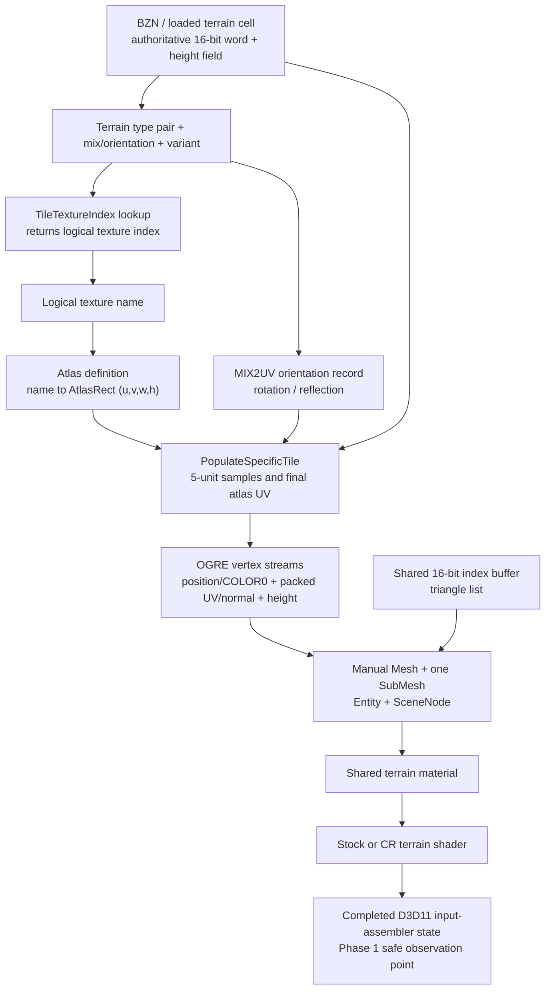

# Battlezone 98 Redux terrain render path

## Phase 1 result

The released Redux renderer can reproduce one stock terrain cluster without
changing gameplay terrain. Its render data is generated from the authoritative
16-bit terrain cell word, packed into three small OGRE vertex streams, and
submitted as one manual mesh/submesh/entity per 320-by-320-world-unit cluster.
The logical tile identity and orientation still exist at CPU construction time,
but only quantized final-atlas UV bytes survive into the D3D11 draw.

Phase 1 adds a disabled-by-default D3D11 observer. It recognizes the completed
terrain input-assembler state, copies one or a few completed buffers through
read-only staging resources, logs a bounded summary, and can write
`terrain_probe.json`. It does not install an executable-address hook, alter
render state, or touch DX9.

The reverse-engineered function names below are semantic labels. Current-build
addresses are included only to make the evidence reproducible; they are not
approved hook addresses.

## End-to-end pipeline



Still unknown: the human-authored meaning/name of every transition lookup entry,
and a stable public OGRE callback that exposes the native zone/cluster coordinate,
material name, and pre-atlas cell word together. Those values are not guessed by
the D3D11 probe.

## Evidence and confidence

The primary static baseline was the released GOG executable with SHA-256
`8d71...7413` (the repository's exact pinned analysis baseline). Repository
notes say settled Steam bytes have matched this executable in the builds checked
so far. Steam still requires post-launch byte validation before any future native
hook is enabled.

The main released-build evidence is in
`reverse_engineering/repo_corpora/bzr_gog_best_effort/ghidrecomp/results/bins/`
`battlezone98redux.exe-6777ca/decomps/`:

- `FUN_007778b0`: zone object construction and the 16 OGRE meshes/entities.
- `FUN_007789a0`: initial mesh population and vertex declaration.
- `FUN_007794f0`: repopulation of dynamic vertex streams and bounds.
- `FUN_00779c20`: terrain-cell lookup, AtlasRect transform, UV/normal/height pack.
- `FUN_0077a650`: manager construction and shared CPU buffer capacities.
- `FUN_0077b000`: zone allocation and 1,280-unit placement.
- `FUN_0077aa50`: atlas-definition parsing and logical-index-to-rect table.
- `FUN_0077c030` / `FUN_0077c130`: shared GPU index/vertex buffer upload.
- `FUN_0077c230` / `FUN_0077c3c0`: shared position and COLOR0 generation.
- `FUN_00780dc0` / `FUN_00780e40`: logical tile and mix lookup from a terrain word.

Private-PDB semantic ranking was refreshed and validated before use. Names such
as `cRenderableZoneCluster::PopulateSpecificTile`,
`cRenderableTileClusterManager::ProcessZones`, `SetClusterNeedsRebuild`, and
`UpdateTerrainHeightMap` are used only as semantic hints corroborated by the
released code's behavior and strings. No leaked-PDB RVA or local-variable storage
location is transferred to the released executable.

The 1.5 executable/PDB decompilation under
`reverse_engineering/decompilation_from_1.5_exe-pdb` was also checked as a
semantic reference. Its named `GetTileTextureIndex` and `GetTileTextureUV`
functions, `mix2UV` table, `AddTerrainPoly`/`AddTerrainSlab` functions, and
terrain-height queries corroborate the legacy logical tile/orientation/UV chain.
Its rendering backend is different, so released Redux code and the live DX11
capture remain authoritative; no 1.5 RVA, layout, or local-variable location is
used by the probe.

## Cluster structure

| Property | Finding |
|---|---|
| Terrain cell size | 20 world units |
| Subdivision | Each normal cell is sampled on a 5-unit grid (5 by 5 subquads) |
| Render cluster | 16 by 16 cells, 320 by 320 world units |
| Zone | 4 by 4 render clusters, 1,280 by 1,280 world units |
| Actual vertex count | 9,409 (97 squared) |
| Actual index count | 38,400 16-bit indices |
| Topology | Triangle list; 6,400 quads / 12,800 triangles |
| CPU/GPU allocations | Exactly 9,409 vertices and 38,400 indices |
| OGRE representation | One manual `Ogre::Mesh`, one `SubMesh`, one `Entity`, and one `SceneNode` per render cluster |
| Entity settings | Shared terrain material, render queue group `0x28`, shadows disabled |
| LOD | No separate terrain LOD representation was found in this construction path |

The generator visits a 17-by-17 set of tile samples. Interior samples contribute
6-by-6 vertices. The outside samples use clipped 3-wide ranges. Tile boundaries
remain duplicated in the vertex sequence, which is important for faithfully
duplicating the index buffer rather than assuming a single welded grid.

Zones are allocated by the manager after map dimensions and origin are known.
Their mesh resources live with the zone object. A renderer-device loss marks the
shared buffers invalid and recreates/repopulates them after restoration.

### Dynamic updates and deformation

Clusters have per-cluster rebuild/update flags. The processing path checks all
16 child clusters in a zone. A full rebuild locks stream 1 and stream 2, reruns
the same `PopulateSpecificTile` sequence, updates the mesh bounds, and clears the
rebuild flag. A second update path refreshes the height stream for height-map
changes. The shared position/COLOR0 stream and shared topology do not need to be
regenerated for ordinary deformation.

Therefore a parallel visual must subscribe to terrain invalidation and refresh
at least height and normals. It must also refresh packed UVs when a terrain tile
or transition changes. Copying a cluster only once at map load would become
visually stale.

## Terrain vertex layout

The OGRE declaration and the D3D11 mapping agree on this three-stream layout:

| Slot / stride | OGRE semantic and type | Bytes | Meaning at construction | Shader interpretation |
|---|---|---:|---|---|
| 0 / 16 | `POSITION`, `VET_FLOAT3` | 0..11 | Local X/Z position; stored Y is 0 | Vertex shader replaces Y with stream-2 height |
| 0 / 16 | `DIFFUSE` (`COLOR0`), `VET_COLOUR` | 12..15 | Static packed RGBA | DX11 uses `R8G8B8A8_UNORM`; CR assigns `vColor = iColor.bgra` |
| 1 / 4 | `BLEND_INDICES`, `VET_UBYTE4` | 0..3 | Quantized atlas U, atlas V, encoded normal X, encoded render-normal Z | `R8G8B8A8_UINT`; UV and normal are reconstructed in the vertex shader |
| 2 / 4 | `TEXCOORD`, index 1, `VET_FLOAT1` | 0..3 | Terrain height multiplied by 0.1 | Becomes final position Y |

For packed bytes `(pu, pv, nx, nz)`:

```text
finalAtlasUV = (float2(pu, pv) + 0.5) / 160
normalXZ     = (float2(nx, nz) - 127) / 127
normalY      = sqrt(saturate(1 - dot(normalXZ, normalXZ)))
renderNormal = float3(normalXZ.x, normalY, normalXZ.y)
```

The CPU stores the source terrain normal's X in byte 2 and its negated Z in
byte 3, matching the render coordinate convention.

### COLOR0 origin

`COLOR0` is produced once in the shared position stream, not read from the BZN
terrain types and not calculated from atlas selection. RGB is always 255. Alpha
is 0 when either local vertex loop coordinate is zero and 255 otherwise. Thus
the two representative byte values are:

```text
[255, 255, 255,   0]  first row or first column of a generated tile patch
[255, 255, 255, 255]  other vertices
```

That condition is proven; its intended artistic semantic is not. It resembles a
seam/overlap mask, but Phase 1 does **not** classify it as terrain material blend
weights. The probe records the real bytes and reports the observed alpha range.

## Logical tile to atlas mapping

Let `w` be the authoritative 16-bit terrain word for a cell. The released code
derives:

```text
typeA       = (w >> 12) & 0xF
typeB       = (w >>  8) & 0xF
mix         = (w >>  4) & 0xF
variant     =  w        & 0x3
lookupIndex = typeA * 64 + typeB * 8 + variant * 2 + ((mix >> 3) & 1)
tileIndex   = TileTextureIndex[lookupIndex]        // uint8 logical index
rect        = AtlasRects[tileIndex]                // float u, v, width, height
orientation = MIX2UV[mix]                          // eight floats
```

The 16 `MIX2UV` records contain two identical copies of eight transforms. The
low three mix bits therefore choose the eight rotations/reflections. The high
mix bit changes the logical-tile lookup variant but not the UV orientation.

The first eight records, shown as the four normalized rectangle corners
`(bottomLeft, topLeft, topRight, bottomRight)`, are:

| mix & 7 | corners |
|---:|---|
| 0 | `(0,1) (0,0) (1,0) (1,1)` |
| 1 | `(0,0) (1,0) (1,1) (0,1)` |
| 2 | `(1,0) (1,1) (0,1) (0,0)` |
| 3 | `(1,1) (0,1) (0,0) (1,0)` |
| 4 | `(1,1) (1,0) (0,0) (0,1)` |
| 5 | `(1,0) (0,0) (0,1) (1,1)` |
| 6 | `(0,0) (0,1) (1,1) (1,0)` |
| 7 | `(0,1) (1,1) (1,0) (0,0)` |

`PopulateSpecificTile` transforms three corners into the AtlasRect, constructs
two affine increments, and evaluates each 5-unit sample. In simplified form:

```text
P00 = rect.xy + orientation.bottomLeft  * rect.wh
P01 = rect.xy + orientation.topLeft     * rect.wh
P10 = rect.xy + orientation.bottomRight * rect.wh

atlasUV(qx, qz) = P00
                  + (qz / 5) * (P01 - P00)
                  + (qx / 5) * (P10 - P00)

packedUV = uint8(atlasUV * 160)          // truncation
shaderUV = (packedUV + 0.5) / 160
```

There is no separate per-vertex tile index in the finished mesh. UVs are
generated directly in final atlas space. No additional CPU-side padding offset
was found: named atlas definitions control each rect, while the fallback is an
8-by-8 grid of 0.125 rects. The byte quantization plus shader half-step provides
the final sample-center convention.

Atlas setup parses named records containing `u,v,w,h`, maps each terrain texture
name to a rect, and fills a 256-entry logical-index vector from the global
16-byte texture-name records. Missing names are logged. If no atlas definition
is available, it constructs the 8-by-8 fallback.

### Recovering `tileIndex + localUV`

Before packing, the exact future representation is already available:

```text
tileIndex   = TileTextureIndex[lookupIndex]
localUV     = float2(qx, qz) / 5
orientation = mix & 7
atlasRect   = AtlasRects[tileIndex]
```

This is the recommended Phase 2 capture point. Given `atlasRect` and
`orientation`, the affine transform is invertible and local UV can also be
recovered from final UV, subject to the existing 1/160 quantization. Given only
a D3D11 buffer, exact logical identity is ambiguous when rects overlap or are
unknown; the probe therefore emits final UV and raw packed bytes but leaves
`logicalTileIds` null.

## Transition, edge, corner, cap, and diagonal representation

The cell word preserves more information than the final vertex buffer:

- two four-bit terrain codes (`typeA` and `typeB`);
- a four-bit mix value whose low three bits select rotation/reflection;
- a two-bit variant;
- the high mix bit as an additional `TileTextureIndex` lookup selector.

The lookup table combines these fields into one logical texture index. The
current renderer then selects one AtlasRect and samples one already-composited
atlas region. It does not generate special transition geometry and the terrain
pixel shader does not blend two base materials for this legacy path.

The terrain editing code builds a four-neighbor difference mask, rejects
unsupported multi-type combinations, consults two 16-entry mapping tables, and
chooses a rotation/variant. This is strong evidence that diagonal, edge,
corner/cap, rotation, mirror, and randomized variants are encoded by the terrain
word plus lookup table and resolve to precomposited texture entries.

What remains unknown is the authoritative human-readable label for each lookup
entry (for example, exactly which table value means a particular cap shape).
Phase 2 does not need those names to duplicate pixels: it can preserve
`typeA/typeB/mix/variant/tileIndex`. A later array-material translator should
extract and catalogue the runtime `TileTextureIndex` table and terrain texture
name table rather than infer pattern names from atlas pixels.

## OGRE submission and candidate interception points

The construction path is:

```text
terrain word + height/normal queries
  -> cRenderableZoneCluster::PopulateSpecificTile (semantic name)
  -> shared slot-0 VB + per-cluster slot-1/slot-2 VBs + shared 16-bit IB
  -> manual Ogre::Mesh / one SubMesh
  -> Ogre::Entity attached to a child SceneNode
  -> shared terrain material
  -> stock terrain shader or CR_terrain-sm4
  -> completed D3D11 input-assembler state
  -> terrain draw submission
```

Campaign Reimagined preserves this contract. For example,
`Materials/ac_detail_atlas.material` derives `AC_DETAIL_ATLAS` from
`CR_BZTerrainBase` and assigns `achilles_atlas_d.dds` through the `DiffuseMap`
alias. `Shaders/CR_terrain-sm4.hlsl` consumes the exact `POSITION`,
`BLENDINDICES`, `COLOR0`, and `TEXCOORD1` fields described above. It reconstructs
height, normal, and `(packedUV+0.5)/160` before sampling the atlas. This is a
material/shader extension over the same stock mesh, not a separate CR geometry
path.

No existing OpenShim terrain-construction hook, animated-terrain experiment, or
water-specific terrain proxy was found. The useful reusable infrastructure was
the DX11 diagnostic bootstrap, Ogre material/resource access, and the chunk
visual-proxy SceneManager/Entity/SceneNode path.

| Rank | Candidate | Reliability / state available | Difficulty and compatibility |
|---:|---|---|---|
| 1 | Observe completed cluster buffers at the OGRE mesh/manual-resource boundary, then build a parallel visual | Best balance: exact geometry, native zone/cluster identity, SceneNode transform, material, and rebuild timing should coexist here | Requires a version-validated callback or exported OGRE interface; safest Phase 2 target once one stable seam is proven |
| 2 | Observe the CPU `PopulateSpecificTile` inputs | Only point with exact cell word, logical tile, AtlasRect, mix/orientation, and unquantized local UV | Most useful data but a private native method; requires exact fingerprint, prologue/semantic validation, and a very small guarded hook |
| 3 | Mirror completed hardware-buffer updates | Exact rendered bytes and deformation refreshes; independent of higher-level guesses | Loses logical tile/material identity unless correlated with cluster construction; global OGRE buffer hooks need careful filtering |
| 4 | Observe finished OGRE Entity/Mesh and duplicate it | Stable object/material/transform view and natural stock-visual coexistence | Pre-atlas metadata is already gone; needs buffer readback or a correlation channel |
| 5 | Completed D3D11 input-assembler observation (implemented Phase 1 probe) | Public ABI, no executable address, exact final bytes, easy fail-soft DX11-only behavior | Material/SceneNode/native cluster coordinate and pre-atlas identity are gone; staging readback stalls, so diagnostic only |
| 6 | Replace only the stock material/renderable | Simple eventual visual switch | Too late to recover tile semantics and prematurely suppresses known-good rendering; not appropriate for reconnaissance |

The existing OpenShim chunk visual-proxy work demonstrates that resolving the
OGRE SceneManager, creating a parallel Entity/SceneNode, assigning a material,
and keeping simulation authoritative is viable. Terrain should follow the same
ownership model, but not reuse chunk-specific state or assume an executable
address without validation.

## Implemented terrain probe

The probe extends the existing DX11 diagnostic bootstrap in
`src/patches/dx11_colorspace_diagnostic.cpp`. It reuses renderer-module discovery,
D3D11 device creation observation, COM-vtable patch validation, bounded logging,
and process-lifetime hook ownership.

OGRE binds the vertex and index buffers before setting the primitive topology.
The live Redux DX11 renderer did not expose the terrain submission through the
ordinary context `DrawIndexed` vtable entry, so the primary observation point is
the subsequent public `IASetPrimitiveTopology` call. A direct `DrawIndexed`
observer remains as a fallback. Recognition requires all of the following:

- triangle-list topology;
- vertex slots 0/1/2 with strides 16/4/4 and zero offsets;
- buffers large enough for 9,409 vertices;
- a 16- or 32-bit index buffer large enough for 38,400 indices;
- for the fallback draw observation, `DrawIndexed(38400, 0, 0)`.

This complete signature is intentionally more conservative than matching a
single stride or index count. A distinct slot-1 COM identity is used as the
diagnostic cluster identity. The ordinal is simply first-observed order and is
not a game zone coordinate.

For a matched state, the observer creates staging buffers capped at 4 MiB each,
copies the three vertex streams and index buffer, maps them read-only, samples
summary ranges, and releases every temporary COM object. Rendering continues
unchanged. The observer caps captures at 16 (bounded headroom for stock draws
observed before a Phase 2 overlay is constructed) and distinct identities at
4,096.
Defaults are one JSON capture and no logging at all unless explicitly enabled.

### Configuration

```ini
[Diagnostics]
TerrainRenderProbe = 1
TerrainRenderProbeMaxClusters = 1
TerrainRenderProbeCluster = -1
TerrainRenderProbeDumpJson = 1
```

`OPENSHIM_TERRAIN_RENDER_PROBE=1` is an enable override. A nonnegative
`TerrainRenderProbeCluster` captures only that zero-based observed ordinal and
reduces the capture limit to one.

The output file is beside the game executable:

- one capture or a selected capture: `terrain_probe.json`;
- multiple captures: `terrain_probe_000.json`, `terrain_probe_001.json`, etc.

The JSON schema is `bzr-openshim-terrain-probe-v1`. It contains decoded local
positions, reconstructed shader normals, final atlas UVs, COLOR0 bytes, raw
packed terrain bytes, all submitted indices, expected-submission metadata, and the first eight
bound pixel-shader resources with debug names/descriptors. It explicitly uses
`null` for material name, world position, logical tile IDs, and orientation flags
because those cannot be safely recovered at this boundary.

Representative output from the live `misn04.bzn` DX11 test:

```text
[TERRAIN-PROBE] clusterOrdinal=0 vertexCount=9409 indexCount=38400 topology=triangle-list strides=16/4/4 worldPosition=<unavailable-at-D3D-boundary> material=<unavailable-at-D3D-boundary>
[TERRAIN-PROBE] clusterOrdinal=0 height=[0.000,0.000] finalAtlasUV=[0.128125,0.003125]-[0.503125,0.128125] COLOR0.rgb=static-white COLOR0.alpha=[0,255]
[TERRAIN-PROBE] clusterOrdinal=0 psResourceSlot=0 format=DXGI_FORMAT_BC1_UNORM size=2048x2048
[TERRAIN-PROBE] clusterOrdinal=0 json=written path="...\\terrain_probe.json"
```

The probe was built as x86 Release and launched directly with
`battlezone98redux misn04.bzn -renderer:dx11`. It captured after approximately
eight seconds. The JSON contained 9,409 vertex records and 38,400 indices; the
index range was exactly 0..9,408, all indices were in bounds, the stream strides
were 16/4/4, and five bound pixel-shader resources were described. The captured
file SHA-256 was
`7A376D5555DF0B7B8EED4FF964D332D5D9CFBC5FFC9110E6B45B1ADFDE99F94B`.

## Runtime testing

1. Build x86 Release:

   ```powershell
   & 'C:\Program Files\Microsoft Visual Studio\2022\Community\MSBuild\Current\Bin\MSBuild.exe' BZROpenShim.sln /m /p:Configuration=Release /p:Platform=Win32
   ```

2. Copy the new `bin\Release\winmm.dll` into the Campaign Reimagined canonical
   source `Bin` and deploy through its supported workflow, or run the canonical
   script's `-deploy` action, which refreshes the bundled shim from this repo and
   deploys to the GOG runtime. Do not deploy into Steam's Workshop cache.

3. Put the `[Diagnostics]` block above in `openshim.ini` beside the deployed
   `winmm.dll`. Start BZR with the Direct3D11 renderer and load a terrain map, or
   launch a mission directly:

   ```powershell
   .\battlezone98redux.exe misn04.bzn -renderer:dx11
   ```

4. Confirm `logs\openshim.log` reports the DX11 observer, a matched terrain cluster,
   and `json=written`. Validate the JSON with:

   ```powershell
   Get-Content -Raw 'C:\Program Files (x86)\GOG Galaxy\Games\Battlezone 98 Redux\terrain_probe.json' |
       ConvertFrom-Json | Select-Object schema, clusterOrdinal, vertexCount, indexCount
   ```

5. Spot-check that `vertexCount=9409`, `indexCount=38400`, indices stay below
   9409, packed UV bytes decode by `(byte+0.5)/160`, and COLOR0 contains the
   expected white RGB with observed alpha values. Deform terrain and select a
   later cluster ordinal in a second run to confirm the refreshed height/normal
   stream appears.

6. Disable `TerrainRenderProbe` after capture. Staging readback intentionally
   stalls the render thread and is not a shipping telemetry path.

For final Steam verification, upload the validated mod to Workshop, allow Steam
to download item `3686673790`, wait for SteamStub/runtime bytes to settle, and
test the subscribed payload. Never copy development files directly into the
Steam Workshop download cache.

## Phase 2 result

Phase 2 is implemented in `src/patches/terrain_proxy.cpp` and remains strictly
opt-in. It duplicates one completed stock cluster into an OpenShim-named OGRE
mesh/entity/node, leaves the source entity untouched, reuses the source
material, and captures one cluster's pre-atlas CPU semantics. It does not alter
gameplay terrain, physics, collision, the terrain shader, or the atlas.

### Interception seam and safety gates

Two released-build seams are used:

- `FUN_007778b0` at preferred VA `0x007778B0`, after the original zone
  constructor has created and populated all 16 mesh/entity/node triples. This
  is where exact geometry, native identity, material, and transform coexist.
  Its placement-new caller consumes the native constructor's machine-level
  `this` result in EAX, so the detour preserves and returns that value after
  observation.
- `FUN_00778450` at preferred VA `0x00778450`, the zone rebuild dispatcher. The
  hook snapshots the selected cluster's full/height dirty bytes, calls the
  original dispatcher, and only then mirrors the completed dynamic buffers.

The hooks are installed only after all of these checks pass:

- at least one Phase 2 setting is explicitly enabled;
- the main executable SHA-256 is exactly
  `8D71F56C1314E69A8AD38F4EEAF20A8FF825965A84CF196E5F77EA4CC3377413`;
- `OgreMain.dll` SHA-256 is exactly
  `E5E693960B95AD0D60733A3B688464A6C6CBA234E86950698F9C2BEA4ACFEB45`;
- all required OGRE exports resolve;
- both released function entries still begin `55 8B EC 6A FF`;
- each five-byte inline detour and trampoline installs successfully.

The rebuild detour also rejects a null zone pointer before entering stock code,
whose first access is `zone+0x270`. This is a fail-soft corruption backstop and
is not expected to fire in a healthy run.

Any failure logs once and leaves stock rendering active. Phase 2 is initialized
outside the older `g_CompatibleVersion` flag because that legacy flag is never
promoted by the current patcher; the independent full-file hashes and entry-byte
checks are the stronger and actually reachable gate.

### Identity, duplication, and ownership

The zone hook reads the released zone fields at `+0x240/+0x244`, then indexes the
4-by-4 mesh, entity, and SceneNode arrays. It cross-checks those coordinates
against the stock resource name
`RenderableTileCluster_<zoneX>x<zoneZ>_<clusterX>x<clusterZ>` before accepting a
selection. Selection can use construction ordinals or exact native coordinates.

The source entity must expose exactly one triangle-list SubEntity with 9,409
vertices, 38,400 indices, stream strides 16/4/4, and a 16-bit index buffer.
`Ogre::Mesh::clone` then produces the independently named mesh, preserving the
real stock topology, immutable stream 0, dynamic streams 1/2, shared declaration,
and indices. An Entity is created from that mesh, assigned the source SubEntity's
material, queue group `0x28`, shadows disabled, and the configured visibility.
A sibling SceneNode copies source position, orientation, and scale, with the
configured offset added to position. Names use the collision-safe prefix
`OpenShim/TerrainProxy/{Mesh,Entity,Node}/z.../c.../<serial>`.

The existing SceneManager `clearScene` and `destroyAllMovableObjects` observation
hooks notify Phase 2. The SceneManager owns entity/node teardown; Phase 2 removes
its named Mesh resource and forgets all native pointers before another map can be
selected. The clone-return SharedPtr could not be destructed safely across the
Redux/OpenShim CRT boundary when its observed count was one, so one handoff
reference is conservatively retained. This is a bounded one-cluster leak and is
an unresolved cleanup risk, not a reason to risk deleting a live OGRE resource.

### Rebuild and semantic capture

After a selected dirty cluster has been rebuilt by stock code, Phase 2 copies
the completed slot-1 packed UV/normal buffer and slot-2 height buffer into the
proxy with `HardwareBuffer::copyData`, then mirrors mesh bounds, radius, and any
material-name change. A full dirty event also refreshes semantics. Stream 0 and
the index buffer are immutable for ordinary terrain changes and are retained
from the original clone.

Semantic capture is performed at the completed zone seam, but it calls the
released CPU terrain accessors rather than attempting to reverse final D3D UVs.
For each of the selected cluster's 256 cells it records cell and terrain
coordinates, the authoritative word, `typeA`, `typeB`, `mix`, `orientation`,
`variant`, `lookupIndex`, `tileIndex`, and the active `AtlasRect`. The bounded
JSON also records the generated-sample convention `localU=qx/5` and
`localV=qz/5`, for `qx,qz` in 0..5. Output is
`terrain_semantic.json` beside the executable with schema
`bzr-openshim-terrain-semantic-v1`.

One live decoded example from `misn04.bzn`, native zone `(2,2)`, cluster `(1,0)`:

```json
{
  "cellX": 0,
  "cellZ": 0,
  "terrainX": 448,
  "terrainZ": 20096,
  "terrainWord": 4402,
  "typeA": 1,
  "typeB": 1,
  "mix": 3,
  "orientation": 3,
  "variant": 2,
  "lookupIndex": 76,
  "tileIndex": 11,
  "atlasRect": { "u": 0.375, "v": 0.125, "w": 0.125, "h": 0.125 }
}
```

### Configuration

All defaults are off. The environment variables
`OPENSHIM_TERRAIN_PROXY=1` and `OPENSHIM_TERRAIN_SEMANTIC_CAPTURE=1` are enable
overrides.

```ini
[Terrain]
TerrainProxyEnabled = 0
TerrainProxyZone = -1
TerrainProxyCluster = -1
; Optional exact selectors override ordinal-only selection when present:
; TerrainProxyZoneX = 0
; TerrainProxyZoneZ = 0
; TerrainProxyClusterX = 0
; TerrainProxyClusterZ = 0
TerrainProxyOffsetX = 0.0
TerrainProxyOffsetY = 0.0
TerrainProxyOffsetZ = 0.0
TerrainProxyVisible = 1
TerrainSemanticCapture = 0
TerrainSemanticDumpJson = 1
```

`TerrainProxyZone=-1` and `TerrainProxyCluster=-1` choose the first constructed
zone and first matching cluster. Explicit native selectors are preferred for a
repeatable comparison. The stock Entity is never hidden by this subsystem.

### Validation and status

**Proven:**

- A full Win32 Release rebuild succeeded. The 12 compiler warnings from that
  rebuild are existing warnings in unrelated code; subsequent incremental
  builds completed with zero warnings and errors.
- With all new settings absent/off, `misn04.bzn -renderer:dx11` remained alive
  through the test window and emitted no Phase 2 or terrain-probe log records.
- With Phase 2 enabled, both exact hashes and entry bytes validated, native zone
  `(2,2)` / cluster `(1,0)` was selected, and the proxy was created at the exact
  stock transform using material `MA_DETAIL_ATLAS`.
- The existing independent Phase 1 probe captured valid completed terrain draws
  with 9,409 vertices, 38,400 indices, stream strides 16/4/4, and an index range
  of 0..9,408. Observed D3D ordinals could not be correlated reliably to the
  selected stock/proxy pair, so byte-for-byte stock/proxy equality is not
  claimed.
- The stock entity remains present and visible by construction; Phase 2 never
  calls its visibility or destruction APIs.
- A 400-unit X offset produced a distinct proxy node at the expected translated
  position. After correcting constructor return preservation, the mission ran
  for 54 seconds without a crash or null-dispatch warning, then completed a
  normal window-close teardown. The original node was not modified.
- Semantic capture wrote exactly 256 authoritative cell records and the sample
  convention shown above.
- The supplied PID 30112 dump and the follow-up PID 33028 dump traced to the
  initial constructor hook discarding the native EAX return. Redux stores that
  result directly in its 5-by-4 zone table, producing null entries and later
  AVs at `0x007784C0` and `0x00778421`. Returning the original constructor result
  fixes the table corruption; the post-fix run produced no new unhandled crash.

**Observed but not fully proven:**

- The rebuild dispatcher and dirty-byte layout are corroborated by the released
  decompilation. The post-original copy path is installed and ready, but this
  automated run did not trigger a controlled terrain deformation, so live
  height/normal refresh remains unproven.
- A normal window close exercised the `clearScene` integration and logged
  `scene resources released reason=clearScene`. An in-process mission-to-mission
  reload was not completed and is not claimed as equivalent evidence.

**Inferred:**

- `Ogre::Mesh::clone`, matching geometry-contract validation, the reused stock
  material, and the copied transform should produce raster parity under the same
  render state. This remains an inference until a correlated stock/proxy capture
  or framebuffer diff is obtained.

**Still unknown / remaining risks:**

- Runtime deformation mirroring and in-process map reload need interactive
  verification, including the resulting `rebuild mirrored` log. Normal
  `clearScene` release is proven; reload/reselection is not.
- Device-loss/recreation was not forced. Stock device restoration may replace
  buffer objects outside the ordinary dirty path; this requires a dedicated
  test before Phase 2 can be treated as production infrastructure.
- The bounded retained clone-handoff reference described above remains until a
  safe Ogre-module destruction bridge is identified.
- Transition-shape friendly names remain intentionally unknown; captured numeric
  fields are authoritative.

Texture arrays, new terrain formats/shaders, PBR, stock-terrain suppression,
terrain LOD, and gameplay/physics changes remain outside Phase 2.
