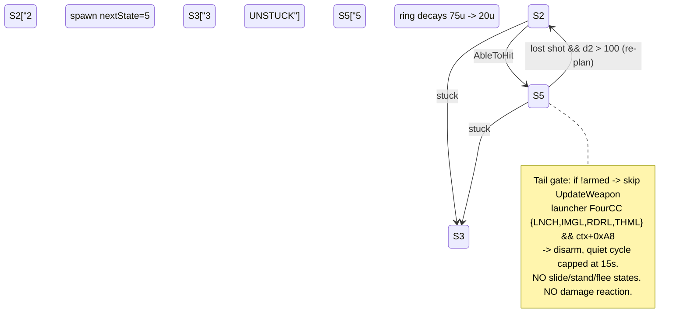

# Battlezone 1.4 Evasive AI Investigation

Date: 2026-08-23

Question:

- Did the Battlezone 1.4 evasive tank AI (damage-triggered flee/slide/stand cycle)
  survive dormant into legacy patch 1.5 and into Redux?
- If not dormant, can the 1.4 system be recovered exactly enough to port?

Verdict summary:

- No. Nothing survived dormant. The 1.4 behaviors were actively rewritten in 1.5 and
  Redux carries the 1.5 rewrite structurally unchanged. Of the whole 1.4 fingerprint
  set, only one piece survives as live generalized code: the missile-launcher FourCC
  fire gate, relocated into `UnitTask::UpdateWeapon` and stripped of its 1.4 arming
  latch and cooldown accumulator.
- The full 1.4 evasive system is nevertheless recoverable: it reduces to four
  well-defined behavioral deltas (D1-D4) in shared `AttackTask::DoState` bodies,
  plus the RocketTank-only hold-fire subsystem that lives outside the tank/scout
  path entirely.

Conventions:

- **1.4** addresses refer to the runtime-unpacked image `bz14_unpacked.exe`
  (imagebase 0x400000; identity map file offset = VA - 0x400000). This is the only
  note about that; all 1.4 addresses below are unpacked-dump VAs.
- **1.5** = legacy `BZ1_Source\1.5` PDB-named `bzone.exe`. **Redux** = GOG
  `battlezone98redux.exe`.
- Claim tags: CONFIRMED-CODE (read directly from decompile/disassembly),
  RUNTIME-SUPPORTED (runtime-derived evidence or interpretation strongly backed by
  code), HYPOTHESIS (design-level or unresolved).

## 1. Executive Summary

The 1.4 evasive AI did **not** survive dormant into 1.5/Redux — it was actively
rewritten (CONFIRMED-CODE):

- **F1**, the 1.4 slide-exit keyed on the *enemy's own task state* `{2,5,7}` with no
  time cap (1.4 `AttackTask::DoState` 0x40CDE0 case 7, predicate site 0x40CF97), is
  absent in 1.5 (DoState 0x40F25B, case 7 uses `IsBuilding(target)` plus a hard 10 s
  cap) and in Redux (FUN_00478A50, identical rewrite). No residual copy exists:
  `SidewaysAndClose` has exactly one caller in 1.5, and no `{2,5,7}` task-state
  compare exists anywhere in either later build (wave2d sweep).
- **F2**, the unbounded hit-flee (1.4 case 9 exits only on attacker-gone /
  distSq > 5625 / stuck), is bounded in 1.5/Redux by a `timer + 3.0 s` re-evaluation;
  1.5's `UnitTask::DoFlee` has exactly one caller, so the unbounded loop does not
  exist elsewhere.
- **F3a**, the launcher-FourCC fire gate `{HCNL,LGMI,LRDR,LMHT}`, survives — but as
  *live, reachable, generalized* gating inside 1.5 `UnitTask::UpdateWeapon`
  (@0046C63E region; HCNL immediates at VA 0x46C6F9/0x46CA90) and Redux
  `FUN_00604130`, called every tick from both DoState tails. It is stripped of the
  1.4 arming latch (+0xF4/+0xFC) and the <= 15 s cooldown accumulator (**F3b/F3c
  ABSENT**; ctor residue repurposed: 1.5 `RocketTankAttack::RocketTankAttack`
  @00470533 writes `field_0xf4`=75.0f mad seed, `field_0xf8`=0.02f).
- The four behavioral deltas D1-D4 (Section 7) fully parameterize the observable
  1.4-vs-1.5 combat-rhythm difference. Every other AI decision constant (5625 flee
  radius, 8 s stand cap, 3.0 s pinned-retaliation, 15.0 s wingman counter-attack,
  formation/range constants, slide quadrant table geometry) survives verbatim across
  all three builds.

## 2. Exact 1.4 Tank/Wingman hit-response state path

All CONFIRMED-CODE unless tagged. Baseline facts (wave2b):

- Craft damage fields: `craft+0x1DC` = last-damage time (float game time),
  `craft+0x1E8` = last-attacker handle (written by the engine on hit).
- Task freshness baseline: `OnEnterState` (FUN_0040CC40, vtable slot 9 of
  PTR_FUN_005E6E58) snapshots `GetTime()` (FUN_005D90C0) into `task+0xD4` **only**
  when entering state 8 or 10 (case labels 62-70). Therefore
  `craft+0x1DC > task+0xD4` means exactly "damaged after this attack/blast state was
  entered".
- `CleanState` (FUN_0040CD50) clears attacker memory on leaving state 9:
  `task+0xFC = 0`.

Chain:

1. **Fresh-hit detect (states 8 and 10 only).** Case 8:
   `if (*(float*)(craft+0x1DC) <= *(float*)(task+0xD4)) { normal stand logic } else
   fall into LAB_0040D08C` (FUN_0040CDE0.c:436 -> 466). Case 10:
   `if (*(float*)(task+0xD4) < *(float*)(craft+0x1DC)) goto LAB_0040D08c`
   (:542). States 2/3/4/6/7/11/12 never test damage freshness.
2. **Attacker handoff (LAB_0040D08C, FUN_0040CDE0.c:466-474):**
   `nextState(+0x10) = 9` and `task+0xFC = *(craft+0x1E8)` — copy the newest
   attacker handle into the task's flee anchor.
3. **State 9 FLEE primitive — `DoFlee` FUN_0046F090** (per tick):
   - resolve `task+0xFC` handle -> attacker position;
   - build normalized away-vector `(mePos - atkPos)/|..|`, scale by
     `_DAT_005EA360` = 40.0, destination = own pos + 40*away;
   - `FUN_004054D0(me, skipObj, 40.0f, dest, &F, 0)` (GotoPoint through
     potential-field avoidance) + `FUN_00407760(...)` (face/move toward point);
   - steer applier `FUN_0046EDE0(&pt,&dir)`: when the generated point lies aft
     (forward-dot <= 0) it hard-locks `ctrl.steer(+0xC4) = +-1.0` (turn-lock while
     driving) and applies the reduced speed cap 0.25 (`_DAT_005EA328/2C/30`: cap =
     |steer| > 0.7 ? 0.25 : 1.0); otherwise proportional steering. Facing emerges
     from pursuit of the point — there is no separate face-away step.
   - No re-entry penalty: OnEnterState does nothing for state 9, so each cycle
     restarts at full intensity with a fresh 40 u away-point.
4. **State 9 exits (FUN_0040CDE0.c:476-532)** — purely distance/gone/stuck:
   - attacker handle resolves null -> state 7;
   - `distSq(me,attacker) > _DAT_005E6EA4` (5625.0 = 75^2) -> state 7;
   - stuck (FUN_0046DD60) -> LAB_0040D17A -> state 10;
   - else keep calling FUN_0046F090. **No elapsed-time bound exists** — the nearby
     -8.0 literal (_DAT_005E6EA0) caps state 8 stand-fire, not the flee. 1.4 will
     run from a stationary shooter forever until 75 u opens.
5. **Return path:** 9 -> 7 SLIDE (DoSlide 0x46ECF0 toward table slot; stall check
   `VecLen(task+0x44..) < _DAT_005E6E9C` (5.0) -> arrived -> 10;
   `SidewaysAndClose` 0x414340 (<50 u && quad 2/6) -> 8; enemy task state {2,5,7}
   -> 10; ring exit -> 2; stuck -> 3) -> 8 STAND+FIRE (`DoStand` FUN_0046E6B0, fires
   while `now <= entry + 8 s` via -8.0; expiry -> state **7** in 1.4 — slide rotation,
   cf. delta D4) or 10 BLAST-HOLD (`DoBlast` FUN_0046E900 strafe-point around target).
   From 10 or 8, any newer damage stamp repeats step 1.
6. **OffensiveProcess 3 s attacker-memory retarget — FUN_004530F0**
   (`OffensiveProcess::DoSubTask`, 'PINS' tag gate at craft class struct +0xC ==
   0x534E4950): while `Get_Time() - *(craft+0x1DC) < _DAT_005E8F68` (3.0), the
   process engagement target is forced to the last attacker
   (`who2 = GetObj(craft+0x1E8)`), current command saved and replaced (commit/
   rollback dance :176-181/:304-320); repeated hits extend the hijack indefinitely
   (window measured from latest damage); after `now + rand()*3.0 + 7.0` without a
   find it rescans.
7. **WingmanProcess 15 s counter-attack gate — FUN_00470EE0**
   (`WingmanProcess::ShouldAttack`, command ATTACK(7)): when the current subtask is
   queued in attack slot 6, allow the interrupt only if
   `distSq(me, [+0x60] object) < [+0x64] rangeSq` **and**
   `Get_Time() - *(craft+0x1DC) < _DAT_005EA5C0` (15.0). FUN_00470E71 is a
   standalone copy of the same predicate; dispatcher FUN_00452E80 additionally
   aborts an out-of-range job when recently damaged.

Group-level net effect: even while AttackTask dodges, the process layer re-points
every 'PINS' craft at the latest attacker for 3 s per shell and lets queued wingmen
counter-attack for 15 s — the pack keeps converging on the threat between dodges.

## 3. Scout specifics

CONFIRMED-CODE (wave2a): the Scout leaves (ScoutFriend vt 0x5EA7F8, ScoutEnemy vt
0x5EA8E8) differ from their siblings in exactly **one** combat-relevant virtual:
slot 57 `ChooseAttackTarget` override 0x4714C0, which delegates to FUN_00404100
(GetClosestEnemyOrMineWithin-like: same scan algorithm as the base delegate
FUN_00403D90 with an extra mine accept-branch). This maps onto 1.5
`ScoutProcess::ChooseAttackTarget` 0x47032D = `GetClosestEnemyOrMineWithin(...)`
vs base `OffensiveProcess::ChooseAttackTarget` 0x44DCA0 = `GetClosestEnemyWithin`.

Everything else — InitAttack (slot 24), InitSubAttack (48), ShouldAttack (58),
DoSubTask (11), ChangesState (9), the UState1 set (49-53) — is the single shared
WingmanProcess-base implementation. Scouts run the identical AttackTask
hit-response path of Section 2; there is no evasion or hit-reaction logic anywhere
in the Scout delta.

## 4. RocketTank negative control

Routing exclusivity (CONFIRMED-CODE, wave2a/2c): a 1.4 rocket tank's process
(vtables 0x5EABF0 / 0x5ACE0-family: RocketTankFriend 0x5EABF0, RocketTankEnemy
0x5EACE0) overrides attack creation — slot 24 `InitAttack` 0x471D20 and slot 48
`InitSubAttack` 0x471E40 build the dedicated `RocketTankAttack` task (vt 0x5EABB8,
object size 0x100, post-ctor paints `curState=1`, `nextState=5` — spawns straight
into BLAST) — except the FORMATION branch, which still builds WingmanBlastAttack
(0x5EA5E0). Generic AttackTask (PTR_FUN_005E6E58) is constructed nowhere in the
rocket cluster.

State space (CONFIRMED-CODE, `RocketTankAttack::DoState` FUN_004723C1): `{1->5, 2,
3, 5, D}` only — approach/stuck/blast. There is no slide (7), no stand (8), no flee
(9), and **no damage reaction**: no lastHitTime comparison exists anywhere in its
DoState, unlike AttackTask cases 8/10. Its only duress responses are a reverse-
throttle floor (`ctrl.braccel < 0 -> -0.3`) and the standoff-ring decay
(`+0xC4 -= TimeStep()*5.0`, floor 20.0; preferred ring creeps 75 u -> 20 u while
blasting).

1.4-only hold-fire subsystem (CONFIRMED-CODE, same function), executed before the
common tail whenever ableToHit latches:

```c
if (!armed(+0xF4) && Get_Time() > armDeadline(+0xFC)) { armed = 1; armDeadline = 0; }
...
if (!armed) return;                                  // skips UpdateWeapon entirely
if (MayHitFriends(me, task+0xB4, 0.3)) return;
w = weaponClass sig dword (ctx+0x9C -> +8 -> +0xC);
launcher = (w==0x4C4E4348 || w==0x494D474C || w==0x5244524C || w==0x54484D4C);
underAttack = (*(int *)(*(int *)(task+0x9C) + 0xA8) != 0);
if (!(launcher && underAttack)) { UpdateWeapon_Special(); return; }
armed = 0;
cycle = Get_Time() - lastCycleStamp(+0xF8); lastCycleStamp = cycle;
if (cycle > 15.0) cycle = 15.0;                      // _DAT_005EA5C0
armDeadline = Get_Time() + cycle;
```

- **Arming latch**: bool `+0xF4` armed when `Get_Time() >= +0xFC`; unarmed ->
  early return, no fire path at all.
- **Launcher-class FourCC dword gate** (little-endian compares): memory spellings
  `HCNL/LGMI/LRDR/LMHT` = forward tags **LNCH / IMGL / RDRL / THML** — the four
  missile-launcher weapon classes (proven by 1.5 PDB ctors: LauncherClass @00530E63,
  ImageLauncherClass @00530286, RadarLauncherClass @0053747C, ThermalLauncherClass
  @0053BFF4).
- **Under-attack flag**: `ctx+0xA8 != 0` on the UnitTask combat context at task+0x9C.
- **Quiet cycles <= 15 s**: the accumulated gap saturates at 15.0
  (`_DAT_005EA5C0`, verified at file offset 0x1EA5C0); while an attacking launcher
  persists, armDeadline is pushed outward every tick.

Discipline is implemented by **skipping `UpdateWeapon`** (0x46E530) — the tank
literally does not update/fire weapons that tick. Net: 1.4 rocket tanks hover
aggressively, absorb hits, and go quiet under launcher pressure; they never do the
turn-away/lateral-hop cycle. 1.5 kept the exclusive routing and the stripped state
machine (`RocketTankAttack::DoState` 0x470B90 = skeleton + mad-floor + ring decay,
arming/FourCC/cooldown deleted; Redux FUN_00614DD0 likewise, identified by the
unique `0xBE99999A` + x5.0 decay signature) while the FourCC concept moved live into
shared `UnitTask::UpdateWeapon`.

## 5. Movement primitives inventory

All CONFIRMED-CODE from 1.4 decompiles (wave2c); the same primitive set exists in
1.5 under PDB names (`UnitTask::DoSlide`, `UnitTask::GoHeading`,
`SidewaysAndClose`, `ActionInfo`, `slideSTable`).

| Primitive | 1.4 addr | Notes |
|---|---|---|
| `ActionInfo(out, me, him)` | 0x40BD90 | spatial relation: ring `<9/<24/<60/<200` -> rings 0-4 (i.e. thresholds 9/24/60/200), plus two 8-sector quadrant codes (`my_quad` = my octant as seen from him; forced to 4/dead-center if he is a building, bit1 of `him_class+0x10C`) |
| `SidewaysAndClose(a,b)` | 0x414340 | `dist2D < _DAT_005E7AC4 (50.0) && (my_quad==2 \|\| my_quad==6)` — "abeam of target and close" |
| `slideSTable` @ DAT_00604CD0 | data | `[ring][my_quad][his_quad]` -> heading dword, stride 8x8x4 |
| `UnitTask::GoHeading(angle)` | 0x46EB50 | blends heading through hull basis rows (`*(me+0xEC)` matrix rows +0x38/+0x20), generates destination `pos + 40.0 * dir` |
| `UnitTask::DoSlide` | 0x46ECF0 | ActionInfo -> table heading -> GoHeading; persistent pitch trim: `pitchTrim = clamp(task+0xBC + task+0x98, -1, 1)`, written back to `task+0x98` and `ctrl+0xC8` |
| `UnitTask::DoFlee` | 0x46F090 | destination `pos + 40 * away-from-fleeFrom` (Section 2) |
| steer applier | 0x46EDE0 | stores force->task+0x44..4C, dir->+0x50..58; body-frame dots -> steer/throttle/braccel; hard +-1 turn-lock + 25 % cap when destination aft |
| `UnitTask::DoGoto` | 0x46D350 | waypoint follower, arrival r^2 `task+0xD0` (default 15.0), skipObj clearance |
| `UnitTask::IsStuck` | 0x46DD60 | immediate obstruction probe, else displacement < 5 u (`_DAT_005EA344`=25) over ~5 s sampling |
| `UnitTask::AbleToHit` | 0x46E280 | weaponRangeSq gate (`task+0x88`, from the craft's actual weapon) + LOS raycast FUN_005455E0; emits aim dir -> task+0xB8/BC/C0, distSq -> +0xB4 |

Every maneuver destination is `pos + 40*dir` fed through potential-field
(FUN_004054D0) and cliff-force (FUN_00407760) avoidance — there is no raw axis
steering and no orbit/circle term anywhere; everything is single generated 40 u
destination points re-issued per tick (RUNTIME-SUPPORTED interpretation of the
primitive set).

How "beside" and "behind" emerge (RUNTIME-SUPPORTED — geometric interpretation of
confirmed mechanisms):

- **Beside (abeam):** `my_quad` is keyed in *attacker-relative* space, so slide
  slots are selected/validated around the enemy; sectors 2/6 are the abeam octants,
  and `SidewaysAndClose` (<=50 u, quad 2/6) confirms arrival — which is what flips
  state 7 into stand-fire 8.
- **Behind:** two cooperating effects. (a) Fleeing extends along the
  `me - attacker` ray, which tends to deposit the tank behind a firing attacker.
  (b) The 1.4 slide-exit predicate keeps the tank *sliding* while the enemy itself
  is chasing/blasting/sliding (task state {2,5,7}) — two mutually sliding tanks
  orbit into each other's rear arcs before either stands.

## 6. Repeated-hit stun-lock semantics

Baseline-staleness mechanism (CONFIRMED-CODE, wave2b Section 3c):

1. `task+0xD4` refreshes **only** on entering states 8/10 (FUN_0040CC40). A hit
   landing during states 2/3/4/6/7/9 is therefore "fresh forever": nothing
   re-baselines the clock while fleeing, and state 9 itself never re-reads
   `craft+0x1DC`.
2. Each new hit overwrites `craft+0x1E8` (newest attacker) even mid-flee.
3. The instant the flee cycle deposits the tank back into 8 or 10
   (9 -> far/gone -> 7 -> SidewaysAndClose -> 8, or 7 -> slid && speed<5 -> 10),
   the **first tick** sees `craft+0x1DC > stale task+0xD4` and jumps straight back
   to 9, copying the newest attacker from `craft+0x1E8` into `task+0xFC`.

Net effect under sustained Mortar/Thumper fire: the tank cycles `9 -> 7 -> 8/10 ->
9 ...`, its shoot-windows collapse to single ticks, and successive shooters rotate
the flee axis (groups scatter laterally rather than charge). This is an intentional
historical weakness of the design — preserved deliberately in any port (Section
12). Lock breaks only via shooter death, 75 u separation achieved during a salvo
pause, or standing the full 8 s in state 8. Group level: OffensiveProcess
re-converges the pack onto the latest attacker for 3 s per shell (FUN_004530F0) and
queued wingmen counter-attack within 15 s of damage (FUN_00470EE0), producing the
observed "kept evasive yet pinned near the threat" behavior.

## 7. 1.4 vs 1.5 delta table

Four behavioral deltas, all in shared `AttackTask::DoState` bodies
(CONFIRMED-CODE; 1.4 disassembly-verified sites, 1.5 = 0x40F25B decompile lines,
Redux = FUN_00478A50):

| # | Behavior | 1.4 | 1.5 / Redux |
|---|---|---|---|
| D1 | Chase with firing solution (case 2 `AbleToHit`) | -> SLIDE(7); site 0x40D190: `call AbleToHit; je ..; mov [esi+0x10],7` — strafe-duel first | -> BLAST-HOLD(10) immediately (`LAB_0040F59D: state=10`) — stops to shoot |
| D2 | Slide-exit predicate (case 7 continuation) | enemy **task state** in {2,5,7} -> stand-fire 10, **uncapped** (no timer anywhere in case 7; site 0x40CF97) | `IsBuilding(target)` -> 10, plus hard **10 s slide cap** after which state=2 (1.5 L25309-25344; Redux `now <= *(this+0x100)+10.0`) |
| D3 | Flee duration (case 9) | **no re-eval bound** — exits only attacker-gone / distSq>5625 / stuck->10 | bounded: `timer + 3.0 < now -> 10` (1.5 L25367-25392; Redux L262-268) |
| D4 | State-8 stand expiry (>8 s) | -> state **7** (slide rotation) | -> state **9** flee (`state=9; fleeFrom=GetHandle(him)`; 1.5 L25352; Redux L233-239) |

Corrected earlier hypotheses (supersede wave2b Section 5 item 3; CONFIRMED-CODE
per wave2c A.4):

- **No extra 1.4 state 6 / buddy-flank-ring / strafe-hold-fire exists.** The 1.4
  switch covers exactly {2,3,4,5,6,7,8,9,A,B,C,D} — the same state set as 1.5.
  State 6 is the shared attack-queue sit (inline CheckWaiting scan over the group
  list at task+0xD8; FUN_0046DBA0 = DoSit, matching 1.5 CheckWaiting 0x40F008).
  States 4/12 flank-follow exist in both builds with identical constants
  (10000/2500/225). No fire suppression is tied to strafing — the common tail
  (MayHitFriends cone 0.3 suppression, neighbor-de-clump throttle, UpdateWeapon)
  runs during slide in both builds.
- **'LMTS' was a mis-transcription.** Memory spelling of dword 0x54484D4C is `LMHT`
  (bytes `4C 4D 48 54`); forward tag THML (Thermal Launcher). Reverse-order forms
  appear nowhere in either exe (byte scans); the coherent set is LNCH/IMGL/RDRL/THML.

Numbers shared by all three builds (port as-is): flee exit 5625 (75^2), stand cap
8 s (-8.0 literal family), OffensiveProcess window 3.0 s, wingman gate 15.0 s, flee
step 40 u at speed arg 40, retarget `now + 7 + rand*3`, MayHitFriends (0.3, 1.0),
follow/wait radii 10000/2500/225/22500/136900/102400.

## 8. Class/vtable evidence

Nine concrete 59-slot process vtables in 1.4 (wave2a; identities certain — each
leaf factory self-registers with a name-bearing SClass descriptor and leaf slot 4
`GetRtimeClass` returns its own registration global; CONFIRMED-CODE):

| vftable | class |
|---|---|
| 0x5EA4D0 | WingmanProcess base (abstract; ctor 0x470D70 / dtor 0x470DB0 have zero references) |
| 0x5EA618 | TankFriend |
| 0x5EA708 | TankEnemy |
| 0x5EA7F8 | ScoutFriend |
| 0x5EA8E8 | ScoutEnemy |
| 0x5EA9D8 | BomberFriend |
| 0x5EAAC8 | BomberEnemy |
| 0x5EABF0 | RocketTankFriend |
| 0x5EACE0 | RocketTankEnemy |

Full sibling diff: only **six of 59 slots** differ — slot 0 dtor, slot 4
GetRtimeClass (per-class bookkeeping), slot 24 InitAttack (RocketTanks -> 0x471D20),
slot 25 CleanAttack (RocketTanks -> behavior-identical 0x471E20), slot 48
InitSubAttack (RocketTanks -> 0x471E40), slot 57 ChooseAttackTarget (Scouts ->
0x4714C0). Everything else — including ChangesState (9), ChangeState (10),
DoSubTask (11 = 0x4530F0 shared), Clean*/UState1 (49-53), ShouldAttack
(58 = 0x470EE0) — is one shared implementation.

Therefore the evasion behavioral drift cannot come from class-specific virtuals: it
lives entirely in the bodies of the shared methods (`WingmanProcess::ShouldAttack`
0x470EE0, `OffensiveProcess::DoSubTask` 0x4530F0, `AttackTask::DoState` 0x40CDE0
cluster). Task-object vtables: generic AttackTask PTR_FUN_005E6E58 (13 slots, slot
11 DoState = 0x40CDE0), WingmanBlastAttack 0x5EA5E0 (slot 11 = 0x471AC0),
RocketTankAttack 0x5EABB8 (slot 11 = 0x4723C0). WingmanBlastAttack (FORMATION pure
blast, states {2,3,5,D}) is verbatim-equivalent across builds in both builds'
processes.

## 9. Dormancy verdicts

Matrix (wave2d; 1.5 evidence at `AttackTask::DoState` @0040F25B
all_decompiled.c L25204-25483; Redux evidence at FUN_00478A50; 1.5
`UnitTask::UpdateWeapon` @0046C63E region; Redux UpdateWeapon-equiv FUN_00604130):

| Fingerprint | 1.4 (baseline) | 1.5 | Redux (GOG) |
|---|---|---|---|
| **F1** enemy-task-state {2,5,7} slide-exit, uncapped | ACTIVE (0x40CDE0 case 7) | REPLACED — ABSENT: IsBuilding + hard 10 s cap (L25309-25344); no residual copy (single SidewaysAndClose caller; raw +0xAC reads pair only with carrier/attack-type checks) | REPLACED — ABSENT: identical rewrite (FUN_00478A50 L180-190; zero {2,5,7} hits file-wide) |
| **F2** hit-flee without +3.0 s bound | ACTIVE (0x40CDE0 case 9) | BOUNDED — unbounded variant ABSENT (single DoFlee caller L25379; other 5625.0 sites are APC/SAV/Scavenger parallels) | BOUNDED — ABSENT (same; `timer+3.0 < now -> exit` L268) |
| **F3a** FourCC launcher gate {HCNL,LGMI,LRDR,LMHT} | ACTIVE (inside RocketTankAttack::DoState 0x4723C1) | PRESENT-CODE — relocated & LIVE in `UnitTask::UpdateWeapon` @0046C63E region (HCNL @VA 0x46C6F9/0x46CA90; readiness read from weapon object incl. LRDR PORT close-range hold) | PRESENT-CODE — LIVE in FUN_00604130 (same sig dispatch + LRDR/PORT special case L138-236) |
| **F3b** arming timer + next-fire-time pair (+0xF4/+0xFC) | ACTIVE | ABSENT as logic — fields repurposed (ctor @00470533: `field_0xf4`=75.0f mad seed, `field_0xf8`=0.02f) | ABSENT (mad value at task+0xF0) |
| **F3c** <=15 s cooldown accumulator (cap 15.0f) | ACTIVE | ABSENT (no 15.0 literal in any fire-control code; grep clean) | ABSENT (same) |

Reachability reasoning: `UnitTask::UpdateWeapon` is called unconditionally from
both DoState tails in 1.5 (L25480, L124294) and Redux (FUN_00604130 /
FUN_00605560 pair in FUN_00614DD0 tail) — the surviving F3a gate is on the hot path
of every attacking unit and cannot be dormant; the removed pieces have no second
implementation (single-caller sweeps came up clean). Verdicts rest on content
(constants + control flow + caller counts), not wrapper names.

## 10. Redux equivalence

Redux is a faithful recompilation of the 1.5 attack subsystem — same state machine,
same constants, same struct-role layout, relocated addresses (redux equivalence
notes; all STRUCTURALLY IDENTICAL unless noted):

| Function | 1.5 | Redux | Verdict |
|---|---|---|---|
| AttackTask::ChooseState | 0x40EE98 | 0x4782D0 | IDENTICAL (open: outer threshold reads task+0x134 vs rangeSq +0xA0 — needs one runtime probe) |
| AttackTask::CheckWaiting | 0x40F008 | 0x4784B0 | IDENTICAL |
| AttackTask::AssignFollowOffset | 0x40F07F | 0x478550 | IDENTICAL ({3,-30} fallback, (idx+1)*-20 overflow rule) |
| AttackTask::CheckFollowing | 0x40ED6A | 0x4786C0 | IDENTICAL |
| AttackTask::DoState | 0x40F25B | 0x478A50 | IDENTICAL — all ten state bodies, all magic numbers (22500/10000/5625/2500/225/100/25, 10.0/8.0/3.0 windows, VecLen 5.0, MayHitFriends 0.3/1.0, power +0.25 cap 1.0) preserved exactly |
| OffensiveProcess::DoSubTask | 0x44DEC8 | 0x583520 | MINOR DIFFERENCES: core flow ('PINS' grace, retarget timer, 0xF validation, commit/rollback) identical; two added unidentified predicate gates (FUN_00417E20 class + FUN_00462670 obj pairs) on attackUser evaluation and target switching — unquantified deltas sitting on the "will this tank attack X" edge |
| WingmanProcess::ShouldAttack | 0x470653 | 0x613B70 | IDENTICAL branch-for-branch |
| WingmanProcess::AttackWaitVsAttack | 0x4705EA | 0x613AD0 | IDENTICAL (distSq < threshold && `Get_Time()-lastDamage < 15.0`) |

Layout corroboration for Redux AttackTask: curState +0x8, nextState +0xC, early-out
`if (*(int*)(this+8)==0xD) return`, craft +0x10, himHandle/him +0x14/+0x18, slide-ref
vec +0x4C, rangeSq +0xA0, fire-ok +0xC4, state-start time +0x100, group ptr +0x104,
followOffset +0x110/0x114, waitRangeSq +0x138, fleeFrom +0x13C. Adjacent confirmed
helpers: state-setter FUN_00478770 (records state-start time into +0x100 for states
5/7/8/9/10 — explains every +10.0/+8.0/+3.0 window) and state-exit cleanup
FUN_00478930 (clears fleeFrom leaving 9, snapshots craft pos into +0x4C).

The anchor `AttackTask::DoState = 0x478A50` is already validated by OpenShim:
`kGogAttackTaskDoStateEntryAddr = 0x00478A50` (src/patches/bzr_hooks.cpp:1029,
runtime byte-validated via ExpectedBytesMatchAt) — RUNTIME-SUPPORTED identity.
Vtable corroboration: WingmanProcess vt 0x88A6EC slot[11] = 0x583520 (= DoSubTask
slot 11) and OffensiveProcess vt 0x884C28 shares it; AttackTask vt 0x876358.

## 11. Port design: opt-in native behavior

Design-level only; no implementation here.

Policy surface: expose an opt-in per-craft policy, conceptually an ODF/native knob
(e.g. `[Ai] combatBehavior = LegacyEvasive14`), applied at **AttackTask level** and
defaulted off — the stock 1.5/Redux flow remains the default for every craft.

Implementation surfaces (all in the Redux AttackTask cluster; the four deltas are
four independent branch sites, so each can be gated/toggled separately):

1. **Chase-routing site (D1):** state 2 `AbleToHit` branch in
   `AttackTask::DoState` 0x478A50 — route to state 7 instead of 10 when enabled.
   This is inside the existing validated hook point (kGogAttackTaskDoStateEntryAddr,
   bzr_hooks.cpp:1029).
2. **Slide-exit predicate site (D2):** state 7 — replace the
   `IsBuilding(target) || now > start+10.0` termination with the 1.4 predicate:
   enemy task state in {2,5,7} -> stand-fire 10, uncapped. Requires resolving the
   enemy's task object and reading its internal state (1.4 pattern:
   `enemy->GetTaskObj()` vtbl+0x30 then read state field at +0xAC; the Redux
   equivalent needs the shifted task-layout offsets).
3. **State-8 expiry site (D4):** on `now > start + 8.0`, write nextState 7 instead
   of 9.
4. **Flee bound omission (D3):** suppress the `start + 3.0 -> 10` re-evaluation in
   state 9 (leave distance/gone/stuck exits).

Offset discipline: the 1.4 damage-field offsets shift in Redux —
`craft+0x1DC/+0x1E8` become `+0x1E0/+0x1EC`, and task fields move accordingly
(state-start time +0xD4 -> +0x100, flee anchor +0xFC -> +0x13C, curState/nextState
+0xC/+0x10 -> +0x8/+0xC, slide ring +0x88 -> +0xA0). Any field read in ported
logic must use Redux offsets; do not transplant 1.4 layout constants.

Scope safety: RocketTank is unaffected by construction — its task class
(RocketTankAttack, Redux FUN_00614DD0) never enters states 7/8/9 and contains no
damage-reaction path, so the gates never engage regardless of policy. The
FORMATION WingmanBlastAttack variant likewise lacks the affected states.
TurretTankProcess is a separate family (its own vtables, out of scope throughout
this investigation) and is untouched.

## 12. Risk assessment

- **Shared-code blast radius.** `AttackTask` is instantiated by the default
  InitAttack/InitSubAttack of TankFriend/TankEnemy, ScoutFriend/ScoutEnemy, and
  BomberFriend/BomberEnemy alike (Section 8) — an ungated patch would change six
  classes at once. The per-craft policy gate is mandatory; bomber-only or
  tank-only exclusion must be expressed at the gate, since there is no class-local
  combat virtual to hang behavior on.
- **Stun-lock exploitability preserved deliberately.** Porting 1.4 faithfully
  reproduces the repeated-hit stun-lock (Section 6), which players could abuse
  against 1.4-era AI with sustained mortar/thumper fire. This weakness is part of
  the requested historical behavior and must not be "fixed" incidentally; the D3
  bound (which 1.5 added partly as the cure) stays available as the independent
  mitigation toggle.
- **Save/net desync considerations minimal.** All four deltas alter AI-local
  decision timing only; outputs are vehicle-control inputs and weapon triggers, not
  engine-visible simulation state. Prefer deriving the policy from non-serialized
  context (class name/ODF at task init) over adding persisted AttackTask fields, to
  avoid save-format drift (HYPOTHESIS — design choice, unverified against the save
  writer).
- **Revert strategy.** Single gate constant disables all four deltas and restores
  the exact stock flow; because each delta is a separate branch site, partial
  enablement (e.g. D1+D4 only) is a configuration matter, not a code fork. The
  existing byte-validation around 0x478A50 continues to guard the patched region.

## 13. State diagrams

### 1.4 Tank/Scout (AttackTask, 0x40CDE0)

```mermaid
stateDiagram-v2
    S2["2 APPROACH"] : DoGoto 0x46D350
    S3["3 UNSTUCK"]
    S7["7 SLIDE"] : DoSlide 0x46ECF0 / GoHeading 0x46EB50
    S8["8 STAND+FIRE"] : DoStand 0x46E6B0, <=8s window
    S9["9 FLEE"] : DoFlee 0x46F090, uncapped
    S10["10 BLAST-HOLD"] : DoBlast 0x46E900

    S2 --> S7: AbleToHit [D1]
    S2 --> S3: stuck
    S7 --> S10: enemy task state in {2,5,7} [D2, uncapped]
    S7 --> S8: SidewaysAndClose (<50u, quad 2/6)
    S7 --> S2: d2 > slideRing / 10s-free (no cap used)
    S7 --> S3: stuck
    S8 --> S9: FRESH HIT craft+1DC > task+D4
    S8 --> S7: stood > 8s [D4]
    S8 --> S7: !AbleToHit
    S9 --> S7: attacker gone / d2 > 5625
    S9 --> S10: stuck
    S10 --> S9: FRESH HIT
    S10 --> S7: !AbleToHit (vehicle) / building -> 2
```

### 1.4 RocketTank (RocketTankAttack, 0x4723C1)



### 1.5/Redux Tank/Scout (AttackTask, 0x40F25B / FUN_00478A50)

```mermaid
stateDiagram-v2
    S2["2 APPROACH"] : DoGoto
    S3["3 UNSTUCK"]
    S7["7 SLIDE"] : UnitTask::DoSlide, 10s HARD CAP
    S8["8 STAND+FIRE"] : DoStand, <=8s window
    S9["9 FLEE"] : DoFlee, bounded 3s
    S10["10 BLAST-HOLD"] : DoBlast

    S2 --> S10: AbleToHit [D1 inverted]
    S2 --> S3: stuck
    S7 --> S10: IsBuilding(target) / slid && VecLen<5
    S7 --> S8: SidewaysAndClose -> 8
    S7 --> S2: now > start+10.0 [D2 inverted] / out of ring
    S8 --> S9: FRESH HIT
    S8 --> S9: stood > 8s [D4 inverted], fleeFrom=GetHandle(him)
    S8 --> S7: !AbleToHit
    S9 --> S10: now > start+3.0 [D3 bound] / stuck
    S9 --> S7: attacker gone / d2 > 5625
    S10 --> S9: FRESH HIT
    S10 --> S2: lost shot && building / S7 vehicle
```

## 14. Address appendix

1.4 column = unpacked dump VAs. Blank = not established in the source artifacts.

| Function | 1.4 (unpacked) | 1.5 | Redux (GOG) |
|---|---|---|---|
| AttackTask ctor | 0x40C510 | 0x40EBA3 | (corpus hole) |
| AttackTask::ChooseState | 0x40C7F0 | 0x40EE98 | 0x4782D0 |
| AttackTask::AssignFollowOffset | 0x40CA60 | 0x40F07F | 0x478550 |
| AttackTask::InitState / OnEnterState | 0x40CC40 | 0x40F193 | (setter FUN_00478770 records +0x100) |
| AttackTask::CleanState | 0x40CD50 | 0x40EDBA | FUN_00478930 |
| AttackTask::CheckWaiting | inline in DoState case 6 | 0x40F008 | 0x4784B0 |
| AttackTask::CheckFollowing | (in DoState case 4/12 paths) | 0x40ED6A | 0x4786C0 |
| AttackTask::DoState | 0x40CDE0 | 0x40F25B | 0x478A50 (hook-validated) |
| AttackTask task vtable | PTR_FUN_005E6E58 | 0x876358 (data) | 0x876358 (data) |
| WingmanBlastAttack::DoState | 0x471AC1 (vt 0x5EA5E0) | 0x470892 | |
| RocketTankAttack::DoState | 0x4723C1 (vt 0x5EABB8) | 0x470B90 | FUN_00614DD0 |
| RocketTank process InitAttack | 0x471D20 | 0x470A8A | |
| RocketTank process InitSubAttack | 0x471E40 | 0x470ABE | |
| RocketTankAttack ctor | 0x472250 | 0x470533 (residue) | |
| OffensiveProcess ctor | 0x452910 | 0x44DAA2 | |
| OffensiveProcess::DoSubTask | 0x4530F0 | 0x44DEC8 | 0x583520 |
| OffensiveProcess::ShouldAttack (base dispatch) | 0x452E80 | 0x44E334 | FUN_00583430 |
| OffensiveProcess::WaitVsAttack | 0x453470 | 0x44E153 | FUN_00583A50 |
| ChooseAttackTarget delegate (base) | 0x4530D0 -> FUN_00403D90 | 0x44DCA0 | |
| ChooseAttackTarget delegate (scout) | 0x4714C0 -> FUN_00404100 | 0x47032D | |
| WingmanProcess vtable (base) | 0x5EA4D0 | | 0x88A6EC (data) |
| TankFriend / TankEnemy vtable | 0x5EA618 / 0x5EA708 | | |
| ScoutFriend / ScoutEnemy vtable | 0x5EA7F8 / 0x5EA8E8 | | |
| BomberFriend / BomberEnemy vtable | 0x5EA9D8 / 0x5EAAC8 | | |
| RocketTankFriend / RocketTankEnemy vtable | 0x5EABF0 / 0x5EACE0 | | |
| WingmanProcess::ChangesState | 0x470E10 (slot 9) | 0x4701C2 | |
| WingmanProcess::ShouldAttack | 0x470EE0 (slot 58) | 0x470653 | 0x613B70 |
| AttackWaitVsAttack gate helper | inline in 0x470EE0; copy 0x470E71 | 0x4705EA | 0x613AD0 |
| UnitTask::UpdateWeapon/Special (combined) | 0x46E530 | split: UpdateWeapon @0046C63E region | FUN_00604130 / FUN_00605560 |
| UnitTask::DoSlide | 0x46ECF0 | 0x46F03B | FUN_00606E20 |
| UnitTask::GoHeading | 0x46EB50 | 0x46EE2D | |
| UnitTask::DoFlee | 0x46F090 | (single caller L25379) | FUN_00607520 |
| UnitTask::DoGoto | 0x46D350 | | FUN_00601250 |
| UnitTask::DoStand | 0x46E6B0 | | FUN_006057E0 |
| UnitTask::DoBlast | 0x46E900 | | FUN_00605F70 |
| UnitTask::DoSit | 0x46DBA0 | | |
| UnitTask::DoStuck | 0x46DE70 | | FUN_006029B0 |
| UnitTask::IsStuck | 0x46DD60 | | FUN_006027F0 |
| UnitTask::AbleToHit | 0x46E280 | | |
| steer/force applier | 0x46EDE0 | | |
| ActionInfo ctor | 0x40BD90 | | |
| SidewaysAndClose | 0x414340 | 0x41516C | FUN_004788D0 |
| slideSTable | DAT_00604CD0 | slideSTable | |
| MayHitFriends | 0x403730 | | FUN_00462B60 |
| Get_Time | FUN_005D90C0 | | FUN_00822D80 |
| Constants: flee exit 5625.0 / stand cap -8.0 / flee step 40.0 / wingman gate 15.0 / pinned window 3.0 / abeam dist 50.0 | 0x5E6EA4 / 0x5E6EA0 / 0x5EA360 / 0x5EA5C0 / 0x5E8F68 / 0x5E7AC4 | | |

Key 1.4 task-layout vs 1.5/Redux task-layout correspondences (role-matched, sizes
differ): curState +0xC -> +0x8; nextState +0x10 -> +0xC; himHandle/him +0x18/+0x1C
-> +0x14/+0x18; slide ring/weaponRangeSq +0x88 -> +0xA0; ableToHit latch +0xA4 ->
+0xC4; state-entry timer +0xD4 -> +0x100; group ptr +0xD8 -> +0x104; fleeFrom/
last-attacker +0xFC -> +0x13C; waitRangeSq +0xF4(role)/+0x138. Craft damage fields:
+0x1DC/+0x1E8 (1.4) -> +0x1E0/+0x1EC (1.5 and Redux).

## 15. Evidence classification

CONFIRMED-CODE (read directly from decompiles/disassembly/constants):

- Full 1.4 AttackTask transition graph, freshness tests, LAB_0040D08C handoff,
  state-9 exit conditions, absence of a flee time bound (0x40CDE0 + memdump
  constants).
- All four deltas D1-D4 with 1.4 disassembly sites (0x40D190, 0x40CF97) and 1.5
  line references (0x40F25B).
- Nine-vtable classification, slot diff (6/59), SClass-descriptor-proven class
  names, abstract WingmanProcess base.
- RocketTank routing exclusivity and the hold-fire subsystem including FourCC byte
  order (HCNL/LGMI/LRDR/LMHT; forward tags LNCH/IMGL/RDRL/THML) and the 15.0 cap
  constant.
- 1.5/Redux dormancy verdicts F1/F2/F3b/F3c (single-caller sweeps, constant
  greps, ctor residue) and F3a relocation into UnitTask::UpdateWeapon (immediate
  sites 0x46C6F9/0x46CA90; Redux FUN_00604130).
- Redux == 1.5 structural identity for the seven compared functions (constant-level
  match tables).
- Identical AttackTask state sets across builds; no 1.4-only state 6/ring/
  hold-fire variants (wave2c corrections).

RUNTIME-SUPPORTED (runtime-derived evidence or strongly backed interpretation):

- The 1.4 baseline itself (runtime-unpacked image; probe-stabilized dump).
- Redux anchor identity `AttackTask::DoState = 0x478A50` — shipped OpenShim hook
  constant, byte-validated at runtime (bzr_hooks.cpp:1029).
- "Beside/behind" emergence geometry (Section 5): supported interpretation of
  confirmed quadrant-keyed table + flee-ray + mutual-slide mechanics; entries of
  slideSTable themselves undecoded.
- Stun-lock group-level description ("evasive yet pinned") — synthesis of three
  individually confirmed mechanisms.
- Redux corpus function identifications FUN_00604130/FUN_00614DD0/FUN_00478A50 —
  structural (unique constant signatures + adjacency), high confidence, not
  PDB-proven.

HYPOTHESIS (design-level or unresolved):

- Port policy shape (`combatBehavior = LegacyEvasive14` naming, per-craft gating
  mechanics, non-serialized policy storage) — design proposal only.
- Redux ChooseState outer-threshold field (+0x134 vs +0xA0) — open question; may
  be ctor-initialized alias rather than behavior change; needs a runtime probe.
- Semantics of the two added Redux DoSubTask predicate gates (FUN_00417E20 +
  FUN_00462670 pairs) — present, live, on the target-selection edge; purpose
  unidentified.
- Owner of Redux FUN_004F86A0 (launcher-count/ammo gate consumer) — irrelevant to
  verdicts, unconfirmed.

## 16. Artifact index

All paths under `%TEMP%\opencode\bz14_diff\` unless noted; scratch, not tracked by
any repo.

Source reports (this document's inputs):

1. `ai_15_behavior_notes.md` — 1.5 behavior reference (PDB-named decomps).
2. `redux_ai_equivalence_notes.md` — Redux == 1.5 confirmation.
3. `bz14_ai_delta_report.md` — initial 1.4/1.5 deltas (packing/delta census,
   correspondence table; 'LMTS' therein superseded per wave2d).
4. `wave2a_class_vtable_report.md` — class/vtable verdicts.
5. `wave2b_damage_trace.md` — 1.4 hit-response path trace.
6. `wave2c_movement_rocket.md` — movement primitives + rocket fire discipline
   (contains the A.4 hypothesis corrections and the LMHT resolution).
7. `wave2d_dormancy_report.md` — dormancy matrix F1/F2/F3a/F3b-c.

Corpora and tooling (scratch):

- 1.4 decompile corpus: `decomp14\FUN_*.c`, `decomp14\all\*.c` (305 window
  functions), inventory `decomp14\_function_inventory.txt`, xref map
  `decomp14\_xref_map.json`, RTTI descriptors
  `decomp14\_rtti_type_descriptors.txt`.
- 1.4 vtable dump: `decomp14\vtables.json` (from `step4c_vtables_json.py`);
  RTTI-derived sibling set referenced by the redux notes as `ai_vtables_all.json`.
- Binaries: `bz14_memdump.bin`, `bz14_unpacked.exe` (identity-map rebuild);
  1.5 reference `BZ1_Source\1.5\Battlezone_Install\bzone.exe`; Redux GOG
  `battlezone98redux.exe`.
- Ghidra projects: `ghproj\bz14\`, `projects\bz14_15-bzone.exe-bzone.exe\`.
- ghidriff outputs: `out\bzone.exe-bzone.exe.ghidriff.md`,
  `out\json\bzone.exe-bzone.exe.ghidriff*.json`, `out\gzfs\*.gzf`,
  `out\ghidriff.log` (failed to match AI functions due to codegen divergence — see
  delta report STEP 2).
- Pipeline scripts: `step1_delta.ps1`, `step2_vdelta.ps1`, `step2b_consts.py`,
  `step3_decomp.py`, `step3b_bulk.py`, `step3c_extras.py`, `step_dump14.py`,
  `step4*_*.py`, `build_ai_table.py`; intermediate CSVs/TXTs (`bz14_diff_ranges.csv`,
  `bz14_text_delta_funcs.csv`, `damage_field_usage.txt`, `ai_range_changes.csv`,
  `step1_out.txt`, `step2_out.txt`).

Repo-side corroboration (tracked): `src\patches\bzr_hooks.cpp:1029`
(kGogAttackTaskDoStateEntryAddr = 0x00478A50).
